# Technical Specification

# 1. Introduction

## 1.1 Executive Summary

`QA-nested-submodule-test-23-July` is a **near-empty scaffold repository**, not a production software application. A complete inspection of the Git checkout confirms it contains **9 tracked files totalling 229 bytes**, of which a single 221-byte documentation file (`user.js/README.md`) accounts for approximately 96% of all content; the remaining eight files each consist of a single newline character and hold no data. The project is therefore best characterized as a skeleton/test artifact rather than an operational system.

**Repository at a glance**

| Attribute | Observed Value |
| --- | --- |
| Repository name | `QA-nested-submodule-test-23-July` |
| Default (and only) branch | `main` |
| Tracked files / total content size | 9 files / 229 bytes |
| Substantive files | 1 (`user.js/README.md`, 221 bytes) |
| Configured Git submodules | 0 (no `[submodule]` sections; no gitlinks) |
| Build / dependency / CI / test tooling | None present |

**Project overview.** The only human-readable content in the repository is `user.js/README.md`, which documents a small "Validation Library" exposing one intended function, `validateEmail(email)`, described as checking whether an email address has a valid format. The corresponding implementation file, `user.js/validate.js`, is empty, so the documented function is **not implemented**. No package manifest, module system, dependency declaration, or executable code exists anywhere in the repository.

**Core business problem.** The repository does not document a business problem, product goal, or market need. Two signals define its apparent purpose. First, the sole functional intent expressed anywhere — in `user.js/README.md` — is generic email-format validation. Second, the repository name (`QA-nested-submodule-test-23-July`) together with its layout — empty `.gitmodules` files at both the root and inside `user-service-part/`, plus ordinary files named `user-service` and `user.js/validation-lib` that mimic typical submodule targets — indicates the repository functions as a QA test fixture for exercising nested Git-submodule handling. Notably, despite these signals, **no submodules are actually configured** (every entry is a regular file).

**Key stakeholders and users.** No stakeholders, personas, or user groups are declared anywhere in the repository. Inferring solely from the repository's name and structure, the apparent audience is engineering/QA and tooling teams who use the repository as a controlled input for validating how repository-processing tools traverse a nested, submodule-like directory layout. This inference derives from naming and structure alone and is not supported by any in-repository stakeholder documentation.

| Stakeholder (inferred) | Basis in Repository | Evidence Strength |
| --- | --- | --- |
| QA / tooling engineers | Repo name `QA-nested-submodule-test`; nested empty `.gitmodules`; submodule-named files | Circumstantial (naming/structure only) |
| Validation-library consumers (hypothetical) | `validateEmail` documented in `user.js/README.md` | Documented intent only; unimplemented |

**Expected business impact and value proposition.** Because the repository contains no operational functionality, it delivers no direct end-user or production business value in its current state. Its value is instrumental: as a compact, deterministic fixture it provides a known, nested directory layout against which repository-processing and submodule-handling tools can be exercised. No quantitative targets, revenue objectives, cost savings, or service-level commitments are expressed anywhere in the repository, and none are asserted in this specification.

## 1.2 System Overview

This system overview describes the repository exactly as observed. Because the codebase is a near-empty scaffold, the overview documents the concept expressed in documentation, the physical structure that is actually present, and the explicit absence of runtime capabilities, integrations, and success metrics.

### 1.2.1 Project Context

**Business context and market positioning.** The repository documents no business context, target market, product line, or competitive positioning. Its provenance and commit history indicate a short, single-session scaffolding exercise rather than the development of a product.

| Context Dimension | Observed Evidence |
| --- | --- |
| Origin | GitHub remote `github.com/Sandeep01Kumar/QA-nested-submodule-test-23-July.git` |
| Branch topology | Single branch `main`; local `main` equals `origin/main` |
| Commit history | 10 commits, all dated 2026-07-23 between 13:25 and 13:30 (+0530) |
| Commit messages | Exclusively `Create <file>` / `Update README.md` (web-UI scaffolding pattern) |
| Working tree | Clean (no uncommitted changes) |

**Current system limitations (replacement/upgrade context).** There is no evidence that this repository replaces, upgrades, or migrates from any pre-existing system. No legacy component, prior version, deprecation note, or migration artifact is referenced anywhere in the tracked files. The concept of a "current system limitation" therefore does not apply; the more accurate framing is that the repository is a greenfield placeholder with no implemented baseline.

**Integration with the existing enterprise landscape.** The repository declares no integrations. There are no API clients or servers, no network or database configuration, no environment files, no service definitions, and no dependency manifests of any kind. The two `.gitmodules` files (root and `user-service-part/`) are empty and define no submodule links, so there is not even an intra-repository composition relationship in effect. Consequently the repository stands entirely alone with no inbound or outbound integration surface.

### 1.2.2 High-Level Description

**Primary system capabilities.** The repository provides no working capability. The only capability described in documentation is a single function, `validateEmail(email)`, defined in `user.js/README.md` as checking whether an email address has a valid format. Because its implementation file `user.js/validate.js` is empty, this capability exists as documented intent only and cannot be invoked.

**Major system components.** The "components" are directories and files rather than software modules. The physical layout is:

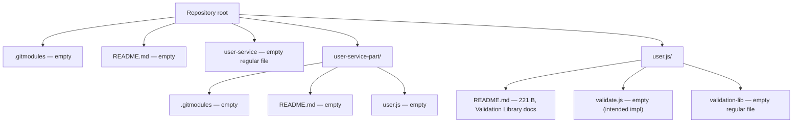
```mermaid
graph TD
    ROOT["Repository root"]
    ROOT --> GM[".gitmodules — empty"]
    ROOT --> RM["README.md — empty"]
    ROOT --> US["user-service — empty regular file"]
    ROOT --> USP["user-service-part/"]
    ROOT --> UJS["user.js/"]
    USP --> USP_GM[".gitmodules — empty"]
    USP --> USP_RM["README.md — empty"]
    USP --> USP_JS["user.js — empty"]
    UJS --> UJS_RM["README.md — 221 B, Validation Library docs"]
    UJS --> UJS_VJS["validate.js — empty (intended impl)"]
    UJS --> UJS_VL["validation-lib — empty regular file"]
```

The full tracked-file inventory, with sizes and observed roles, is:

| Path | Bytes | Named/Documented Role | Content Status |
| --- | --- | --- | --- |
| `.gitmodules` | 1 | Root submodule configuration | Empty; no `[submodule]` sections |
| `README.md` | 1 | Root project README | Empty |
| `user-service` | 1 | File named like a submodule target | Empty; regular file (not a submodule) |
| `user-service-part/.gitmodules` | 1 | Nested submodule configuration | Empty; no `[submodule]` sections |
| `user-service-part/README.md` | 1 | Nested README | Empty |
| `user-service-part/user.js` | 1 | Nested source file | Empty |
| `user.js/README.md` | 221 | Validation Library documentation | Substantive; documents `validateEmail` |
| `user.js/validate.js` | 1 | Intended implementation | Empty; `validateEmail` not implemented |
| `user.js/validation-lib` | 1 | File named like a submodule target | Empty; regular file (not a submodule) |

Every tracked entry is an ordinary file (Git mode `100644`); there are no gitlink entries (mode `160000`), confirming that despite the repository's name and the presence of empty `.gitmodules` files, no Git submodules are configured. The directory `user.js/` is a normal folder, notwithstanding its `.js`-looking name.

**Core technical approach.** No technical approach is implemented. The naming (`user.js`, `validate.js`) and the `javascript` example in `user.js/README.md` (which shows the invocation `validateEmail("test@example.com")`) imply an intended JavaScript utility-library style, but there is no module system, export, package metadata, runtime, or build step present to realize it. It is also worth noting for documentation fidelity that the fenced `javascript` code block in `user.js/README.md` is never closed before end-of-file, making that README technically malformed Markdown.

### 1.2.3 Success Criteria

The repository defines no success criteria. There are no acceptance criteria, no measurable objectives, no explicitly stated critical success factors, and no key performance indicators (KPIs) or service-level objectives anywhere in the tracked files. There is likewise no automated test suite, no continuous-integration configuration, no coverage threshold, and no performance budget against which success could be measured.

| Success-Criteria Category | Status in Repository |
| --- | --- |
| Measurable objectives | None defined |
| Critical success factors | None defined |
| KPIs / SLAs | None defined |
| Automated tests / CI quality gates | None present |
| Acceptance criteria for `validateEmail` | Not specified (only a prose description and one usage example) |

The only implicit, informal criterion that can be derived from documentation is that a completed `validateEmail(email)` would correctly determine whether a given string is a validly formatted email address, per the description in `user.js/README.md`. This remains an unverified aspiration because no implementation, specification, or test encodes it.

## 1.3 Scope

Scope here reflects the repository's present state as verified in the checkout. Because the codebase is a near-empty scaffold, "in scope" denotes the artifacts that actually exist — documentation and directory structure — while "out of scope" captures the substantial functionality that is named, implied, or documented but not implemented.

### 1.3.1 In-Scope

**Core features and functionalities.** In its current state the repository "delivers" only documentation and structure; no executable feature is in scope because none is implemented. The concrete, present artifacts are:

| In-Scope Element | Evidence | Status |
| --- | --- | --- |
| Validation-library concept and `validateEmail(email)` description | `user.js/README.md` | Documentation only |
| Nested, submodule-like directory scaffold | Root plus `user-service-part/` and `user.js/`, with empty `.gitmodules` at two levels | Structure only |
| Name-reserving placeholder files | `user-service`, `user.js/validation-lib`, and the empty `README.md` / `.js` files | Empty placeholders |

Mapping the prompt's feature dimensions onto observed reality:

- **Must-have capabilities:** the only documented capability is `validateEmail(email)` (email-format checking) per `user.js/README.md`; it is described but unimplemented.
- **Primary user workflows:** none are implemented. The single documented usage is the illustrative call `validateEmail("test@example.com")` shown in the README.
- **Essential integrations:** none. No dependency, service, or submodule linkage is defined.
- **Key technical requirements:** none are stated (no language/runtime version, no performance, security, or compatibility requirement is recorded anywhere).

**Implementation boundaries.** The system boundary is the set of nine tracked files in the `main` branch and nothing beyond it. There is no external process, network endpoint, or storage inside the boundary.

| Boundary Dimension | Coverage in Repository |
| --- | --- |
| System boundary | The 9 tracked files on branch `main`; no external surface |
| User groups covered | None defined (no roles, auth, or personas) |
| Geographic / market coverage | None specified |
| Data domains included | Email-address strings only, referenced conceptually in `user.js/README.md`; no data is stored or processed |

### 1.3.2 Out-of-Scope

The following are explicitly out of scope in the current repository because they are absent, empty, or documented-but-unbuilt. This list is descriptive of the present state, not a commitment to deliver these items later.

| Out-of-Scope Item | Evidence of Exclusion |
| --- | --- |
| Working email-validation logic | `user.js/validate.js` is empty; `validateEmail` is documented but not coded |
| Configured Git submodules | Both `.gitmodules` files are empty; all entries are regular files (no gitlinks) |
| Additional validators (e.g., phone, URL, password) | Only email validation is documented in `user.js/README.md` |
| Integrations, APIs, persistence, UI, authentication | No manifests, service definitions, or code of any kind present |
| Build, dependency, packaging, test, and CI tooling | No `package.json`, lockfiles, test suites, or CI configuration exist |
| Any runtime or executable behavior | All source files (`*.js`) are empty single-newline files |

**Future-phase considerations.** The repository's placeholders imply, but do not commit to, natural future work: implementing `validateEmail` in `user.js/validate.js`; populating the empty `.gitmodules` and the `user-service` / `validation-lib` names to establish real (nested) submodules; and adding package metadata, tests, and build tooling. No roadmap, issue, milestone, or TODO documenting such a plan exists in the repository, so these are inferences from the naming and structure rather than stated commitments.

**Integration points not covered.** No integration points are covered at all — there are no inbound or outbound interfaces, no submodule references to resolve, and no external dependencies to fetch or version.

**Unsupported use cases.** Any actual invocation of `validateEmail`, any programmatic import or consumption of the `user.js/` "library," and any submodule initialization/update against the empty `.gitmodules` files are unsupported, because no corresponding implementation or configuration exists.

## 1.4 References

The following repository artifacts were inspected directly and cited as evidence for this section.

**Files**

- `README.md` — Root README; verified empty (single newline), establishing the absence of any top-level project documentation.
- `.gitmodules` — Root submodule configuration; verified empty with no `[submodule]` sections, establishing that no submodules are configured at the root.
- `user-service` — Root-level regular file (Git mode `100644`); verified empty; a submodule-named placeholder that is not a gitlink.
- `user-service-part/README.md` — Verified empty; confirmed the nested folder carries no documentation.
- `user-service-part/.gitmodules` — Nested submodule configuration; verified empty, establishing that no nested submodules are configured.
- `user-service-part/user.js` — Verified empty source placeholder.
- `user.js/README.md` — The only substantive file (221 bytes); documented the "Validation Library," the intended `validateEmail(email)` function and its example usage, and exhibited the unclosed `javascript` code fence noted in the overview.
- `user.js/validate.js` — Verified empty; established that `validateEmail` is documented but not implemented.
- `user.js/validation-lib` — Regular file (Git mode `100644`); verified empty; a submodule-named placeholder that is not a gitlink.

**Folders**

- `` (repository root) — Established the top-level structure: two empty root files, one empty root placeholder file, and the `user-service-part/` and `user.js/` directories.
- `user-service-part/` — Contained only empty placeholder files (`.gitmodules`, `README.md`, `user.js`).
- `user.js/` — A normal directory despite its `.js` name; contained the sole substantive documentation (`README.md`) alongside two empty files (`validate.js`, `validation-lib`).

**Repository metadata**

- Git repository metadata (`git ls-files --stage`, `git log`, `git branch`, `git status`, `git hash-object`) — Established the single `main` branch and its equality with `origin/main`; the 10-commit history dated 2026-07-23 (13:25–13:30 +0530) with `Create`/`Update` messages; the GitHub remote `github.com/Sandeep01Kumar/QA-nested-submodule-test-23-July.git`; the complete 9-file, 229-byte tracked inventory with all entries at mode `100644` (no gitlinks / mode `160000`); and the single-newline blob identity (`8b137891791fe96927ad78e64b0aad7bded08bdc`) shared by the eight empty files.

**Web / external sources**

- None consulted. The repository declares no dependencies, frameworks, or versioned components, so no external facts required verification.

# 2. Product Requirements

## 2.1 Feature Catalog

This section catalogs the product features that are actually documented in the repository. The codebase `QA-nested-submodule-test-23-July` is a near-empty scaffold (see Section 1.2 System Overview): of its nine tracked files, only `user.js/README.md` carries substantive content, and it documents exactly one feature — an email-format validation function. That feature is therefore the single entry in this catalog. No other functional feature is described anywhere in the repository, and the one documented feature is not implemented (`user.js/validate.js`, the intended implementation file, is empty).

**Scope note.** The repository's name and layout — empty `.gitmodules` files at two levels plus ordinary files named like submodule targets (`user-service`, `user.js/validation-lib`) — suggest an apparent secondary purpose as a QA fixture for nested Git-submodule handling. Because no submodules are actually configured (every entry is a regular file; see Section 1.2) and because no requirement, acceptance criterion, or capability is documented for that behavior, it is treated as repository context in Section 2.6 (Assumptions and Constraints) rather than as a product feature. In keeping with an evidence-based specification, no feature has been invented beyond what the repository documents.

### 2.1.1 Feature Inventory

| Feature ID | Feature Name | Category | Status |
| --- | --- | --- | --- |
| F-001 | Email Format Validation (`validateEmail`) | Data Validation Utility | Proposed (documented, not implemented) |

### 2.1.2 F-001 — Email Format Validation

#### 2.1.2.1 Feature Metadata

| Attribute | Value |
| --- | --- |
| Unique ID | F-001 |
| Feature Name | Email Format Validation (`validateEmail(email)`) |
| Feature Category | Data Validation Utility — single library function |
| Priority Level | Critical (assigned) — the sole documented capability of the "Validation Library"; the repository itself declares no priority |
| Status | Proposed — documented in `user.js/README.md`; unimplemented (`user.js/validate.js` is empty) |

#### 2.1.2.2 Description

**Overview.** `user.js/README.md` documents a "Validation Library" described as "A small validation utility library," exposing a single function, `validateEmail(email)`, whose stated behavior is to check "whether an email contains a valid format." A usage example is given as `validateEmail("test@example.com")`. This is the only functional capability described anywhere in the repository.

**Business Value.** The repository declares no business value, revenue objective, or market context (consistent with Section 1.1 Executive Summary, which records no business problem or value proposition). Any value is instrumental and prospective: were the function implemented, it would provide a reusable check that a string is a well-formed email address.

**User Benefits.** No user personas or user-facing workflows are defined in the repository. The only benefit implied by the documentation is that a developer consuming the library could validate email-address formatting through a single function call. This benefit is aspirational because the function is not implemented.

**Technical Context.** The `javascript` fenced example and the `.js` file naming (`validate.js`) imply an intended JavaScript utility-library style, but no module system, export statement, package manifest, or runtime is present to realize it. The documenting file is also technically malformed: the `javascript` code fence opened at line 16 of `user.js/README.md` is never closed before end-of-file.

#### 2.1.2.3 Dependencies

| Dependency Type | Detail |
| --- | --- |
| Prerequisite Features | None — F-001 is the only documented feature and depends on no other feature |
| System Dependencies | A JavaScript runtime is implied by the `.js` naming and the `javascript` example, but none is declared; no package manifest or module system exists in the repository |
| External Dependencies | None declared — the repository contains no dependency manifest (`package.json`), lockfile, or import statements |
| Integration Requirements | None — the library exposes no export, no import surface, and no API; nothing in the repository consumes or is consumed by F-001 |

## 2.2 Functional Requirements

The following requirements are derived directly from the documented description of F-001 in `user.js/README.md`. Because the repository specifies no formal acceptance criteria, performance targets, or validation specification (Section 1.2.3 records that no success criteria, KPIs, or tests exist), the acceptance criteria below are expressed against the documented intent and annotated with their current implementation status. All requirements are currently unmet because `user.js/validate.js` is empty.

### 2.2.1 F-001 Requirement Details

| Requirement ID | Description | Priority | Complexity |
| --- | --- | --- | --- |
| F-001-RQ-001 | The validation library shall expose a callable `validateEmail(email)` function | Must-Have | Low |
| F-001-RQ-002 | `validateEmail(email)` shall determine whether the supplied email string conforms to a valid email format | Must-Have | Low |

Acceptance criteria, traced to the documented intent; current status reflects the empty implementation file:

| Requirement ID | Acceptance Criteria | Current Status |
| --- | --- | --- |
| F-001-RQ-001 | A `validateEmail(email)` function is available from the library implementation (`user.js/validate.js`) and can be invoked as shown by the documented example | Not met — `user.js/validate.js` is empty |
| F-001-RQ-002 | Given an email string, the function returns an indication of whether the string is a validly formatted email; the documented example input `"test@example.com"` (a well-formed address) is accepted | Not met — no implementation exists |

### 2.2.2 Technical Specifications (F-001)

| Aspect | Specification |
| --- | --- |
| Input Parameters | A single argument `email`, per the documented signature `validateEmail(email)`; the documented example passes a string literal (`"test@example.com"`), so the intended input is an email-address string. No parameter type is formally declared. |
| Output / Response | An indication of whether the email "contains a valid format" (per `user.js/README.md`); the concrete return type is not specified in the documentation. |
| Performance Criteria | None specified anywhere in the repository (no latency, throughput, or resource target). |
| Data Requirements | Operates on a single in-memory email-address string supplied by the caller; no persistence, data store, or external data source is involved (consistent with Section 1.3, which records "Email-address strings only … no data is stored or processed"). |

### 2.2.3 Validation Rules (F-001)

| Rule Category | Documented Rule / Status |
| --- | --- |
| Business Rules | A single conceptual rule: an email must "contain a valid format" (`user.js/README.md`). No concrete format definition (e.g., RFC reference, pattern, or allowed-character set) is provided. |
| Data Validation | F-001 is itself the data-validation mechanism; however, the specific validation logic (structure, character set, length limits) is undefined in the repository. |
| Security Requirements | None documented. No input-sanitization, injection-handling, or input-safety requirements are stated. |
| Compliance Requirements | None documented. No regulatory or standards-compliance requirements (for example, an email/RFC standard) are referenced. |

### 2.2.4 Requirement Baseline and Versioning

All F-001 requirements are recorded at baseline version 1.0, derived from `user.js/README.md` as tracked on branch `main`. Because the repository contains no changelog, issue tracker, or requirement-management artifacts, requirement versioning is anchored to the Git history of `user.js/README.md` (the only substantive file): any future change to that file constitutes the next requirement revision. As of this baseline, F-001-RQ-001 and F-001-RQ-002 are both open (unimplemented).

## 2.3 Feature Relationships

Because the repository documents a single feature (F-001) and defines no integrations, inter-feature relationships are minimal. This section documents only the relationships that are actually evident from the repository — the association between F-001 and the files that document or would implement it — and records the explicit absence of integration points, shared components, and common services.

### 2.3.1 Feature Dependency and Artifact Map

There are no feature-to-feature dependencies (F-001 is the only feature). The evident relationships are between F-001 and the repository artifacts that document it, are intended to implement it, or reserve its name. The dashed edges denote intended-but-unrealized links (the target files are empty).

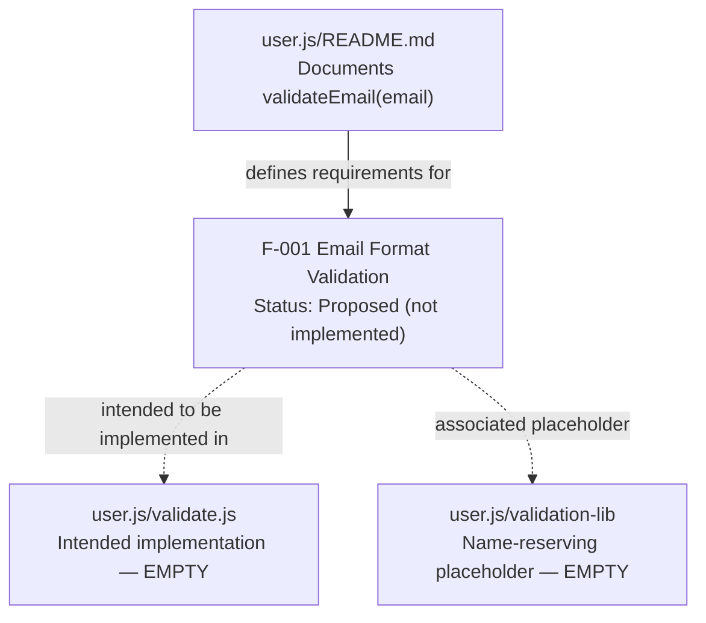
```mermaid
graph TD
    F001["F-001 Email Format Validation<br/>Status: Proposed (not implemented)"]
    DOC["user.js/README.md<br/>Documents validateEmail(email)"]
    IMPL["user.js/validate.js<br/>Intended implementation — EMPTY"]
    PLACE["user.js/validation-lib<br/>Name-reserving placeholder — EMPTY"]
    DOC -->|defines requirements for| F001
    F001 -.->|intended to be implemented in| IMPL
    F001 -.->|associated placeholder| PLACE
```

The solid edge is the only realized relationship: `user.js/README.md` defines the documented behavior of F-001. The dashed edges are unrealized because `user.js/validate.js` and `user.js/validation-lib` are both empty (1-byte) files.

### 2.3.2 Integration Points, Shared Components, and Common Services

| Relationship Dimension | Status in Repository |
| --- | --- |
| Inter-feature dependencies | None — F-001 is the only documented feature |
| Integration points | None — no APIs, network endpoints, imports, or exports are defined (consistent with Section 1.2, which records no integration surface) |
| Shared components | None — there is no shared module or library beyond the single documented function; no code is shared because no code exists |
| Common services | None — no service layer, runtime process, data store, or infrastructure component is present |

## 2.4 Implementation Considerations

The repository states no explicit implementation constraints, performance targets, or operational requirements for F-001. The considerations below therefore combine the few constraints that are directly evident from the repository's state with an explicit record of what is unspecified. They apply to F-001 as it would need to be implemented in the currently-empty `user.js/validate.js`.

### 2.4.1 F-001 Implementation Considerations

| Consideration | Detail |
| --- | --- |
| Technical Constraints | No runtime, build tooling, module system, or package manifest exists, so an implementation must first establish these; the documented signature `validateEmail(email)` and the `javascript` example constrain the intended language to JavaScript. The implementation target is `user.js/validate.js` (currently empty). The documenting file (`user.js/README.md`) is malformed markdown — its `javascript` code fence is unclosed — which should be corrected alongside implementation. |
| Performance Requirements | None specified. No latency, throughput, memory, or CPU target is recorded anywhere in the repository. |
| Scalability Considerations | Not applicable in the current form. As documented, `validateEmail` is a single, stateless, in-memory string check; no concurrency model, data-volume expectation, or horizontal-scaling requirement is documented. |
| Security Implications | None documented. Email-format validation is often used as an input-validation control, but the repository states no security requirement, threat model, sanitization rule, or handling of untrusted input, so the security posture is undefined. |
| Maintenance Requirements | No automated tests, continuous integration, linting, formatting, versioning policy, or contribution guidance exists; the single documented file would be the maintenance surface. Two evident maintenance items are implementing the documented function in `user.js/validate.js` and closing the unterminated code fence in `user.js/README.md`. |

## 2.5 Requirements Traceability Matrix

This matrix traces the single documented feature and its requirements back to the repository evidence that defines them and to the related sections of this specification. Every requirement traces to `user.js/README.md`, the only substantive file in the repository.

### 2.5.1 Feature-to-Requirement-to-Evidence Traceability

| Requirement ID | Parent Feature | Source Evidence | Status |
| --- | --- | --- | --- |
| F-001-RQ-001 | F-001 | `user.js/README.md` — Overview/Functions and the `validateEmail(email)` signature (lines 6, 8, 10) | Not implemented (`user.js/validate.js` empty) |
| F-001-RQ-002 | F-001 | `user.js/README.md` — "Checks whether an email contains a valid format" and example `validateEmail("test@example.com")` (lines 12, 17) | Not implemented (`user.js/validate.js` empty) |

### 2.5.2 Cross-Reference to Related Specification Sections

| Product Requirements Item | Related Section(s) |
| --- | --- |
| F-001 feature definition | 1.1 Executive Summary; 1.2.2 High-Level Description |
| F-001 scope (in-scope / out-of-scope) | 1.3.1 In-Scope; 1.3.2 Out-of-Scope |
| Acceptance / success criteria | 1.2.3 Success Criteria (records that none are defined) |
| Evidence artifacts cited | 1.4 References; Section 2.7 References (this section) |

## 2.6 Assumptions and Constraints

This section records the assumptions underlying the feature catalog and the constraints imposed by the repository's actual state. Because the repository is a near-empty scaffold, these items are essential to interpreting the requirements above correctly.

### 2.6.1 Assumptions

| ID | Assumption |
| --- | --- |
| A-1 | F-001 (`validateEmail`) is the intended product feature, based solely on the description in `user.js/README.md`; no other feature intent is documented. |
| A-2 | The intended implementation language is JavaScript, inferred from the `.js` file naming (`validate.js`) and the `javascript` example fence in `user.js/README.md`. |
| A-3 | The repository's apparent secondary purpose — a QA fixture for nested Git-submodule handling — is inferred from its name and layout (empty `.gitmodules` at two levels; regular files named `user-service` and `user.js/validation-lib`). No submodules are actually configured, and this purpose carries no documented product requirement. |
| A-4 | Requirement versioning is anchored to the Git history of `user.js/README.md` because no changelog, issue tracker, or requirement-management artifact exists. |

### 2.6.2 Constraints

| ID | Constraint |
| --- | --- |
| C-1 | F-001 is documented but unimplemented — `user.js/validate.js` is empty — so all requirements (F-001-RQ-001, F-001-RQ-002) are currently open. |
| C-2 | No package manifest, module system, runtime, build tooling, tests, CI, or declared dependencies exist anywhere in the repository. |
| C-3 | No KPIs, SLAs, performance targets, or security/compliance requirements are defined (consistent with Section 1.2.3). |
| C-4 | No user roles or personas are defined; the only data domain is email-address strings, none of which are stored or processed (consistent with Section 1.3). |
| C-5 | Documentation defect: the `javascript` code fence opened at line 16 of `user.js/README.md` is never closed, making the file malformed markdown. |
| C-6 | This specification reflects branch `main` exactly as tracked (9 files, all Git mode `100644`); no other branch or submodule contributes content. |

## 2.7 References

The following repository artifacts and specification sections were inspected directly and cited as evidence for this section.

**Files**

- `user.js/README.md` — The sole substantive file (221 bytes); established the "Validation Library," the F-001 `validateEmail(email)` feature, its "valid format" behavior, the example invocation, and the unclosed `javascript` code fence.
- `user.js/validate.js` — Verified empty (1 byte); the intended implementation of F-001 and the basis for the "not implemented / Proposed" status of the feature and its requirements.
- `user.js/validation-lib` — Verified empty (1 byte); a name-reserving placeholder shown in the feature/artifact map (Section 2.3.1).
- `README.md` — Verified empty (1 byte); part of the near-empty-scaffold characterization.
- `user-service` — Verified empty regular file (Git mode `100644`); a submodule-named placeholder underpinning the QA-fixture assumption (A-3).
- `.gitmodules` and `user-service-part/.gitmodules` — Verified empty; established that no submodules are configured and informed the submodule-fixture inference.
- `user-service-part/README.md`, `user-service-part/user.js` — Verified empty placeholders contributing to the scaffold structure.

**Folders**

- `` (repository root) — Established the top-level structure (root files plus the `user-service-part/` and `user.js/` directories).
- `user.js/` — Contained the sole documentation (`README.md`) and the two empty files (`validate.js`, `validation-lib`) referenced by F-001.
- `user-service-part/` — Empty placeholder folder cited for the submodule-fixture inference.

**Repository metadata**

- Git metadata (`git ls-files --stage`, `git grep`, `git branch`) — Established the complete 9-file inventory, all entries at mode `100644` (no gitlinks / mode `160000`), the absence of any `[submodule]` sections, and the single `main` branch; basis for the "no submodules configured" and "not implemented" claims.

**Related specification sections**

- 1.1 Executive Summary; 1.2 System Overview (1.2.2 High-Level Description, 1.2.3 Success Criteria); 1.3 Scope (1.3.1 In-Scope, 1.3.2 Out-of-Scope); 1.4 References — Cross-referenced for consistent framing of the scaffold, the sole documented capability, and the absence of success criteria.

**Web / external sources**

- None consulted. The repository declares no dependencies, frameworks, or versioned components, so no external facts required verification.

# 3. Technology Stack

## 3.1 Programming Languages

The repository defines no build target, runtime, or executable program, so no compiled or interpreted language is in active use. Language presence is limited to three things: (1) a single documented JavaScript *intent*, (2) Markdown used for documentation, and (3) empty Git-configuration files. This is consistent with the near-empty scaffold characterization in Sections 1.1–1.3 and with constraint C-2 in Section 2.6, which records that no module system, runtime, build tooling, or declared dependencies exist anywhere in the repository. No programming-language version is declared for any component (see 3.1.3).

### 3.1.1 Languages and Formats by Component

| Language / Format | Where Observed (evidence) | Role | Implementation Status |
| --- | --- | --- | --- |
| JavaScript | `user.js/README.md` (documents `validateEmail(email)` with a `javascript` example); file names `user.js/validate.js`, `user-service-part/user.js` | Intended implementation language of the documented email-validation utility | Documented intent only — `user.js/validate.js` is empty (1 byte); no JavaScript is implemented |
| Markdown | `user.js/README.md` (only substantive file), root `README.md`, `user-service-part/README.md` | Human-readable documentation | Present but minimal — only `user.js/README.md` (221 bytes) has content; the other two READMEs are empty (1 byte each) |
| Git configuration (INI-style) | `.gitmodules`, `user-service-part/.gitmodules` | Git submodule configuration syntax | Present but empty — no `[submodule]` sections are declared in either file |

**Primary (intended) language — JavaScript.** The only functional intent expressed anywhere in the repository is a `validateEmail(email)` function, documented in `user.js/README.md` as checking whether an email address has a valid format. The README illustrates the intended call site as a one-line example:

```javascript
validateEmail("test@example.com")
```

The corresponding implementation file, `user.js/validate.js`, is empty, so this function is not implemented and cannot be invoked. JavaScript is therefore an *aspirational* language for this repository rather than one that is actually used to run code.

**Documentation language — Markdown.** All three `README.md` files use Markdown, but only `user.js/README.md` contains content. For documentation fidelity, note that this file is malformed Markdown: the `javascript` code fence opened near its end (a line beginning with three backtick characters) is never closed before end-of-file — the same defect recorded as constraint C-5 in Section 2.6.

**Configuration format — Git submodule config.** The root `.gitmodules` and `user-service-part/.gitmodules` follow Git's INI-style configuration format but contain no `[submodule]` sections, so they declare no language- or build-relevant configuration.

There are no other languages present: no TypeScript, Python, Swift, Kotlin, Objective-C, HTML/CSS, SQL, or shell scripting appears anywhere in the tracked files.

### 3.1.2 Selection Criteria and Justification

The repository records no explicit language-selection rationale, decision log, or style guide. The identification of JavaScript as the intended language is therefore an evidence-based inference (aligned with Assumption A-2 in Section 2.6) drawn from two signals: the `.js` file names (`validate.js`, `user.js`) and the `javascript`-tagged example fence in `user.js/README.md`. Markdown's selection is self-evident from the `.md` extensions and their documentation content. No criteria such as performance, ecosystem, team familiarity, or platform support are documented, because no implementation decision has been committed to the repository.

### 3.1.3 Constraints, Dependencies, and Version Governance

- **No language version is pinned.** There is no `engines` field, no `.nvmrc`, `.node-version`, or `.tool-versions` file, no `tsconfig`, and no lockfile. As a result, no JavaScript language edition (e.g., a specific ECMAScript version) and no execution environment (Node.js vs. browser) is declared or constrained.
- **No language runtime or toolchain dependency is declared.** Consistent with 3.3 and 3.6, the repository does not depend on an interpreter, transpiler, or package manager to build or run.
- **Security implication.** Because no executable code exists, there is no language-level runtime attack surface at present. The documented `validateEmail` would, once implemented, serve as an input-format validation control; in its current unimplemented state it provides no actual input sanitization or protection (consistent with the undefined security posture noted in Section 2.4).

## 3.2 Frameworks & Libraries

No application frameworks or third-party libraries are present in the repository. Although the sole substantive document, `user.js/README.md`, labels the intended deliverable "A small validation utility library," this is a description of a *planned* artifact, not evidence of an actual library: there is no source code, no module or export, and no package metadata anywhere in the tree. Consequently there are no framework or library versions to report, and no compatibility requirements exist. This is consistent with Sections 1.1–1.2 ("Build / dependency / CI / test tooling: None present") and constraint C-2 in Section 2.6.

| Aspect | Status | Evidence |
| --- | --- | --- |
| Core framework(s) | None | No framework configuration, bootstrap file, or import statement in any tracked file |
| Supporting libraries | None | No `node_modules/`, no vendored source, no `import`/`require` statements anywhere |
| Framework / library versions | None declared | No `package.json`, lockfile, or dependency manifest exists (see 3.3) |
| Compatibility requirements | Not applicable | No runtime, engine, or dependency target is defined for anything to be compatible with |

**Justification.** Because the repository is a scaffold with no implemented code (Sections 1.1–1.3; constraint C-2 in Section 2.6), no engineering decision to adopt or reject any specific framework has been committed to the repository, so none can be justified from evidence. For clarity and to prevent misattribution: none of the frameworks or libraries associated with a conventional full-stack application — for example a web UI framework, a backend web framework, or an AI/agent framework — are present, referenced, or configured here. The "library" concept exists only as documentation intent for a single `validateEmail(email)` function whose implementation file (`user.js/validate.js`) is empty.

## 3.3 Open Source Dependencies

The repository declares **zero** open-source or third-party dependencies. There is no dependency manifest, no lockfile, no vendored third-party code, and no evidence that any package registry (npm, PyPI, Maven Central, Go modules, crates.io, etc.) is used. This directly reflects constraint C-2 in Section 2.6 ("No package manifest, module system, runtime, build tooling, tests, CI, or declared dependencies exist anywhere in the repository") and Section 1.2's statement that the repository declares "no dependency manifests of any kind."

| Dependency Facet | Status | Evidence |
| --- | --- | --- |
| Package manifest | Absent | No `package.json`, `requirements.txt`, `pyproject.toml`/`setup.py`, `Pipfile`, `go.mod`, `Cargo.toml`, `pom.xml`, or `build.gradle` anywhere in the tree |
| Dependency lockfile | Absent | No `package-lock.json`, `yarn.lock`, `pnpm-lock.yaml`, `Pipfile.lock`, or equivalent |
| Package registry usage | None | No install/build step, no registry references, no `.npmrc`/index configuration |
| Vendored third-party code | None | No `node_modules/` or `vendor/` directory; the tree contains only the 9 tracked files enumerated in Section 1.2 |
| Declared dependency versions | None | Nothing is depended upon, so there are no versions to pin or report |

**Registries and versions.** Because no manifest or lockfile exists, there is no registry to resolve against and no version to record for any component. The version instruction in this section is therefore satisfied by explicit negative confirmation: the repository pins no dependency versions.

**Security implication.** The absence of declared dependencies means the repository currently has **no third-party or transitive supply-chain vulnerability surface** — there are no packages to audit, patch, or scan. Correspondingly, no software-composition-analysis (SCA) or dependency-scanning tooling is configured, because there is nothing to scan. Any future implementation of `validateEmail` (Section 2.4) would introduce this concern only if it added external dependencies.

## 3.4 Third-Party Services

At the application level the repository integrates with **no** external service. The only third-party service in its lifecycle is the code-hosting/version-control remote on **GitHub**, which stores the Git repository; this is an operational hosting relationship, not an application integration. Section 1.2 confirms the repository "declares no integrations" and has "no API clients or servers, no network or database configuration, no environment files, no service definitions."

| Category | Service / Integration | Status & Evidence |
| --- | --- | --- |
| Source hosting / VCS remote | GitHub (`origin` → `github.com/Sandeep01Kumar/QA-nested-submodule-test-23-July`, branch `main`) | Present — the sole external touchpoint; hosts the repository (per Section 1.2 commit/remote metadata) |
| External APIs / integrations | None | No API client or server, SDK, endpoint, or base-URL/configuration anywhere in the tree |
| Authentication services | None | No Auth0/OAuth/OIDC/identity-provider configuration and no authentication code (consistent with "no auth or personas" in Section 1.3) |
| Monitoring / observability | None | No APM, logging, metrics, or tracing agent, library, or configuration |
| Cloud services | None | No AWS/GCP/Azure SDK, credentials file, or cloud resource definition present |

**Integration requirements.** The repository has no inbound or outbound integration surface to configure or secure. None of the external services associated with a conventional default stack are present — there is no managed authentication provider (e.g., Auth0), and no cloud platform (e.g., AWS). GitHub is used purely as the Git hosting/remote for the nine tracked files; no GitHub API usage, webhooks, or GitHub Actions workflows are configured (see 3.6). 

**Security note.** Access to the GitHub remote is governed by GitHub's standard authenticated Git transport; no service credentials, secrets, tokens, or environment files are stored in the tracked repository content. Because there are no external service integrations, there are no third-party data-sharing, API-key-management, or service-to-service trust concerns to document at this time.

## 3.5 Databases & Storage

The repository uses **no database, no cache, and no storage service** of any kind. There is no primary or secondary datastore, no data-persistence layer, no caching tier, and no object/file/blob storage integration. The only durable storage mechanism involved is Git's own content-addressable object store, which holds the repository's tracked files. This is consistent with Section 1.2 ("no ... database configuration") and Section 1.3 (the only data domain is "email-address strings ... no data is stored or processed").

| Storage Concern | Status | Evidence |
| --- | --- | --- |
| Primary database | None | No database driver/client, connection string, schema, or ORM in any tracked file |
| Secondary database | None | No additional datastore of any kind (relational, document, key-value, graph, or search) |
| Data-persistence strategy | None | No models, migrations, repositories/DAOs, or serialization/persistence code exists |
| Caching solution | None | No Redis/Memcached or in-process cache configuration |
| Object / file / blob storage | None | No S3/GCS/Azure Blob client or managed file-storage integration |
| Version-control object store (Git) | Present | Git stores the 9 tracked files (229 bytes total) as content-addressable blobs on branch `main` |

**Data domain and persistence.** The sole data concept referenced anywhere is an email-address string, and only conceptually, within `user.js/README.md`'s description of `validateEmail`. No email address (or any other datum) is ever read, written, or persisted; the string `test@example.com` in the README is an illustrative documentation example, not stored application data.

**Security implication.** Because no datastore or storage service exists, there is no data at rest to encrypt, back up, access-control, or classify, and the repository stores no personally identifiable information (PII). Data-storage security considerations would arise only if a future implementation introduced persistence, which is currently out of scope (Section 1.3).

## 3.6 Development & Deployment

The development and deployment toolchain observed in the repository consists of **Git** for version control and **GitHub** for hosting the remote, and nothing else. There is no build system, no package/dependency manager, no containerization, no CI/CD automation, no infrastructure-as-code, and no deployment target. This matches Section 1.1 ("Build / dependency / CI / test tooling: None present") and constraint C-2 in Section 2.6.

| Concern | Tool / Status | Evidence |
| --- | --- | --- |
| Version control | Git (branch `main`) | Standard Git checkout; 9 tracked files, all mode `100644` (per Section 1.2) |
| Source hosting | GitHub remote (`origin`) | Remote `github.com/Sandeep01Kumar/QA-nested-submodule-test-23-July` |
| Build system | None | No `Makefile`, build script, task runner, or bundler (`webpack`/`vite`/etc.) |
| Package / dependency manager | None | No `package.json`/lockfile or other manifest (see 3.3) |
| Containerization | None | No `Dockerfile`, `.dockerignore`, or `docker-compose.*` |
| CI / CD | None | No `.github/workflows/`, `.gitlab-ci.yml`, `Jenkinsfile`, or `.circleci/` |
| Infrastructure as Code | None | No Terraform (`*.tf`), CloudFormation, or other IaC files |
| Test / quality tooling | None | No test framework, linter, or formatter configuration |

### 3.6.1 Development Environment and Version Control

Git is the only development tool evidenced by the repository. Its commit history — 10 commits, all dated 2026-07-23 within a five-minute window, with messages of the form `Create <file>` / `Update README.md` — is characteristic of files authored through the GitHub web UI rather than a local IDE workflow (per Section 1.2). No editor or IDE configuration (`.editorconfig`, `.vscode/`), no language-version pin (`.nvmrc`, `.node-version`, `.tool-versions`), and no linting/formatting configuration is present. The only version-like marker observed is Git's own local repository-format version (`repositoryformatversion = 0`), a standard Git storage-format indicator of the checkout — not a project dependency version.

### 3.6.2 Build, Containerization, CI/CD, and Infrastructure as Code

No automation exists at any stage of a build-test-package-deploy pipeline. There is nothing to build (no source is implemented), nothing to package (no manifest), no container image definition, and no pipeline configuration. Consequently, the repository has **no deployment target and no runtime environment**: it is not deployed, served, or executed anywhere. To prevent misattribution, none of the operational technologies associated with a conventional default stack are present or configured here — specifically, there is no Docker containerization, no Terraform infrastructure-as-code, and no GitHub Actions (or any other) CI/CD workflow.

### 3.6.3 Technology Footprint

The complete technology footprint of the repository is therefore limited to version control and hosting acting over static documentation and empty placeholder files, as summarized below.

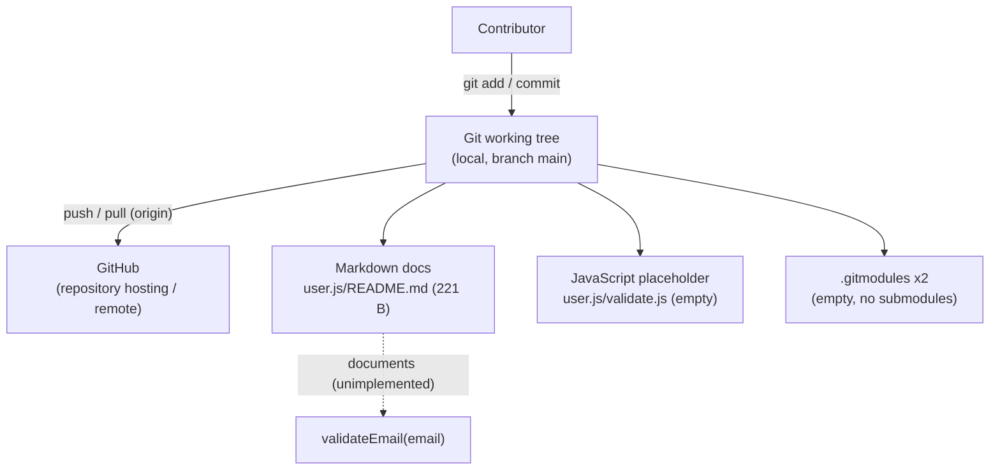
```mermaid
flowchart TD
    DEV["Contributor"]
    DEV -->|"git add / commit"| GIT["Git working tree<br/>(local, branch main)"]
    GIT -->|"push / pull (origin)"| GH["GitHub<br/>(repository hosting / remote)"]
    GIT --> MD["Markdown docs<br/>user.js/README.md (221 B)"]
    GIT --> JS["JavaScript placeholder<br/>user.js/validate.js (empty)"]
    GIT --> GM[".gitmodules x2<br/>(empty, no submodules)"]
    MD -. "documents (unimplemented)" .-> INTENT["validateEmail(email)"]
```

**Security implication.** With no CI/CD, no build, and no deployment surface, the repository exposes no pipeline secrets, no artifact-signing requirements, and no runtime hardening obligations at this time. The only security-relevant control is GitHub's authenticated access to the remote; no credentials or secrets are stored in the tracked repository content (see 3.4).

## 3.7 References

The following repository artifacts, Git metadata, and specification sections were inspected as evidence for Section 3. No web sources were required, because the repository declares no external dependencies, versions, or services to verify.

**Repository files examined**

- `user.js/README.md` — the only substantive file (221 bytes); established the documented "Validation Library" concept, the intended `validateEmail(email)` function, the JavaScript example, and the unclosed `javascript` code fence (malformed Markdown).
- `user.js/validate.js` — empty (1 byte); established that the documented `validateEmail` is not implemented (intended JavaScript implementation target).
- `user.js/validation-lib` — empty (1 byte) regular file; a submodule-named placeholder with no content.
- `README.md` (root) — empty (1 byte); confirmed no substantive top-level documentation.
- `.gitmodules` (root) — empty (1 byte); confirmed no `[submodule]` sections / no configured submodules.
- `user-service` — empty (1 byte) regular file; submodule-named placeholder.
- `user-service-part/.gitmodules` — empty (1 byte); confirmed no nested submodule configuration.
- `user-service-part/README.md` — empty (1 byte) placeholder.
- `user-service-part/user.js` — empty (1 byte) placeholder.

**Repository folders examined**

- `` (repository root) — established the top-level structure (two empty root files, one empty regular file, and two subfolders) and the absence of any manifest, CI, container, or IaC files.
- `user.js/` — contained the sole substantive README plus the empty `validate.js` and `validation-lib` placeholders.
- `user-service-part/` — contained only empty placeholder files.

**Git repository metadata inspected (local checkout)**

- Tracked-file inventory and modes (`git ls-files`) — confirmed 9 files, all Git mode `100644` (regular files; no `160000` gitlinks), totalling 229 bytes.
- Repository configuration and remote (`origin` → GitHub `Sandeep01Kumar/QA-nested-submodule-test-23-July`, branch `main`; `repositoryformatversion = 0`) — established the version-control/hosting facts and the only observed version-like marker. No credentials from this local metadata are reproduced in this specification.

**Cross-referenced specification sections**

- 1.1 Executive Summary — near-empty scaffold (9 files / 229 bytes); "Build / dependency / CI / test tooling: None present".
- 1.2 System Overview — GitHub remote, single branch `main`, commit metadata, no integrations/manifests, intended JavaScript with no runtime/build/package metadata.
- 1.3 Scope — documentation-and-structure only; email-address string as the sole conceptual data domain; no auth/personas.
- 2.4 Implementation Considerations — no runtime/build tooling/module system/package manifest; intended language JavaScript; undefined security posture.
- 2.6 Assumptions and Constraints — A-2 (intended language JavaScript), C-2 (no manifest/module system/runtime/build/tests/CI/dependencies), C-5 (unclosed code fence), feature identifier F-001 (`validateEmail`).

# 4. Process Flowchart

## 4.1 System Workflows

This section documents the process flows of the `QA-nested-submodule-test-23-July` repository exactly as they exist in the tracked source. As established in Sections 1.2 (System Overview) and 2.1 (Feature Catalog), the repository is a near-empty scaffold: eight of its nine tracked files are one-byte placeholders and the single substantive file, `user.js/README.md`, documents one unimplemented function, `validateEmail(email)` (feature F-001). There is therefore no running application, no service, no request/response cycle, and no persistent data flow to trace at runtime.

Given that evidence, the workflows below fall into exactly two honestly observable categories, and no others are invented:

1. **Observed process — content authoring and version control.** The only process that actually executes against this repository is the authoring of files and their capture in Git history on branch `main`. This is the process that produced the repository's current state (10 commits dated 2026-07-23, all with `Create <file>` / `Update README.md` messages).
2. **Documented intent — the `validateEmail` runtime path (unimplemented).** `user.js/README.md` describes a single runtime behavior. It is presented here as documented intent only, because its implementation file `user.js/validate.js` is empty (Constraint C-1 in Section 2.6).

Every flowchart is annotated to distinguish the observed process from the documented-only intent. Absent capabilities (business transactions, multi-step user journeys, service orchestration, event/batch pipelines, and error-recovery machinery) are stated explicitly rather than depicted as if present.

### 4.1.1 Core Business Processes

**Implemented business processes: none.** The repository implements no business process. There is no executable code (`user.js/validate.js` and every other placeholder file are empty), no entry point, no runtime, and no build step (Section 2.4; Constraint C-2). Consequently there are no application-level end-to-end user journeys, no runtime system interactions, and no implemented decision or error-handling branches. The only complete, repeatable process observable in the repository is the version-control authoring lifecycle that created it.

The high-level workflow below places the observed authoring process alongside the documented-only runtime intent for feature F-001. The implementation gate makes explicit why the runtime branch cannot execute today.

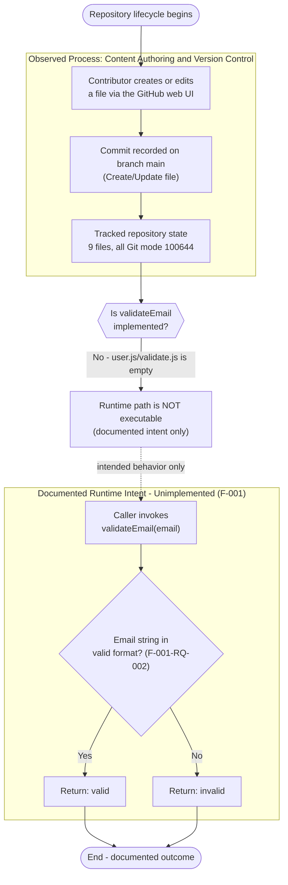
```mermaid
flowchart TD
    Start([Repository lifecycle begins]) --> Author

    subgraph Observed["Observed Process: Content Authoring and Version Control"]
        Author["Contributor creates or edits<br/>a file via the GitHub web UI"]
        Commit["Commit recorded on branch main<br/>(Create/Update file)"]
        RepoState["Tracked repository state<br/>9 files, all Git mode 100644"]
        Author --> Commit --> RepoState
    end

    RepoState --> ImplCheck{{"Is validateEmail<br/>implemented?"}}
    ImplCheck -->|"No - user.js/validate.js is empty"| NotExec["Runtime path is NOT executable<br/>(documented intent only)"]

    subgraph Documented["Documented Runtime Intent - Unimplemented (F-001)"]
        CallerReq["Caller invokes<br/>validateEmail(email)"]
        FormatCheck{"Email string in<br/>valid format? (F-001-RQ-002)"}
        RetTrue["Return: valid"]
        RetFalse["Return: invalid"]
        CallerReq --> FormatCheck
        FormatCheck -->|Yes| RetTrue
        FormatCheck -->|No| RetFalse
    end

    NotExec -.->|"intended behavior only"| CallerReq
    RetTrue --> EndDoc([End - documented outcome])
    RetFalse --> EndDoc
```

**End-to-end user journeys.** The sole actor with a real journey is a *contributor* (developer) who creates or edits a file and commits it to `main`; the commit metadata (web-UI `Create`/`Update` messages) evidences this journey. No *application end-user* journey exists. The documented intent implies a prospective *caller/developer* journey — invoke `validateEmail(email)` and receive a validity result (requirements F-001-RQ-001 and F-001-RQ-002) — but this journey is not executable in the current state.

**System interactions.** The only system-to-system interaction is between the local Git working tree and the GitHub remote `origin/main` (detailed in Section 4.1.2). No inter-module or inter-service interaction exists inside the repository: the two `.gitmodules` files are empty, so there is not even an intra-repository submodule composition in effect (Section 1.2.1).

**Decision points.** In the observed authoring process the only branch is the routine accept-and-commit of a file change. In the documented intent, one business decision point is defined — whether the supplied email string is in a valid format (F-001-RQ-002) — preceded by an implementation-existence gate (is `validateEmail` implemented?) that currently resolves to "No."

**Error-handling paths.** No error-handling path is implemented anywhere in the repository. The conceptual/intended handling of an invalid email and the actual error surface (invoking an unimplemented function) are documented in Section 4.3.2.

A concise mapping of each requested core-business-process dimension to its observed status:

| Business-process dimension | Observed status in repository |
| --- | --- |
| End-to-end user journeys | Only the contributor authoring/commit journey; no application end-user journey |
| System interactions | Only local Git ↔ GitHub `origin/main`; no inter-service interaction |
| Decision points | Documented intent: email-format validity (F-001-RQ-002) plus an implementation gate; observed: file commit only |
| Error-handling paths | None implemented (see Section 4.3.2) |

### 4.1.2 Integration Workflows

**Application-level integrations: none.** The repository declares no integrations (Section 1.2.1): there are no API clients or servers, no network or database configuration, no environment files, no service definitions, and no dependency manifests. The only integration surface that exists is Git version control between the local working tree and the GitHub remote `origin/main`.

The sequence diagram below documents that single integration — the create / commit / clone / fetch exchange with `origin/main`.

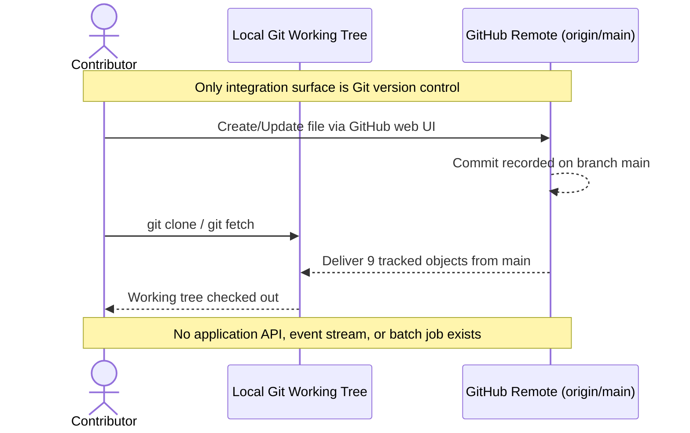
```mermaid
sequenceDiagram
    actor Dev as Contributor
    participant WT as Local Git Working Tree
    participant Remote as GitHub Remote (origin/main)

    Note over Dev,Remote: Only integration surface is Git version control
    Dev->>Remote: Create/Update file via GitHub web UI
    Remote-->>Remote: Commit recorded on branch main
    Dev->>WT: git clone / git fetch
    Remote-->>WT: Deliver 9 tracked objects from main
    WT-->>Dev: Working tree checked out
    Note over Dev,Remote: No application API, event stream, or batch job exists
```

Each requested integration-workflow dimension, mapped to observed evidence:

| Integration dimension | Observed status |
| --- | --- |
| Data flow between systems | Only Git object transfer between the local working tree and GitHub `origin/main`; no application data crosses any boundary |
| API interactions | None — no HTTP/REST/GraphQL/RPC client or server, and no API surface (F-001 exposes no export) |
| Event processing flows | None — no message queue, event bus, webhook, or subscriber is present |
| Batch processing sequences | None — no scheduled job, cron entry, ETL pipeline, or batch runner is present |

Because none of the application-level integration mechanisms exist, no additional data-flow, API, event, or batch diagrams are warranted; depicting them would misrepresent the repository.

## 4.2 Detailed Process Flows and Validation Rules

Because the repository documents exactly one feature — F-001 Email Format Validation (Section 2.1) — and implements none of it, this section provides the detailed process flow for that single feature and records the validation rules that govern it. The flow is presented with swim lanes for the two system boundaries a call would cross (the caller and the intended validation library), and every element is annotated with its current implementation status. No other feature-level flow exists to document.

### 4.2.1 Email Format Validation — Detailed Process Flow (F-001)

The diagram below expands the `validateEmail(email)` path introduced in Section 4.1.1 into a step-level flow. It uses two swim lanes to make the system boundary explicit and includes both the intended decision logic and the error state that actually occurs today, given that `user.js/validate.js` is empty.

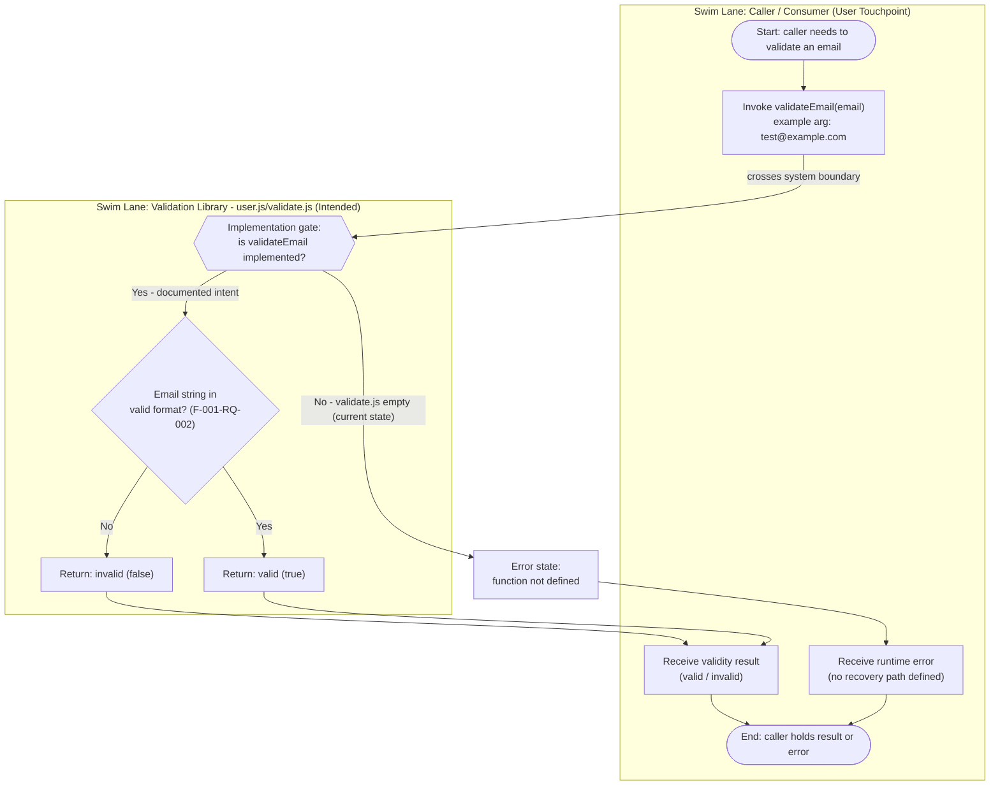
```mermaid
flowchart TD
    subgraph CallerLane["Swim Lane: Caller / Consumer (User Touchpoint)"]
        A([Start: caller needs to validate an email]) --> B["Invoke validateEmail(email)<br/>example arg: test@example.com"]
        R1["Receive validity result<br/>(valid / invalid)"]
        R2["Receive runtime error<br/>(no recovery path defined)"]
        Z([End: caller holds result or error])
    end

    subgraph LibLane["Swim Lane: Validation Library - user.js/validate.js (Intended)"]
        G{{"Implementation gate:<br/>is validateEmail implemented?"}}
        D{"Email string in<br/>valid format? (F-001-RQ-002)"}
        T["Return: valid (true)"]
        F["Return: invalid (false)"]
    end

    B -->|crosses system boundary| G
    G -->|"No - validate.js empty (current state)"| ERR["Error state:<br/>function not defined"]
    G -->|"Yes - documented intent"| D
    D -->|Yes| T
    D -->|No| F
    ERR --> R2
    T --> R1
    F --> R1
    R1 --> Z
    R2 --> Z
```

Each element required of a detailed workflow, mapped to what the repository actually evidences:

| Flow element | Detail for F-001 |
| --- | --- |
| Start / end points | Start: a caller needs to validate an email string. End: the caller holds either a validity result (intended) or a runtime error (current state). |
| Process steps | Invoke `validateEmail(email)` → cross into the library → implementation gate → format check → return result. |
| Decision diamonds | (1) Implementation-existence gate — currently resolves "No"; (2) email-format validity per F-001-RQ-002. |
| System boundaries | Caller/consumer boundary and the intended validation-library boundary (`user.js/validate.js`); the two are shown as separate swim lanes. |
| User touchpoints | The single touchpoint is the developer-caller's invocation of `validateEmail(email)` (documented example: `validateEmail("test@example.com")`). |
| Error states & recovery paths | Current state: invoking the unimplemented function yields a "function not defined" error; no recovery, retry, or fallback path is defined (see Section 4.3.2). |
| Timing & SLA considerations | None defined. F-001 has no performance criteria (Section 2.2.2) and the repository defines no KPIs, SLAs, or latency/throughput budgets (Section 1.2.3, Constraint C-3). |

### 4.2.2 Validation Rules

The prompt's validation-rule categories are addressed below strictly against documented evidence. The only rule the repository actually states is the conceptual requirement that an email "contain a valid format"; all other categories are explicitly absent.

**Business rules at each step.** The single business rule governing F-001 is that the supplied email string must be in a valid format (`user.js/README.md`; requirement F-001-RQ-002). The repository provides no concrete format definition — no RFC reference, regular expression, allowed-character set, or length limit (Section 2.2.3) — so the rule exists only at the conceptual level and is not encoded anywhere.

**Data validation requirements.** F-001 is itself intended to be the data-validation mechanism (its purpose is to validate an email-address string). However, the specific validation logic (structure, character set, length limits) is undefined in the repository and the implementation file is empty, so no data validation is actually performed. The only input is a single in-memory email string; no data is stored or processed (Section 2.2.2; Constraint C-4).

**Authorization checkpoints.** None exist. The repository defines no authentication or authorization, no user roles or personas (Constraint C-4), and no access-control logic. There is no privileged step in the flow at which an authorization check could apply.

**Regulatory compliance checks.** None exist. No regulatory obligation or standards-compliance requirement (for example, an email or RFC conformance standard) is referenced anywhere in the repository (Section 2.2.3).

| Validation-rule category | Documented rule / status |
| --- | --- |
| Business rules | One conceptual rule — email must be in a valid format (F-001-RQ-002); no concrete definition provided |
| Data validation requirements | F-001 is the intended validator, but the concrete logic is undefined and unimplemented (`validate.js` empty) |
| Authorization checkpoints | None — no authN/authZ, no roles/personas, no access control |
| Regulatory compliance checks | None — no regulatory or standards-compliance requirement referenced |

## 4.3 Technical Implementation

This section documents the state-management and error-handling behavior of the repository. Because no application code, runtime, database, or messaging layer exists (Section 2.4; Constraint C-2), the only state model that actually operates is the Git version-control lifecycle, and no error-handling machinery is implemented at all. Both facts are documented explicitly below rather than substituting generic patterns.

### 4.3.1 State Management

**Application/runtime state: none.** There is no process, session, in-memory store, or database, so there is no application state to manage. As documented for F-001, the intended `validateEmail` is a single stateless, in-memory string check (Section 2.4). The only state that actually transitions in this repository is the version-control state of each tracked file. The observed commits were made through the GitHub web UI, but the underlying tracked-file lifecycle is modeled below.

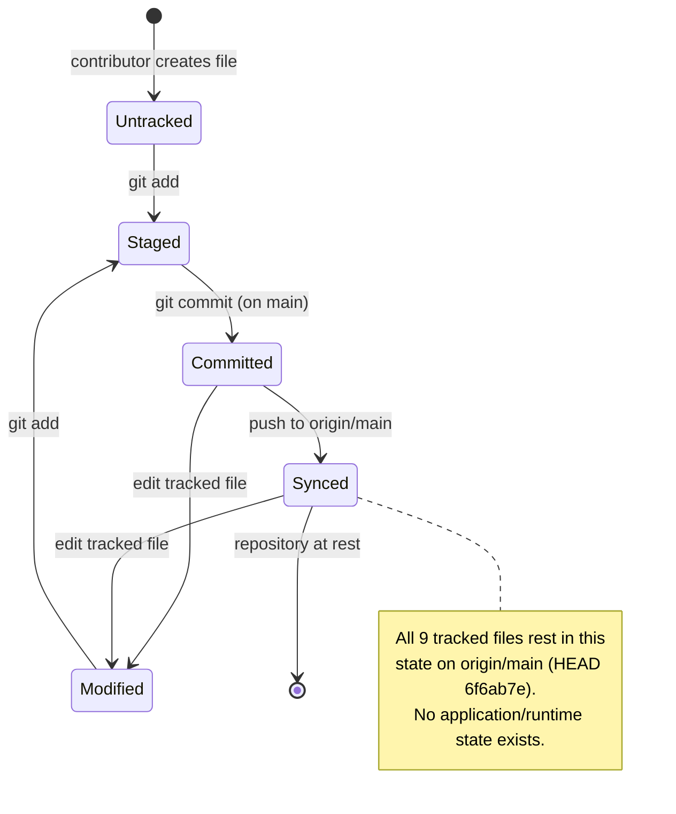
```mermaid
stateDiagram-v2
    [*] --> Untracked: contributor creates file
    Untracked --> Staged: git add
    Staged --> Committed: git commit (on main)
    Committed --> Synced: push to origin/main
    Committed --> Modified: edit tracked file
    Synced --> Modified: edit tracked file
    Modified --> Staged: git add
    Synced --> [*]: repository at rest

    note right of Synced
        All 9 tracked files rest in this
        state on origin/main (HEAD 6f6ab7e).
        No application/runtime state exists.
    end note
```

The requested state-management dimensions, mapped to observed evidence:

| State-management dimension | Observed status |
| --- | --- |
| State transitions | Only the Git tracked-file lifecycle (Untracked → Staged → Committed → Synced, with a Modified re-entry); no application state machine exists |
| Data persistence points | The sole persistence is Git's content-addressable object store holding the committed blobs/tree on `origin/main`; there is no database, object store, or file-storage service (Section 3.5), and F-001 persists nothing (Section 2.2.2) |
| Caching requirements | None — no cache layer, memoization, or cache configuration is present anywhere in the repository |
| Transaction boundaries | No application or database transactions exist; the only atomic unit is a single Git commit, which atomically records one tree state on `main` |

### 4.3.2 Error Handling

**Error-handling machinery: none.** The repository contains no `try/catch` blocks, no error classes, no logging, no alerting, and no monitoring integration (Section 3.4 records no monitoring/observability service). The flowchart below documents both the error surface that actually occurs today — invoking the unimplemented `validateEmail` — and the intended normal path (which returns a value rather than raising, per the documentation), so the distinction between an error state and an ordinary "invalid" result is explicit.

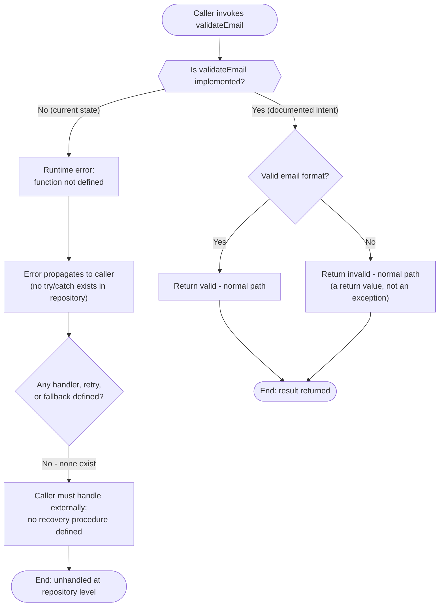
```mermaid
flowchart TD
    Start([Caller invokes validateEmail]) --> Impl{{Is validateEmail implemented?}}
    Impl -->|"No (current state)"| Err["Runtime error:<br/>function not defined"]
    Err --> Prop["Error propagates to caller<br/>(no try/catch exists in repository)"]
    Prop --> NoHandler{"Any handler, retry,<br/>or fallback defined?"}
    NoHandler -->|"No - none exist"| Ext["Caller must handle externally;<br/>no recovery procedure defined"]
    Ext --> EndErr([End: unhandled at repository level])

    Impl -->|"Yes (documented intent)"| Fmt{"Valid email format?"}
    Fmt -->|Yes| RV["Return valid - normal path"]
    Fmt -->|No| RI["Return invalid - normal path<br/>(a return value, not an exception)"]
    RV --> EndOk([End: result returned])
    RI --> EndOk
```

The requested error-handling dimensions, mapped to observed evidence:

| Error-handling dimension | Observed status |
| --- | --- |
| Retry mechanisms | None — no retry, backoff, or re-attempt logic is present |
| Fallback processes | None — no default value, alternate path, or degraded-mode behavior is defined |
| Error notification flows | None — no logging, alerting, error reporting, or monitoring integration exists (Section 3.4) |
| Recovery procedures | None — no documented or coded recovery step; an unimplemented-function error would be unhandled at the repository level |

The single conceptual "error" the documentation implies — an email that is not in a valid format — is, by the documented design, a normal return value (invalid) rather than a raised error; no exception-handling flow is documented or required for it. The one *actual* fault available today, calling an unimplemented function, has no handling because no runtime or code exists to handle it. The evident remediation (implementing `validateEmail` in the empty `user.js/validate.js`) is recorded as a maintenance item in Section 2.4 rather than as an error-recovery process.

## 4.4 References

The following repository files, folders, repository metadata, and cross-referenced Technical Specification sections were examined as evidence for this section. All process flows above are grounded in these sources; no runtime, integration, or error-handling behavior was inferred beyond what they evidence.

**Repository files inspected**

- `user.js/README.md` — the sole substantive file (221 bytes); documents the intended `validateEmail(email)` feature (F-001), the `javascript` usage example, and the unclosed code fence; the basis for the documented-intent flows in Sections 4.1, 4.2, and 4.3.
- `user.js/validate.js` — empty (one byte); the intended implementation file, confirming F-001 is unimplemented and driving the implementation-gate and error-state branches.
- `.gitmodules` (root) — empty (one byte); no `[submodule]` sections, confirming no submodule composition workflow exists.
- `user-service-part/.gitmodules` — empty (one byte); no `[submodule]` sections at the nested level.
- `README.md` (root) — empty (one byte) placeholder.
- `user-service` — empty (one byte) regular file named like a submodule target; confirmed not a gitlink.
- `user.js/validation-lib` — empty (one byte) regular file named like a submodule target; confirmed not a gitlink.
- `user-service-part/README.md` — empty (one byte) placeholder.
- `user-service-part/user.js` — empty (one byte) placeholder.

**Repository folders inspected**

- `/` (repository root) — top-level structure: `.gitmodules`, `README.md`, `user-service`, and the folders `user-service-part/` and `user.js/`.
- `user.js/` — folder containing `README.md`, `validate.js`, and `validation-lib`.
- `user-service-part/` — folder containing `.gitmodules`, `README.md`, and `user.js`.

**Repository metadata (Git) evidence**

- `git ls-files --stage` — established the 9-file inventory and confirmed every entry is Git mode `100644` (no mode `160000` gitlinks); basis for the "no submodules configured" statements.
- `git submodule status` — returned empty, confirming no submodules are configured.
- `git log` — 10 commits dated 2026-07-23 with `Create <file>` / `Update README.md` messages (HEAD `6f6ab7e`); basis for the authoring workflow and the state-transition diagram.
- `git remote -v` / branch topology — remote `origin` at `github.com/Sandeep01Kumar/QA-nested-submodule-test-23-July`, single branch `main`; basis for the Git↔GitHub integration sequence diagram.

**Cross-referenced Technical Specification sections**

- `1.2 System Overview` — confirmed the near-empty-scaffold nature, the single documented capability, and the absence of integrations/runtime/success criteria.
- `2.1 Feature Catalog` — confirmed F-001 as the sole feature (Proposed, unimplemented).
- `2.2 Functional Requirements` — provided F-001-RQ-001 / F-001-RQ-002, the validation rules, and the absence of performance criteria and security/compliance requirements.
- `2.4 Implementation Considerations` — confirmed the absence of runtime, build tooling, module system, and manifest, and the empty implementation target.
- `2.6 Assumptions and Constraints` — provided Constraints C-1 through C-6 (unimplemented feature; no manifest/module/runtime/build/tests/CI/deps; no KPIs/SLAs; no user roles; malformed markdown; branch-`main` scope).
- `3.4 Third-Party Services` — confirmed the absence of monitoring/observability services (error-notification flows).
- `3.5 Databases & Storage` — confirmed the absence of databases, caching, and object/file storage (state-management persistence and caching).

# 5. System Architecture

## 5.1 High-Level Architecture

The `QA-nested-submodule-test-23-July` repository is a **near-empty scaffold**: it contains no executable code, no runtime, and no build or deployment tooling. As established in Sections 1.2, 1.3, and 3.6 — and formalized by constraints C-1 and C-2 in Section 2.6 — the only substantive artifact is `user.js/README.md`, which documents a single, **unimplemented** function, `validateEmail(email)` (feature F-001). Accordingly, this section documents the architecture that actually exists (a Git-tracked static file-and-directory layout) together with the one design *intent* expressed in documentation. It does not depict runtime components, services, or data pipelines that are not present.

### 5.1.1 System Overview

**Architecture style and rationale.** No implemented runtime architecture style exists — there is no layered, microservice, event-driven, or monolithic application, because there is no executable code (constraint C-2). Only two styles are observable in the repository:

- **Version-controlled static content repository (realized).** The realized "architecture" is a Git repository of nine tracked files on branch `main` whose directory layout deliberately mimics a *nested, submodule-style composition*: a root parent containing the `user-service-part/` and `user.js/` subtrees, plus empty `.gitmodules` files at two levels and files named like submodule targets. This layout is consistent with the repository's apparent secondary purpose as a QA fixture for nested Git-submodule handling (Assumption A-3), even though no submodules are actually configured.
- **In-process utility-library style (documented intent only).** `user.js/README.md` describes "a small validation utility library" exposing one stateless function, `validateEmail(email)`. This implies an in-process, single-function library invoked directly by a caller — but the implementation file `user.js/validate.js` is empty, so the style is aspirational rather than realized.

**Key architectural principles and patterns.** The following are the only patterns evidenced by the repository:

- **Documentation-first / intent-only definition** — the interface (`validateEmail`) is specified in `user.js/README.md` before any implementation exists.
- **Modular composition by directory** — functionality is partitioned into named subtrees (`user.js/`, `user-service-part/`) intended to map onto independent (submodule) components; the partitioning is structural only and is not wired together, since both `.gitmodules` files are empty.
- **Stateless, in-memory function contract (intended)** — the documented `validateEmail(email)` takes a single input and returns a validity result with no persistence or side effects.
- Absent by evidence: no layering/tiering, no service orchestration, no dependency injection, no messaging, and no shared runtime components (Sections 2.3, 4.1).

**System boundaries and major interfaces.** Per Section 1.3, the system boundary is exactly the nine tracked files on branch `main`; there is no external process, network endpoint, or storage inside the boundary. The interfaces are:

- **Version-control interface (realized, external).** The single boundary-crossing interface is Git version control between the local working tree and the GitHub remote `origin/main` (push / pull / clone / fetch over HTTPS).
- **Programmatic library interface (documented intent only).** `validateEmail(email)` is the sole intended in-process API; it is unimplemented and exposes no module export, so it cannot currently be invoked (constraint C-1).
- Absent by evidence: no HTTP/REST/GraphQL/RPC endpoint, no message/event interface, no database connection, and no user interface.

The system-context diagram below shows the boundary, the single realized external interface, and the intended (unimplemented) programmatic interface.

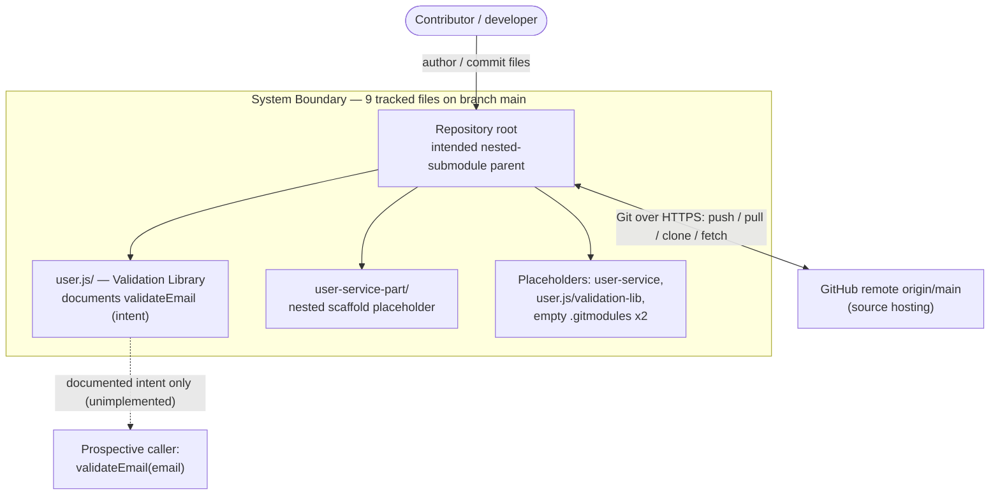
```mermaid
flowchart TD
    Contributor(["Contributor / developer"])
    GitHub["GitHub remote origin/main<br/>(source hosting)"]
    subgraph Boundary["System Boundary — 9 tracked files on branch main"]
        RootParent["Repository root<br/>intended nested-submodule parent"]
        ValLib["user.js/ — Validation Library<br/>documents validateEmail (intent)"]
        UserSvcPart["user-service-part/<br/>nested scaffold placeholder"]
        Placeholders["Placeholders: user-service,<br/>user.js/validation-lib,<br/>empty .gitmodules x2"]
        RootParent --> ValLib
        RootParent --> UserSvcPart
        RootParent --> Placeholders
    end
    Contributor -->|"author / commit files"| RootParent
    RootParent <-->|"Git over HTTPS: push / pull / clone / fetch"| GitHub
    ValLib -.->|"documented intent only (unimplemented)"| Caller["Prospective caller:<br/>validateEmail(email)"]
```

### 5.1.2 Core Components

The section prompt requests five attributes per component (name, responsibility, dependencies, integration points, critical considerations). Because the output standard limits tables to four columns — and because, as established in Sections 1.2–1.3 and 4.1, every component's dependencies and integration points are effectively "none" — the *Key Dependencies* and *Integration Points* dimensions are consolidated into a single column below. All "components" are directories and files rather than software modules.

| Component | Primary Responsibility | Dependencies / Integration Points | Critical Considerations |
| --- | --- | --- | --- |
| Repository root (`/`) | Aggregation root and intended nested-submodule parent; holds the root `README.md`, empty `.gitmodules`, and the `user-service` placeholder | Git ↔ GitHub `origin/main` (the only external integration); no intra-repo linkage — root `.gitmodules` is empty | Root `README.md` is empty; declares no composition or entry point |
| Validation Library (`user.js/`) | Documents and is intended to house the `validateEmail` utility (F-001) | None wired; the sole intended integration is an in-process caller invoking `validateEmail` | Documented but unimplemented (C-1); the `.js`-named path is an ordinary folder |
| Library documentation (`user.js/README.md`) | Sole substantive artifact; specifies `validateEmail(email)` and its intent (F-001-RQ-001/002) | None | 221 bytes; malformed markdown — an unterminated fenced code block (the `javascript` fence opened near line 16 is never closed) per C-5 |
| Intended implementation (`user.js/validate.js`) | Intended to implement `validateEmail` | None | Empty (1 byte); feature F-001 is not implemented |
| Nested scaffold (`user-service-part/`) | Nested placeholder subtree containing empty `.gitmodules`, `README.md`, and `user.js` | None | All three files empty; documents and implements nothing |
| Name-reserving placeholders (`user-service`, `user.js/validation-lib`) | File names reserving intended submodule-target mount points | None; these are **not** gitlinks | Ordinary empty files (Git mode `100644`), not configured submodules |
| Submodule configuration (`.gitmodules` ×2) | Intended Git submodule configuration (root and `user-service-part/`) | Git | Both empty; define no `[submodule]` sections, so no nested submodules are in effect (A-3, C-6) |

### 5.1.3 Data Flow Description

**Primary application data flows: none.** Because no executable code exists (constraint C-2), there is no request/response cycle, no inter-component call, and no runtime data flow to trace (Section 4.1). No data is stored or processed anywhere; email-address strings are referenced only conceptually in `user.js/README.md` (constraint C-4).

**Realized data flow — version-control content flow.** The only data that actually moves is Git content. A contributor authors or edits a file, the change is committed on branch `main`, and the resulting tracked objects are synchronized between the local working tree and the GitHub remote `origin/main`. The "payload" is the set of nine tracked file blobs (of which only `user.js/README.md` carries meaningful bytes).

**Integration patterns and protocols.** The single integration pattern is client–server version control: the Git client exchanges objects with GitHub over HTTPS (push / pull / clone / fetch). There is no application-level protocol (no HTTP API, messaging, or RPC).

**Documented intent — the `validateEmail` data path (unimplemented).** `user.js/README.md` describes one intended in-memory transformation: a caller supplies a single email string as input (F-001-RQ-001), the function evaluates whether that string conforms to a valid email format (F-001-RQ-002), and it returns a validity indication as output. This path is stateless and side-effect-free, and it is documented intent only — it cannot execute because `user.js/validate.js` is empty.

**Data transformation points.** No transformation is realized. The sole *intended* transformation point is the email-string-to-validity evaluation inside `validateEmail`; its concrete rule (regex/RFC) is unspecified.

**Key data stores and caches.** There are no databases, no caches, and no object/file storage services (Sections 3.4, 3.5). The only "store" present is Git's content-addressable object store holding the tracked files on branch `main`.

### 5.1.4 External Integration Points

The repository declares no application-level external integrations — no third-party APIs, authentication providers, monitoring services, message brokers, cloud services, or databases (Sections 3.4, 3.5). The only external integration point is source hosting via GitHub. The prompt's five requested columns are consolidated into four (protocol and data-exchange pattern are combined) to respect the four-column table standard.

| System Name | Integration Type | Protocol / Data Exchange Pattern | SLA Requirements |
| --- | --- | --- | --- |
| GitHub (`origin` remote) | Source hosting and version control | Git over HTTPS; request/response object transfer via push / pull / clone / fetch (files created/updated via the GitHub web UI) | None defined in the repository (constraint C-3) |

No SLA, uptime target, latency budget, or throughput requirement is defined anywhere in the tracked files (constraint C-3); the single row above therefore records "None defined" rather than an assumed value.

## 5.2 Component Details

The repository contains exactly one component of documented substance — the **Validation Library** (`user.js/`) — and a set of empty scaffold placeholders. Each is detailed below against the requested dimensions (purpose, technologies, interfaces, persistence, scaling). Where a dimension does not apply — for example, persistence or scaling for a component that has no runtime — that is stated explicitly rather than assumed, consistent with constraints C-1 through C-4 in Section 2.6.

### 5.2.1 Validation Library (`user.js/`)

**Purpose and responsibilities.**

- House the `validateEmail(email)` utility described in `user.js/README.md` as part of "a small validation utility library" (feature F-001).
- Expose a callable `validateEmail(email)` entry point (requirement F-001-RQ-001).
- Determine whether a supplied email string conforms to a valid email format (requirement F-001-RQ-002).
- Current status: **documentation only** — the responsibilities are specified but not implemented (constraint C-1).

**Technologies and frameworks.**

- **JavaScript (intended).** Inferred from the `.js` file naming (`user.js/validate.js`) and the `javascript` usage example in `user.js/README.md` (Assumption A-2). No JavaScript is actually implemented.
- **Markdown** for the contract specification (`user.js/README.md`).
- **No framework, library, package manifest, module system, or runtime** is present (constraint C-2); no language version or edition is pinned (Section 3.1).

**Key interfaces and APIs.**

- The single intended interface is `validateEmail(email)`: one string parameter, returning a validity indication whose concrete return type is unspecified in the documentation.
- The documented example invocation is `validateEmail("test@example.com")`.
- No module `export`/`import` is declared, so the function is not importable and cannot currently be invoked (constraint C-1).

**Data persistence requirements.** None. The documented function is a stateless, in-memory format check; no data is stored or processed, and email strings are referenced conceptually only (constraint C-4). There is no database, cache, or file store (Sections 3.5, 5.1.3).

**Scaling considerations.** None applicable in the current state. A pure, stateless, in-process function has no server, concurrency model, or deployment surface to scale (constraints C-2, C-3). If implemented, it would execute in-process within its caller and scale trivially with that caller; no independent scaling mechanism is documented or required.

The component-interaction diagram below shows the intended relationship between a prospective caller, the documentation contract, and the (empty) implementation file.

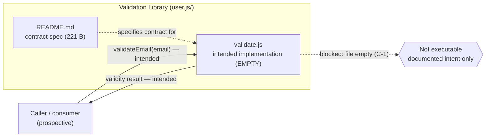
```mermaid
flowchart LR
    Caller["Caller / consumer<br/>(prospective)"]
    subgraph ValidationLibrary["Validation Library (user.js/)"]
        Readme["README.md<br/>contract spec (221 B)"]
        Impl["validate.js<br/>intended implementation (EMPTY)"]
        Readme -. "specifies contract for" .-> Impl
    end
    Caller -->|"validateEmail(email) — intended"| Impl
    Impl -->|"validity result — intended"| Caller
    Impl -.->|"blocked: file empty (C-1)"| NotImpl{{"Not executable<br/>documented intent only"}}
```

The sequence diagram below documents the intended `validateEmail` call flow. It is annotated as documented intent only, because the implementation file is empty and the flow cannot execute today.

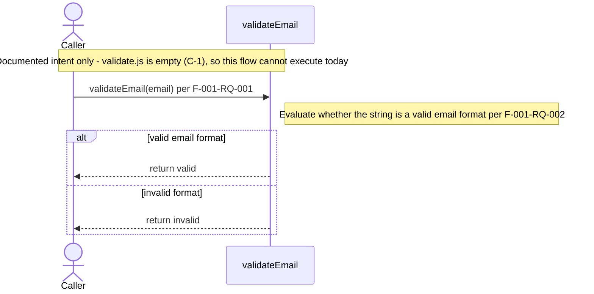
```mermaid
sequenceDiagram
    actor Caller
    participant Lib as validateEmail
    Note over Caller,Lib: Documented intent only - validate.js is empty (C-1), so this flow cannot execute today
    Caller->>Lib: validateEmail(email) per F-001-RQ-001
    Note right of Lib: Evaluate whether the string is a valid email format per F-001-RQ-002
    alt valid email format
        Lib-->>Caller: return valid
    else invalid format
        Lib-->>Caller: return invalid
    end
```

Finally, the state-transition diagram models the *implementation-maturity* lifecycle that applies to every artifact in the repository. It highlights that `validateEmail` (F-001) currently sits in the **Documented** state while eight of the nine tracked files remain in the **Placeholder** state; the **Implemented** and **Verified** states are not reached anywhere (constraint C-2).

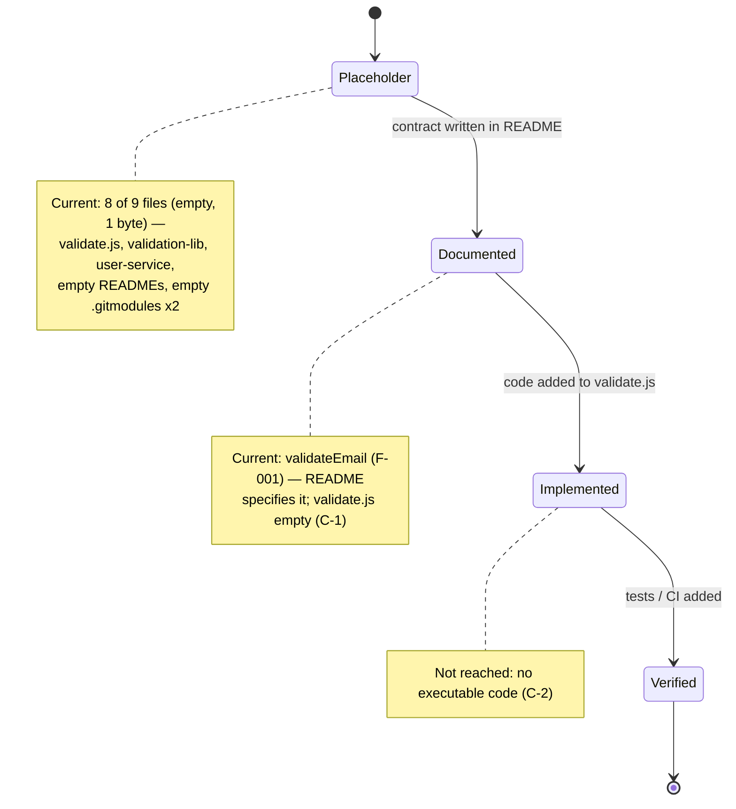
```mermaid
stateDiagram-v2
    [*] --> Placeholder
    Placeholder --> Documented: contract written in README
    Documented --> Implemented: code added to validate.js
    Implemented --> Verified: tests / CI added
    Verified --> [*]
    note right of Placeholder
        Current: 8 of 9 files (empty, 1 byte) —
        validate.js, validation-lib, user-service,
        empty READMEs, empty .gitmodules x2
    end note
    note right of Documented
        Current: validateEmail (F-001) — README
        specifies it; validate.js empty (C-1)
    end note
    note right of Implemented
        Not reached: no executable code (C-2)
    end note
```

### 5.2.2 Nested Scaffold Placeholder (`user-service-part/`)

**Purpose and responsibilities.** A nested placeholder subtree whose name suggests an intended "user service" component. It contains `.gitmodules`, `README.md`, and `user.js`, each of which is an empty (1-byte) placeholder. It documents and implements nothing.

- **Technologies and frameworks:** none present; `user-service-part/user.js` is empty despite its `.js` name.
- **Key interfaces and APIs:** none — no exports, functions, or documented contract.
- **Data persistence requirements:** none.
- **Scaling considerations:** not applicable — there is no code or runtime.
- **Critical consideration:** the folder's own `.gitmodules` is empty and defines no `[submodule]` sections, so it establishes no nested submodule (Assumption A-3, constraint C-6).

### 5.2.3 Name-Reserving Placeholders and Submodule Configuration

**Purpose and responsibilities.** Two ordinary files — `user-service` (root) and `user.js/validation-lib` — have names that reserve intended submodule-target mount points, and two `.gitmodules` files (root and `user-service-part/`) are intended to hold Git submodule configuration. Together they constitute the repository's QA-fixture aspect for nested Git-submodule handling.

- **Technologies and frameworks:** Git only (the `.gitmodules` INI-style configuration format).
- **Key interfaces and APIs:** none realized. The intended interface — Git submodule links resolving external repositories at these mount points — does not exist.
- **Data persistence requirements:** none.
- **Scaling considerations:** not applicable.
- **Critical considerations:** `user-service` and `user.js/validation-lib` are ordinary empty files at Git mode `100644`, **not** gitlinks (mode `160000`); both `.gitmodules` files are empty and declare no `[submodule]` sections. Consequently no nested submodules are configured despite the repository's name (Assumption A-3, constraints C-6; Section 1.2).

## 5.3 Technical Decisions

The repository contains no decision log, ADR file, or design-rationale document — a fact already recorded in Section 3.1.2 ("no explicit language-selection rationale, decision log, or style guide"). The decisions documented here are therefore *reconstructed from observable evidence*: the two things that were adopted (Git/GitHub for source control; documentation-first specification of `validateEmail`) and the many capabilities that were deliberately not adopted (choices made by omission). The stated tradeoffs are analytical — derived from the evidence — and are not quoted from the authors.

The decision tree below captures the evidence-based reasoning that governs *what* architecture can be documented for this repository; each branch resolves against a verified fact, and every branch resolves toward the "near-empty scaffold" outcome.

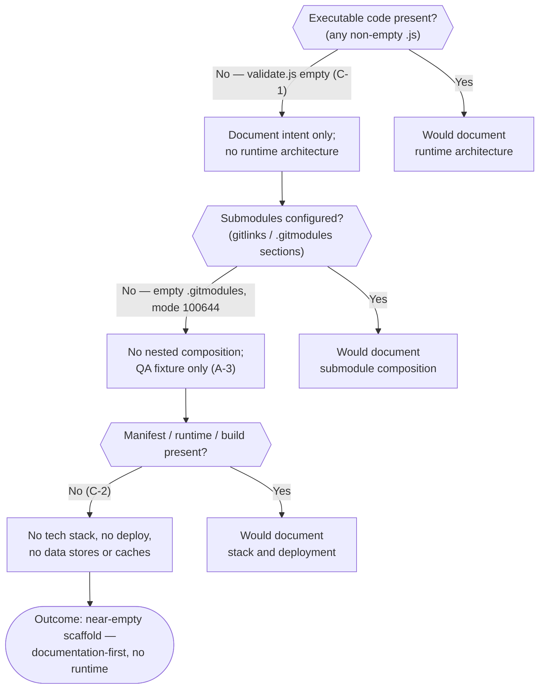
```mermaid
flowchart TD
    Q1{{"Executable code present?<br/>(any non-empty .js)"}}
    Q1 -->|"No — validate.js empty (C-1)"| A1["Document intent only;<br/>no runtime architecture"]
    Q1 -->|"Yes"| RuntimeArch["Would document<br/>runtime architecture"]
    A1 --> Q2{{"Submodules configured?<br/>(gitlinks / .gitmodules sections)"}}
    Q2 -->|"No — empty .gitmodules, mode 100644"| A2["No nested composition;<br/>QA fixture only (A-3)"]
    Q2 -->|"Yes"| Comp["Would document<br/>submodule composition"]
    A2 --> Q3{{"Manifest / runtime / build present?"}}
    Q3 -->|"No (C-2)"| A3["No tech stack, no deploy,<br/>no data stores or caches"]
    Q3 -->|"Yes"| Stack["Would document<br/>stack and deployment"]
    A3 --> Outcome(["Outcome: near-empty scaffold —<br/>documentation-first, no runtime"])
```

### 5.3.1 Architecture Style Decision and Tradeoffs

The observed decision is to define the system **documentation-first** as a directory-partitioned scaffold that mimics a nested-submodule composition, with no runtime architecture. The intended composition was not realized because both `.gitmodules` files are empty (Assumption A-3, constraint C-6).

| Aspect | Observed Choice | Alternative(s) Not Adopted | Consequence |
| --- | --- | --- | --- |
| Runtime architecture | None — static files plus documentation | Layered / microservice / monolithic application | No executable system; specification exists as intent only (C-1) |
| Composition | Directory subtrees mimicking nested submodules | Configured Git submodules; monorepo packages | QA-fixture layout with no real linkage (empty `.gitmodules`) |
| Interface style | In-process utility function (intended) | Network API (REST/RPC), CLI, service | Simplicity and no deployment surface, but the function is unimplemented |

### 5.3.2 Communication Pattern Choice

- **Realized pattern:** client–server version control only — the Git client exchanges objects with GitHub `origin/main` over HTTPS (Section 5.1.3).
- **Intended pattern (documented):** a synchronous, **in-process function call** — a caller invokes `validateEmail(email)` directly and receives a return value. This is the natural pattern for a utility library and requires no network transport.
- **Rationale and tradeoff (inferred):** an in-process call avoids serialization, network latency, and remote-failure handling, at the cost of not being independently deployable or callable across a process boundary. No asynchronous, event-driven, or message-based pattern is present or implied (Section 4.1.2).

### 5.3.3 Data Storage Solution Rationale

The observed decision is to use **no data storage** of any kind. The only documented behavior is a stateless email-format check that neither reads nor writes data (constraint C-4), so no database, no file store, and no object store is warranted (Section 3.5). The sole "storage" in play is Git's content-addressable object store, which persists the nine tracked source files on branch `main`; this is source-control storage, not application data storage.

### 5.3.4 Caching Strategy Justification

The observed decision is to use **no caching**. There is nothing to cache: no data is stored, no computation runs, and there is no runtime (constraints C-2, C-4). Even the intended `validateEmail` is a pure, deterministic, in-memory format check whose cost would not justify a cache. No in-memory, distributed, or HTTP cache is present or implied (Section 3.5).

### 5.3.5 Security Mechanism Selection

- **In-repository security mechanisms:** none. No authentication, authorization, secret management, input-sanitization code, or transport-security configuration exists in the tracked files (constraints C-3, C-4; Section 3.6.3).
- **Only realized control:** GitHub's authenticated access to the `origin` remote governs who may read/write the repository. No credentials or secrets are stored in tracked content.
- **Intended control (documented, unimplemented):** `validateEmail` is described as an input-format validation check — a control that would, once implemented, reject malformed email input. Because `user.js/validate.js` is empty, it provides no actual protection today (Section 3.1.3, constraint C-1).

### 5.3.6 Architecture Decision Records (ADRs)

The following ADRs are reconstructed from repository evidence; the repository itself contains no authored ADR documents. "Adopted by omission" denotes a capability that is consistently and verifiably absent, which the specification treats as a deliberate scaffold-stage choice rather than an accidental gap.

| ADR | Decision | Status | Consequence |
| --- | --- | --- | --- |
| ADR-01 | Use Git for version control and GitHub for hosting | Adopted (branch `main`, `origin` remote) | Distributed VCS; source recoverable from the remote; the only integration surface |
| ADR-02 | Specify `validateEmail` via documentation before implementation | Adopted (README written; `validate.js` empty) | Contract exists (F-001) but no working code (C-1) |
| ADR-03 | Partition intended functionality into directory subtrees mimicking nested submodules | Adopted structurally, not realized | QA-fixture layout; no configured submodules (A-3, C-6) |
| ADR-04 | Adopt JavaScript as the intended implementation language | Proposed / inferred (A-2) | No runtime, edition, or engine pinned (C-2) |
| ADR-05 | Forgo build, test, CI, and dependency tooling | Adopted by omission | Nothing to build or deploy; no supply-chain surface; no automated verification (C-2) |
| ADR-06 | Forgo data storage, caching, and application-layer security | Adopted by omission | Stateless design; GitHub authentication is the only security control (C-3, C-4) |

## 5.4 Cross-Cutting Concerns

Because the repository is a near-empty scaffold with no runtime and no deployment target (Section 3.6.2), most conventional cross-cutting concerns have no implementation. Each concern below records the observed state; where a capability is absent, that is stated plainly rather than assumed (constraints C-2, C-3). The only concern with a meaningfully realized mechanism is disaster recovery, which is provided by distributed version control. The table gives an at-a-glance summary; the subsections that follow provide detail.

| Concern | Observed Status | Reference |
| --- | --- | --- |
| Monitoring & observability | None | C-2, C-3; Section 3.6.2 |
| Logging & tracing | None (Git commit history is the only audit trail) | C-2; Assumption A-4 |
| Error handling | None implemented | C-2; Section 4.3.2 |
| Authentication & authorization | GitHub remote access control only | C-4; Section 3.6.3 |
| Performance requirements & SLAs | None defined | C-3 |
| Disaster recovery | Distributed Git + GitHub remote | Section 3.6 |

### 5.4.1 Monitoring and Observability

No monitoring or observability capability exists. There are no metrics, health checks, dashboards, application-performance-monitoring (APM) agents, or telemetry exporters anywhere in the tracked files (constraints C-2, C-3). Because the repository is not deployed, served, or executed (Section 3.6.2), there is no running process, endpoint, or resource to observe.

### 5.4.2 Logging and Tracing

No application logging framework and no distributed tracing instrumentation are present (constraint C-2); there is no logger, no log configuration, and no trace/span emission. The only audit trail associated with the repository is its **Git commit history** — ten commits dated 2026-07-23 with `Create <file>` / `Update README.md` messages — which records the authoring of files, not runtime events. Requirement versioning is anchored to this history (Assumption A-4). This is a version-control record, not an operational log or trace.

### 5.4.3 Error Handling

No error-handling code is implemented anywhere in the repository — there is no `try`/`catch`, no error type, no retry, no fallback, and no error-notification path (constraint C-2), consistent with Section 4.3.2. Two error behaviors are nonetheless relevant:

- **Actual error surface (current state).** Invoking the unimplemented `validateEmail` would fail at the call site (an undefined/reference error), and no handler exists to catch, log, or recover from it.
- **Intended handling (documented).** For the format check itself, the documented contract returns a validity *result value* (valid/invalid) rather than raising an exception; no retry, fallback, or recovery procedure is documented for the intended function.

The error-handling flow below distinguishes the actual (unhandled) failure path from the intended validity-result path.

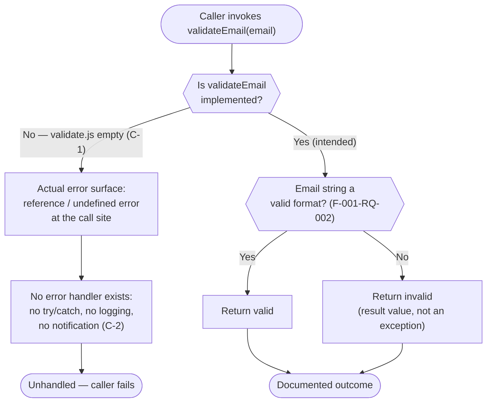
```mermaid
flowchart TD
    Start(["Caller invokes validateEmail(email)"])
    Start --> Impl{{"Is validateEmail<br/>implemented?"}}
    Impl -->|"No — validate.js empty (C-1)"| ActualErr["Actual error surface:<br/>reference / undefined error<br/>at the call site"]
    ActualErr --> NoHandler["No error handler exists:<br/>no try/catch, no logging,<br/>no notification (C-2)"]
    NoHandler --> EndActual(["Unhandled — caller fails"])
    Impl -->|"Yes (intended)"| FormatCheck{{"Email string a<br/>valid format? (F-001-RQ-002)"}}
    FormatCheck -->|"Yes"| RetValid["Return valid"]
    FormatCheck -->|"No"| RetInvalid["Return invalid<br/>(result value, not an exception)"]
    RetValid --> EndIntended(["Documented outcome"])
    RetInvalid --> EndIntended
```

### 5.4.4 Authentication and Authorization

No authentication or authorization framework exists inside the repository. There are no user roles, personas, identity providers, tokens, or permission checks in the tracked files (constraint C-4). The only access control that applies is **GitHub's authentication and authorization** governing read/write access to the `origin` remote; no credentials or secrets are stored in tracked content (Section 3.6.3). The documented `validateEmail` is an input-format check, not an authentication mechanism.

### 5.4.5 Performance Requirements and SLAs

No performance requirements or service-level agreements are defined anywhere in the repository (constraint C-3). There is no latency target, throughput goal, uptime/availability commitment, performance budget, or benchmark. The intended `validateEmail` has no documented performance criteria (Sections 2.2, 2.4). This subsection therefore records the explicit absence of such requirements rather than assuming any value.

### 5.4.6 Disaster Recovery

The single realized resilience mechanism is **distributed version control**. Git replicates the full commit history and tracked content between local working trees and the GitHub remote `origin/main`, so any clone constitutes a complete backup and recovery is achieved by re-cloning or re-pulling from the remote (Section 3.6). Because there is no runtime, database, or generated artifact, the only asset to recover is the source itself. No recovery-time or recovery-point objectives (RTO/RPO), backup schedule, failover topology, or disaster-recovery runbook is documented (constraint C-3).

## 5.5 References

The following repository artifacts, version-control state, and prior specification sections were inspected as evidence for Section 5. No web sources were used, and no external dependencies exist to cite.

**Repository files and folders**

- `user.js/README.md` — Sole substantive file (221 bytes); documented the `validateEmail(email)` contract (feature F-001, requirements F-001-RQ-001/002), the usage example, and the unterminated fenced code block (constraint C-5). Basis for the Validation Library component, its intended interface, and the sequence/error-handling diagrams.
- `user.js/validate.js` — Empty intended implementation file; established that F-001 is unimplemented (constraint C-1) and that no runtime architecture exists.
- `user.js/validation-lib` — Empty (1-byte) name-reserving placeholder file; established it is an ordinary file (mode `100644`), not a configured submodule/gitlink.
- `user.js/` — The Validation Library folder; the only component of documented substance and an intended nested component.
- `README.md` (root) — Empty root README; established there is no root-level composition, entry point, or documentation.
- `.gitmodules` (root) — Empty submodule-configuration file; established that no root submodules are declared.
- `user-service` (root) — Empty (1-byte) name-reserving placeholder file; established it is an ordinary file, not a submodule.
- `user-service-part/` — Nested scaffold placeholder folder; the intended "user service" subtree.
- `user-service-part/.gitmodules` — Empty; established that no nested submodule is declared at this level.
- `user-service-part/README.md` — Empty; documents nothing.
- `user-service-part/user.js` — Empty; implements nothing.

**Repository version-control state (Git)**

- Git metadata for branch `main` — `git ls-files` showed all nine tracked files at mode `100644` (no gitlinks/`160000`); `git submodule status` returned nothing (no submodules configured); the commit history (ten `Create`/`Update` commits dated 2026-07-23) established the authoring/audit trail and the distributed-VCS disaster-recovery mechanism via the GitHub `origin` remote. (The remote's embedded credential was deliberately not reproduced.)

**Cross-referenced Technical Specification sections**

- `1.2 System Overview` — Near-empty-scaffold framing; submodule/composition facts; system boundaries.
- `1.3 Scope` — System boundary defined as the nine tracked files on branch `main`.
- `2.1 Feature Catalog` — Definition of feature F-001 (`validateEmail`).
- `2.2 Functional Requirements` — Requirements F-001-RQ-001/002; absence of performance criteria.
- `2.3 Feature Relationships` — Absence of shared components/services.
- `2.4 Implementation Considerations` — Stateless in-memory check; absence of performance/security requirements.
- `2.6 Assumptions and Constraints` — Assumptions A-1 through A-4 and constraints C-1 through C-6 reused throughout Section 5.
- `3.1 Programming Languages` — Intended-JavaScript inference; absence of a decision log; `validateEmail` as an intended input-validation control.
- `3.4 Third-Party Services` — Absence of external application integrations.
- `3.5 Databases & Storage` — Absence of databases, caches, and object/file storage.
- `3.6 Development & Deployment` — Git/GitHub-only toolchain; no deployment target; GitHub authenticated access as the only security control.
- `4.1 System Workflows` — Absence of runtime/application data flows and integrations beyond Git ↔ GitHub.
- `4.3 Technical Implementation` — Error-handling framing (Section 4.3.2) used for consistency in Section 5.4.3.

# 6. SYSTEM COMPONENTS DESIGN

## 6.1 Core Services Architecture

### 6.1.1 Applicability Assessment

The `QA-nested-submodule-test-23-July` repository is a near-empty, version-controlled scaffold with no executable code, no runtime, and no deployment target (Sections 1.2, 3.6, 5.1). On this basis:

**Core Services Architecture is not applicable for this system.**

The repository defines no services of any kind — no microservices, no distributed or multi-process components, and no independently deployable or network-addressable service units. This is a direct, evidence-based consequence of the repository's actual state, verified both by direct inspection of the nine tracked files and by the cross-cutting findings recorded in Sections 1.2 (System Overview), 3.6 (Development & Deployment), 5.1 (High-Level Architecture), and 5.4 (Cross-Cutting Concerns).

The three standard triggers for a Core Services Architecture were each evaluated against the repository and found absent:

| Determination Criterion | Verdict | Supporting Evidence |
| --- | --- | --- |
| Microservices present? | None | No service process, framework, or entry point exists; 8 of the 9 tracked files are empty and the ninth is a Markdown document (Section 1.2). |
| Distributed / multi-process architecture present? | None | No runtime, network endpoint, message bus, or deployment target; the system "is not deployed, served, or executed anywhere" (Section 3.6.2). |
| Distinct, deployable service components? | None | `user-service` and `user.js/validation-lib` are empty regular files (Git mode `100644`), and both `.gitmodules` files are empty — name-reserving placeholders, not services or submodules (constraint C-6; Section 5.1). |

**Naming caveat.** The repository name and several path names (`user-service`, `user-service-part/`, `user.js/validation-lib`) evoke a service-oriented, nested-submodule composition. This is an intended QA-fixture layout only (assumption A-3): no submodules are configured and every entry is an ordinary empty file, so the names do not denote services. The single element with any documented behavior is `validateEmail(email)` in `user.js/README.md` — an in-process, single-function utility that is documented intent only and remains unimplemented (constraint C-1; `user.js/validate.js` is empty).

Because there is no service topology to depict, the diagram below records the applicability determination itself and the only elements that actually exist: one in-process (unimplemented) function and the single realized interface — Git version control against the GitHub remote. It thus stands in for the "service interaction" view, showing that the only realized interaction is version-control synchronization rather than any service-to-service call.

**Diagram 6.1.1-A — Core Services Architecture Applicability Determination.**

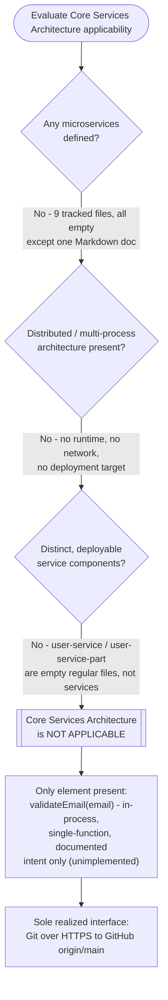
```mermaid
flowchart TD
    Start(["Evaluate Core Services Architecture applicability"])
    Start --> Q1{"Any microservices<br/>defined?"}
    Q1 -->|"No - 9 tracked files, all empty<br/>except one Markdown doc"| Q2{"Distributed / multi-process<br/>architecture present?"}
    Q2 -->|"No - no runtime, no network,<br/>no deployment target"| Q3{"Distinct, deployable<br/>service components?"}
    Q3 -->|"No - user-service / user-service-part<br/>are empty regular files, not services"| Verdict[["Core Services Architecture<br/>is NOT APPLICABLE"]]
    Verdict --> Only["Only element present:<br/>validateEmail(email) - in-process,<br/>single-function, documented<br/>intent only (unimplemented)"]
    Only --> VCS["Sole realized interface:<br/>Git over HTTPS to GitHub origin/main"]
```

The remaining subsections (6.1.2–6.1.4) address the specific Service Components, Scalability Design, and Resilience Patterns concerns enumerated by the section prompt, recording for each the observed status and the evidence establishing why it is not applicable (with the sole exception of version-control-level disaster recovery noted in 6.1.4).

### 6.1.2 Service Components

Because the system contains no services (Section 6.1.1), none of the standard service-component concerns are realized. Each concern required by the section prompt is recorded below with its observed status and supporting evidence; every item is *Not applicable* on the current codebase.

| Service-Component Concern | Status | Observed State (Evidence) |
| --- | --- | --- |
| Service boundaries & responsibilities | Not applicable | No service exists to bound; the only documented unit is the in-process `validateEmail` function. Directory names such as `user-service/` are empty placeholders, not bounded services (Sections 1.2, 5.1). |
| Inter-service communication patterns | Not applicable | There is no second service and no communication surface — no HTTP/REST, gRPC, messaging/queues, or RPC anywhere in the tracked files (Sections 5.1, 5.4). |
| Service discovery mechanisms | Not applicable | No service registry, DNS-based discovery, or Consul/Eureka-style component is present; there is nothing to register or discover (constraint C-2). |
| Load balancing strategy | Not applicable | No runtime, no replicas, and no reverse proxy or load balancer exist; there is no request traffic to distribute (Section 3.6.2). |
| Circuit breaker patterns | Not applicable | There are no inter-service calls to protect and no resilience libraries or error-handling code present (Section 5.4.3; constraint C-2). |
| Retry & fallback mechanisms | Not applicable | No error handling is implemented — no retry, backoff, or fallback path exists anywhere (Section 5.4.3). |

**Intended in-process design (for completeness).** Even the one documented capability is not a service. If `validateEmail(email)` were implemented per `user.js/README.md`, it would be a stateless library function invoked directly, in-process, by a caller — returning a validity result rather than communicating over a network (Sections 2.2, 5.1). It would therefore introduce no service boundaries, discovery, load balancing, or circuit breaking even once realized.

No additional diagram is added for this subsection: the only realized interaction — Git-over-HTTPS synchronization with the GitHub remote — is depicted in **Diagram 6.1.1-A**, and there are no service-to-service interactions to portray.

### 6.1.3 Scalability Design

Scalability design presupposes a runtime that serves load and can be scaled along a compute, memory, or throughput dimension. This repository has no deployment target and no runtime environment — it "is not deployed, served, or executed anywhere" (Section 3.6.2) — so there is no workload to scale and no infrastructure to provision. Every scalability concern required by the section prompt is therefore *Not applicable*, as recorded below.

| Scalability Concern | Status | Observed State (Evidence) |
| --- | --- | --- |
| Horizontal / vertical scaling approach | Not applicable | There is no running process or deployable artifact to scale out (more instances) or up (larger instance); nothing executes (Section 3.6.2). |
| Auto-scaling triggers & rules | Not applicable | No orchestrator (Kubernetes, autoscaling group, or serverless platform) and no metrics source exist, so no scaling policy or trigger can be defined (constraint C-2). |
| Resource allocation strategy | Not applicable | No CPU/memory/storage requests, limits, or quotas are declared; there is no infrastructure-as-code or container specification (Section 3.6; constraint C-2). |
| Performance optimization techniques | Not applicable | There is no executable code path to optimize, no caching layer, and no performance budget or SLA (Section 5.4.5; constraint C-3). |
| Capacity planning guidelines | Not applicable | No throughput, concurrency, request-rate, or traffic-growth targets are documented anywhere (constraint C-3). |

**Storage footprint (for scale context).** The entire tracked content is nine files totaling well under one kilobyte, of which only `user.js/README.md` (221 bytes) is non-empty. There is no data store, cache, or generated artifact whose growth would require planning (constraint C-4; Section 5.4). The only "scaling" behavior the repository exhibits is Git's inherent replication of the full history to each additional clone — a version-control property, not an application scaling strategy.

The diagram below shows the actual topology — a single version-controlled working tree synchronized with the GitHub remote — alongside the conventional scalable runtime tier (load balancer, horizontal replicas, auto-scaler) that is deliberately absent here.

**Diagram 6.1.3-A — Actual Topology vs. Absent Scalable Runtime Tier.**

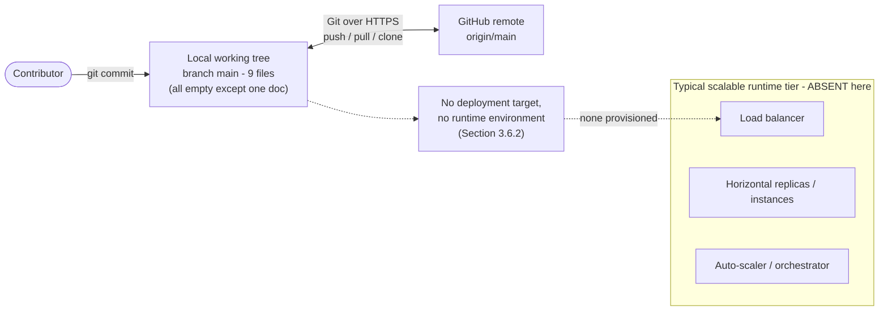
```mermaid
flowchart LR
    Dev(["Contributor"])
    Local["Local working tree<br/>branch main - 9 files<br/>(all empty except one doc)"]
    Remote["GitHub remote<br/>origin/main"]
    Dev -->|"git commit"| Local
    Local <-->|"Git over HTTPS<br/>push / pull / clone"| Remote
    Note["No deployment target,<br/>no runtime environment<br/>(Section 3.6.2)"]
    Local -.-> Note
    subgraph Absent["Typical scalable runtime tier - ABSENT here"]
        LB["Load balancer"]
        Rep["Horizontal replicas / instances"]
        AS["Auto-scaler / orchestrator"]
    end
    Note -.->|"none provisioned"| LB
```

The realized left-hand path is the complete scalability picture; the boxed right-hand tier is shown only to make explicit which conventional scaling components are not present.

### 6.1.4 Resilience Patterns

Service-level resilience patterns require running services that can fail, retry, degrade, and fail over. Because there is no runtime (Section 3.6.2) and no error-handling code (Section 5.4.3), the service-oriented resilience concerns are *Not applicable*. The one resilience mechanism that is genuinely realized operates at the version-control layer: distributed Git replication provides source-level data redundancy and disaster recovery (Section 5.4.6). Each concern required by the section prompt is recorded below.

| Resilience Concern | Status | Observed State (Evidence) |
| --- | --- | --- |
| Fault tolerance mechanisms | Not applicable | There is no running service to tolerate faults; no error handling, retry, or fallback logic exists (Section 5.4.3; constraint C-2). |
| Disaster recovery procedures | Realized (VCS-level only) | Distributed Git means any clone is a complete backup; recovery is by re-cloning or re-pulling `origin/main`. No RTO/RPO, backup schedule, or DR runbook is documented (Section 5.4.6; constraint C-3). |
| Data redundancy approach | Realized (source only) | The full commit history is replicated across every clone and the GitHub remote. No application data exists to replicate (constraint C-4). |
| Failover configurations | Not applicable | There is no active/standby pair, replica set, or cluster; with no runtime, there is nothing to fail over (Section 3.6.2). |
| Service degradation policies | Not applicable | There is no service, request traffic, feature flag, or graceful-degradation path; nothing can degrade (constraint C-2). |

**Actual failure surface.** The only failure that can occur today is at authoring time: invoking the unimplemented `validateEmail` would raise a reference error at the call site with no handler to catch it (Section 5.4.3). This is a documentation/implementation gap (constraint C-1), not a service-resilience concern.

The diagram below depicts the single realized resilience pattern — distributed version-control redundancy — showing each clone and the remote as a full copy, and recovery by restoring from `origin/main`.

**Diagram 6.1.4-A — Realized Resilience: Distributed Version-Control Redundancy.**

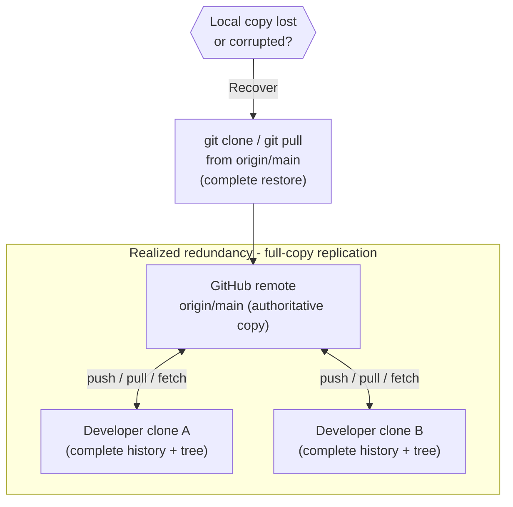
```mermaid
flowchart TD
    subgraph Redundancy["Realized redundancy - full-copy replication"]
        Remote["GitHub remote<br/>origin/main (authoritative copy)"]
        Clone1["Developer clone A<br/>(complete history + tree)"]
        Clone2["Developer clone B<br/>(complete history + tree)"]
    end
    Remote <-->|"push / pull / fetch"| Clone1
    Remote <-->|"push / pull / fetch"| Clone2
    Loss{{"Local copy lost<br/>or corrupted?"}}
    Loss -->|"Recover"| Recover["git clone / git pull<br/>from origin/main<br/>(complete restore)"]
    Recover --> Remote
```

Because there is no runtime, this version-control redundancy is the entirety of the system's resilience posture; the service-oriented patterns in the table above become relevant only if and when executable services are introduced.

### 6.1.5 References

**Repository files examined**

- `user.js/README.md` - the only substantive tracked file; documents the intended, unimplemented in-process `validateEmail(email)` utility, establishing that the sole design intent is a single library function rather than any service.
- `user.js/validate.js` - empty intended implementation file; confirms `validateEmail` is unimplemented (constraint C-1).
- `.gitmodules` (root) and `user-service-part/.gitmodules` - both empty; confirm that no submodules — and therefore no composed/service components — are configured.
- `README.md` (root) - empty root README; no service or composition definition.
- `user-service` and `user.js/validation-lib` - empty regular files (Git mode `100644`) named like service/submodule targets; established that the service-suggestive names are name-reserving placeholders, not services.
- `user-service-part/README.md` and `user-service-part/user.js` - empty nested placeholder files.

**Repository folders examined**

- `user.js/` - folder holding the validation-library documentation and the empty implementation file.
- `user-service-part/` - nested placeholder folder; all contained files empty.
- Repository root (`/`) - established the complete four-child top-level layout.

**Repository verification (Git metadata)**

- `git ls-files --stage`, `git submodule status`, `git branch -a` - confirmed 9 tracked files, all mode `100644` (no gitlinks/mode 160000), zero configured submodules, and a single branch `main`.

**Technical Specification sections cross-referenced**

- Section 1.2 System Overview - file inventory; repository declares no integrations and stands entirely alone.
- Section 2.6 Assumptions and Constraints - constraints C-1 through C-6 and assumptions A-1 through A-4 (notably A-3, the QA-fixture layout; C-1, unimplemented feature; C-2, no runtime/build/deps; C-3, no SLAs/KPIs; C-4, no stored data; C-6, branch `main`, 9 files all mode `100644`).
- Section 3.6 Development & Deployment - no build system, CI/CD, containerization, or IaC; explicitly no deployment target and no runtime environment (3.6.2).
- Section 5.1 High-Level Architecture - no implemented runtime architecture style; sole external integration is GitHub source hosting over Git/HTTPS.
- Section 5.4 Cross-Cutting Concerns - no monitoring, no error handling (no retry/fallback), no performance requirements/SLAs; disaster recovery provided by distributed Git plus the GitHub remote (5.4.6).

## 6.2 Database Design

### 6.2.1 Applicability Assessment

The `QA-nested-submodule-test-23-July` repository is a near-empty, version-controlled scaffold with no executable code, no runtime, and no configured datastore (Sections 1.2, 3.5, 5.1). Direct inspection of all nine tracked files — eight of which are empty single-newline placeholders and the ninth a 221-byte Markdown document — confirms there is no database, no persistence layer, and no data model of any kind. On this basis:

**Database Design is not applicable to this system.**

The repository defines no database or persistent storage: there is no relational, document, key-value, graph, or search datastore; no schema, model, or migration; no data-access layer; and no object/file/blob storage integration. This is a direct, evidence-based consequence of the repository's actual state, corroborated by Section 3.5 (Databases & Storage), which states plainly that "the repository uses no database, no cache, and no storage service of any kind," and by Sections 1.2 (System Overview) and 1.3 (Scope). The only durable storage mechanism present is Git's own content-addressable object store, which holds the tracked source files — repository content under version control, not application data.

The standard triggers that would necessitate a database design were each evaluated against the repository and found absent:

| Determination Criterion | Verdict | Supporting Evidence |
| --- | --- | --- |
| Any database or datastore configured? | None | No database driver/client, connection string/DSN, or ORM appears in any tracked file; a full-content keyword sweep (postgres, mysql, mongo, sqlite, redis, dynamo, cassandra, and related terms) over branch `main` returns zero matches (Section 3.5). |
| Any persistence or storage layer present? | None | No models, migrations, repositories/DAOs, schema/DDL, or file/blob storage client exists; `user.js/validate.js`, the only intended implementation file, is an empty 1-byte placeholder (constraint C-1). |
| Any data written, read, or retained? | None | The sole data concept is an email-address string referenced only conceptually in `user.js/README.md`; per Section 1.3, "no data is stored or processed" (constraint C-4). |
| Dependency or infrastructure implying a datastore? | None | No package manifest, container specification, or infrastructure-as-code declares a database or storage service anywhere (Section 3.6; constraint C-2). |

Because there is no schema, dataset, or storage tier to depict, the diagram below records the applicability determination itself and identifies the only durable store that actually exists — Git's object store of source files. It thereby establishes the baseline against which the remaining subsections (6.2.2–6.2.5) record each required Database Design concern as *Not applicable*, with the narrow exceptions of source-level Git redundancy and Git-based version history that are noted where relevant.

**Diagram 6.2.1-A — Database Design Applicability Determination.**

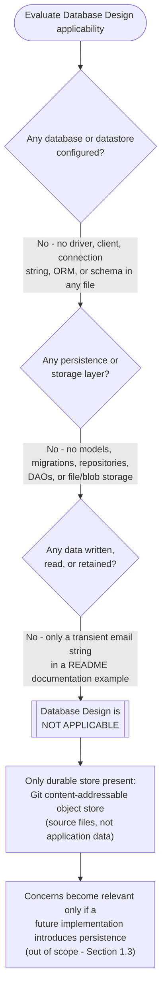
```mermaid
flowchart TD
    Start(["Evaluate Database Design applicability"])
    Start --> Q1{"Any database or datastore<br/>configured?"}
    Q1 -->|"No - no driver, client, connection<br/>string, ORM, or schema in any file"| Q2{"Any persistence or<br/>storage layer?"}
    Q2 -->|"No - no models, migrations, repositories,<br/>DAOs, or file/blob storage"| Q3{"Any data written,<br/>read, or retained?"}
    Q3 -->|"No - only a transient email string<br/>in a README documentation example"| Verdict[["Database Design is<br/>NOT APPLICABLE"]]
    Verdict --> Only["Only durable store present:<br/>Git content-addressable object store<br/>(source files, not application data)"]
    Only --> Future["Concerns become relevant only if a<br/>future implementation introduces persistence<br/>(out of scope - Section 1.3)"]
```

**Naming caveat.** The repository name and several path names (`user-service`, `user-service-part/`, `user.js/validation-lib`) evoke a data-bearing, service-oriented composition. This is an intended QA-fixture layout only (assumption A-3): both `.gitmodules` files are empty, no submodules are configured, and every entry is an ordinary regular file (Git mode `100644`), so the names denote neither services nor datastores. The single element with any documented behavior — `validateEmail(email)` in `user.js/README.md` — is a stateless, in-process string check that, even as specified, neither reads nor writes persistent data; it is documented intent only and remains unimplemented (constraint C-1). Consequently, every database-design concern enumerated by the section prompt is addressed below as not applicable, with supporting evidence.

### 6.2.2 Schema Design

Schema design presupposes a datastore with defined structures to model, index, partition, replicate, and back up. This repository has none (Section 6.2.1), so there is no schema to design. Every schema-design concern required by the section prompt is recorded below with its observed status and the evidence establishing why it is not applicable; two concerns (replication and backup) have a narrow source-level realization through Git that is described in the dedicated subsections that follow.

| Schema Concern | Status | Observed State (Evidence) |
| --- | --- | --- |
| Entity relationships | None | No entities and no relationships are defined; there is no ORM, schema, or DDL in any tracked file (Section 3.5). |
| Data models & structures | None | No table, collection, document, or type definition exists; the only data concept is a transient email string described in `user.js/README.md` (Section 1.3). |
| Indexing strategy | None | No database exists, so zero indexes are defined (see the inventory in 6.2.2.2). |
| Partitioning approach | None | No table or dataset exists to partition, shard, or range/hash-distribute (constraint C-4). |
| Replication configuration | None (DB); Git-level only | No database replication is configured; the only realized replication is distributed version control (see 6.2.2.3 and Diagram 6.2.2-B). |
| Backup architecture | None (DB); Git-level only | No datastore backup exists; source-file redundancy is provided by distributed Git and the GitHub remote (see 6.2.2.4; Section 6.1.4). |

#### 6.2.2.1 Entity Relationships and Data Models

There are no entities, relationships, or data models in the repository. No relational tables, document collections, key-value namespaces, or typed record structures are defined anywhere, and no ORM or schema definition file exists (Section 3.5). The only data concept referenced in the entire codebase is a single email-address string, and only conceptually: `user.js/README.md` documents an intended `validateEmail(email)` function that "checks whether an email contains a valid format," using the illustrative example `validateEmail("test@example.com")`. That string is a documentation example, not stored application data — per Section 1.3, no data is stored or processed, and the intended function (had it been implemented) would perform an in-process, stateless format check that neither reads from nor writes to any persistent store.

The entity-relationship diagram below is therefore necessarily degenerate: it depicts the sole data concept the system references — a transient email string — explicitly annotated to record that it is never persisted and participates in no relationships. There are no foreign keys, associations, or cardinalities because no second entity and no datastore exist.

**Diagram 6.2.2-A — Conceptual Data Model (ERD): Single Transient, Non-Persisted Concept.**

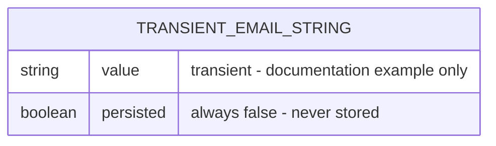
```mermaid
erDiagram
    TRANSIENT_EMAIL_STRING {
        string value "transient - documentation example only"
        boolean persisted "always false - never stored"
    }
```

This ERD stands in for the required "database schema diagram." It intentionally contains one standalone entity with no relationships, reflecting that the repository defines no persistent schema; the `persisted` attribute is shown as permanently false to make the non-persistence explicit.

#### 6.2.2.2 Indexing and Partitioning Strategy

No indexing or partitioning strategy exists because there is no schema, table, or dataset to index or partition. There are no primary, unique, secondary, composite, full-text, or spatial indexes; no partition keys, shards, or range/hash/list partitions; and no clustering or sort keys. The output-format requirement to "document all indexes and constraints" is satisfied by the exhaustive inventory below, which enumerates zero of each because no database object is defined anywhere in the tracked files.

| Database Object | Count | Detail |
| --- | --- | --- |
| Tables / collections | 0 | None defined — no database or datastore exists (Section 3.5). |
| Indexes (primary, unique, secondary, composite) | 0 | None defined — there is no table or collection to index. |
| Constraints (primary key, foreign key, unique, check, not-null) | 0 | None defined — no schema or DDL exists in any tracked file. |
| Partitions / shards | 0 | None defined — no dataset exists to partition or distribute (constraint C-4). |

Partitioning, clustering, and any read/write index tuning would become relevant only if a future implementation introduced a datastore; that is out of scope for the current repository (Section 1.3).

#### 6.2.2.3 Replication Configuration

No database replication is configured. There is no primary/writer node, no read replica, no replica set or cluster, and no write-ahead-log, binlog, or logical-replication stream — because no database exists (Section 6.2.1). The only replication the system genuinely exhibits is a property of distributed version control: each Git clone holds a complete copy of the repository history, and the GitHub remote `origin/main` serves as the authoritative copy that clones synchronize with via `git push`, `git pull`, and `git fetch` (Section 6.1.4). This is source-file replication, not application-data replication.

The diagram below contrasts the realized version-control replication (left) with the conventional database replication tier (right) that is deliberately absent here.

**Diagram 6.2.2-B — Replication Architecture: Realized Git Redundancy vs. Absent Database Replication Tier.**

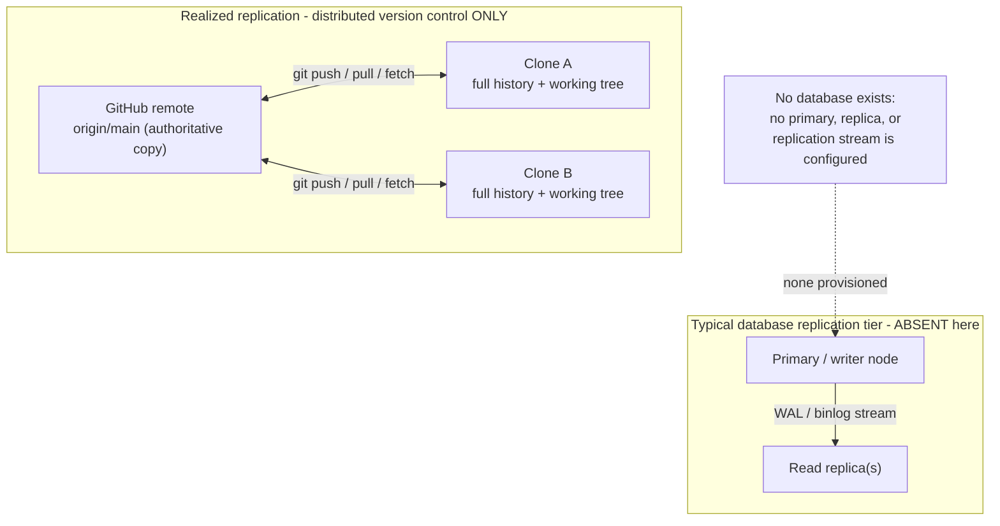
```mermaid
flowchart TD
    subgraph Realized["Realized replication - distributed version control ONLY"]
        Remote["GitHub remote<br/>origin/main (authoritative copy)"]
        CloneA["Clone A<br/>full history + working tree"]
        CloneB["Clone B<br/>full history + working tree"]
    end
    Remote <-->|"git push / pull / fetch"| CloneA
    Remote <-->|"git push / pull / fetch"| CloneB
    subgraph Absent["Typical database replication tier - ABSENT here"]
        Primary["Primary / writer node"]
        Replica["Read replica(s)"]
        Primary -->|"WAL / binlog stream"| Replica
    end
    NoDB["No database exists:<br/>no primary, replica, or<br/>replication stream is configured"]
    NoDB -.->|"none provisioned"| Primary
```

The realized left-hand cluster is the complete replication picture; the boxed right-hand tier is shown only to make explicit which conventional database-replication components are not present.

#### 6.2.2.4 Backup Architecture

There is no database backup architecture — no scheduled snapshots, point-in-time recovery, dump/restore pipeline, or backup retention tier — because there is no datastore to back up (Section 3.5). The only backup posture the system has is again a version-control property: because Git is distributed, every clone and the GitHub remote each constitute a complete, self-contained backup of the full commit history, and recovery is performed by re-cloning or re-pulling `origin/main` (Section 6.1.4). No recovery-time objective (RTO), recovery-point objective (RPO), backup schedule, or disaster-recovery runbook is documented anywhere (constraint C-3). These source-level guarantees protect the repository's files; they are not a database backup strategy, and none is required given the absence of stored data (constraint C-4).

### 6.2.3 Data Management

Data management covers how data is migrated, versioned, archived, stored, retrieved, and cached over its lifecycle. Because the system defines no datastore and stores no data (Section 6.2.1), none of these concerns operate on application data. The only mechanisms that are genuinely realized apply to the repository's own source files under Git: version history and content-addressable storage of the tracked files. Each concern required by the section prompt is recorded below.

| Data-Management Concern | Status | Observed State (Evidence) |
| --- | --- | --- |
| Migration procedures | None | No schema exists and no migration tool or files (Flyway, Liquibase, Alembic, Knex, Sequelize, Prisma) are present anywhere (Section 3.5; constraint C-2). |
| Versioning strategy | Source-level only (Git) | No data or schema versioning; the repository's files are versioned by Git commit history on branch `main` (Section 1.2). |
| Archival policies | None | No data is produced or stored, so there is nothing to archive, tier, or expire (constraint C-4). |
| Data storage & retrieval | None (Git object store only) | No read/write code path exists; the only storage is Git's content-addressable object store holding the 9 tracked files (~229 bytes total) (Section 3.5). |
| Caching policies | None | No cache is configured — no Redis/Memcached tier and no in-process cache (Section 3.5). |

**Storage and retrieval — what actually moves.** The only data flow in the system is version-control activity: a contributor commits changes to the tracked files, and those files synchronize with the GitHub remote `origin/main` over Git-run HTTPS. No application datastore is ever read from or written to. The email-address string in `user.js/README.md` is an illustrative documentation token that flows nowhere at runtime — it is never parsed, transmitted, or persisted — and the intended implementation file `user.js/validate.js` is empty, so no read/write or persistence code path exists (constraint C-1).

**Versioning.** The system's only versioning mechanism is Git: file revisions are tracked as commits, and the authoritative line of history is branch `main`. This is source-artifact versioning, not data or schema versioning; there is no dataset whose versions require management (Section 1.2).

**Migration, archival, and caching.** With no schema there is no forward/backward migration path; with no stored data there is no archival or retention tiering; and with no runtime there is no cache to populate, invalidate, or expire. Each of these would become relevant only if a future implementation introduced persistence, which is out of scope (Section 1.3).

The data-flow diagram below depicts the single realized flow (authoring and Git synchronization) and shows, with dashed edges, the persistence paths that do not exist — clarifying that the documented email string and the empty implementation file never reach any datastore.

**Diagram 6.2.3-A — Data Flow: Version-Control Activity Only; No Persistence Path.**

```mermaid
flowchart LR
    Author(["Contributor / author"])
    subgraph Repo["Version-controlled tracked files (branch main)"]
        Readme["user.js/README.md<br/>documents validateEmail(email)<br/>example string: test@example.com"]
        Impl["user.js/validate.js<br/>empty - no read/write logic"]
    end
    GH["GitHub remote<br/>origin/main"]
    Author -->|"git commit"| Repo
    Repo <-->|"Git over HTTPS<br/>push / pull / clone"| GH
    Store[["Application datastore<br/>(NONE - does not exist)"]]
    Readme -.->|"illustrative string only -<br/>never read, written, or persisted"| Store
    Impl -.->|"no persistence code path"| Store
```

The solid edges are the entirety of the realized data flow; the dashed edges to the "Application datastore" node record that no read, write, or persistence path exists.

### 6.2.4 Compliance Considerations

Data-compliance controls govern how stored data is retained, protected, kept private, audited, and access-controlled. Because the repository holds no database and stores no data at rest (Section 3.5), there is no data-protection surface: no personally identifiable information (PII) is collected, processed, or stored, so no data-retention, privacy, or data-access-control regime is required or defined. Two concerns have a narrow realization at the repository/version-control layer — source redundancy via Git and an authorship trail via commit history — and one (access) is governed by GitHub repository authentication. Each concern required by the section prompt is recorded below.

| Compliance Concern | Status | Observed State (Evidence) |
| --- | --- | --- |
| Data retention rules | None (no data) | No datastore and no stored data exist; there is no PII and no data at rest to retain, expire, or purge (Section 3.5; constraint C-4). |
| Backup & fault-tolerance policies | Git-level only | Distributed Git plus the GitHub remote provide source-file redundancy; no database backup or fault-tolerance policy exists, and no RTO/RPO is documented (Section 6.1.4; constraint C-3). |
| Privacy controls | Not applicable | No personal data is collected, processed, or stored; the string `test@example.com` in `user.js/README.md` is an illustrative documentation example, not stored data (Section 3.5; constraint C-4). |
| Audit mechanisms | Source-level only (Git) | No application or database audit log exists; the only audit trail is Git commit history (authorship and timestamps) on branch `main` (Section 1.2). |
| Access controls | Repository-level only | No database roles, grants, or row-/column-level security exist; access is governed solely by GitHub repository authentication over HTTPS (Section 3.6). |

**Privacy and retention.** Section 3.5 records the security implication directly: because no datastore or storage service exists, "there is no data at rest to encrypt, back up, access-control, or classify, and the repository stores no personally identifiable information (PII)." The only data domain the repository even references is email-address strings, and only conceptually (Section 1.3); no such value is ever stored, so data-retention schedules, right-to-erasure handling, and data-classification tiers are all not applicable. These considerations would arise only if a future implementation introduced persistence (Section 1.3).

**Audit and access.** The system defines no database audit mechanism (no change-data-capture, no audit tables, no access logging). The only audit trail available is the Git commit history — a record of who changed which files and when — which is a version-control property rather than a data-audit control. Likewise, there are no database access controls; the sole enforced control is authenticated access to the GitHub-hosted repository over HTTPS (Section 3.6). No secrets or credentials are stored in tracked content.

### 6.2.5 Performance Optimization

Database performance optimization tunes how queries execute, how results are cached, how connections are pooled, how reads and writes are routed, and how bulk work is batched. All of these presuppose a running datastore serving a query workload. This repository has no database, no runtime, and no executable code path (Sections 3.5, 6.2.1), so there is no query workload to optimize and no performance budget or SLA against which to optimize it (Section 5.4.5; constraint C-3). Each concern required by the section prompt is recorded below as not applicable, with supporting evidence.

| Performance Concern | Status | Observed State (Evidence) |
| --- | --- | --- |
| Query optimization patterns | Not applicable | No database and no queries exist to plan, index, denormalize, or tune; there is no query planner to analyze (Section 3.5). |
| Caching strategy | None | No cache tier (Redis/Memcached) and no in-process/result cache are configured; there are no results to cache (Section 3.5). |
| Connection pooling | Not applicable | No database connection is ever opened, so there is no pool to size, warm, or bound; no client library or DSN exists (constraint C-2). |
| Read/write splitting | Not applicable | No primary/replica topology exists, so there are no reads or writes to route across nodes (see Diagram 6.2.2-B). |
| Batch processing approach | None | No ETL/batch/stream job, scheduler, or bulk data path exists anywhere in the tracked files (Sections 1.2, 4.1). |

**Why none of these apply.** Query optimization, connection pooling, and read/write splitting all operate against live database connections and query plans, none of which the system possesses. Caching requires a workload whose results are worth reusing; with no data access, there is nothing to cache. Batch processing requires a data pipeline or scheduled job; the repository contains no such job, no scheduler, and no bulk-load path — its only "processing" is version-control activity (Section 4.1). The one documented capability, `validateEmail(email)`, is specified as a stateless in-process string check that would touch no datastore even if implemented, so it introduces no query, connection, or batch concern (Section 6.1.2). All of the above would become relevant only if a future implementation introduced a datastore and a query workload, which is out of scope for the current repository (Section 1.3).

### 6.2.6 References

**Repository files examined**

- `user.js/README.md` - the only substantive tracked file (221 bytes); documents the intended, unimplemented `validateEmail(email)` utility and establishes that the sole data concept is a transient email-address string (example `test@example.com`) that is never stored or processed.
- `user.js/validate.js` - empty (1-byte) intended implementation file; confirms no read/write, persistence, or data-access code path exists (constraint C-1).
- `.gitmodules` (root) and `user-service-part/.gitmodules` - both empty; confirm that no submodules — and therefore no composed data-bearing components — are configured.
- `README.md` (root) - empty root README; contains no schema, data model, or storage definition.
- `user-service` and `user.js/validation-lib` - empty regular files (Git mode `100644`) named like service/submodule targets; established that these data-suggestive names are name-reserving placeholders, not datastores.
- `user-service-part/README.md` and `user-service-part/user.js` - empty nested placeholder files; no data definitions.

**Repository folders examined**

- `user.js/` - folder holding the validation-library documentation and the empty implementation file.
- `user-service-part/` - nested placeholder folder; all contained files empty.
- Repository root (`/`) - established the complete top-level layout and the absence of any manifest, schema, migration, or infrastructure file.

**Repository verification (Git metadata and content)**

- `git ls-files --stage` and `git submodule status` - confirmed 9 tracked files, all mode `100644` (no gitlinks/mode 160000), zero configured submodules, and a single branch `main`; total tracked content ~229 bytes.
- Full-content keyword sweep across branch `main` (database, postgres, mysql, mongo, sqlite, redis, dynamo, cassandra, schema, migration, index, constraint, connection pool, and ORM/tool names) - returned no matches, confirming no database, ORM, migration, schema, cache, or storage code/config exists in tracked content.
- Repository file listing - confirmed no package manifest, SQL/DDL file, container specification, or infrastructure-as-code file is present anywhere.

**Technical Specification sections cross-referenced**

- Section 1.2 System Overview - near-empty scaffold; the repository declares no database configuration and no integrations; `validateEmail` is documented intent only.
- Section 1.3 Scope - the only data domain is email-address strings referenced conceptually; no data is stored or processed; persistence is explicitly out of scope.
- Section 2.6 Assumptions and Constraints - constraints C-1 (unimplemented feature; `validate.js` empty), C-2 (no manifest/runtime/build/dependencies), C-3 (no KPIs/SLAs/performance or compliance requirements), C-4 (no stored data; only data domain is email strings), C-6 (branch `main`, 9 files all mode `100644`); assumptions A-2 (intended language JavaScript) and A-3 (QA-fixture layout, no submodules configured).
- Section 3.5 Databases & Storage - the repository uses no database, cache, or storage service of any kind; the only durable store is Git's content-addressable object store; no PII and no data at rest.
- Section 3.6 Development & Deployment - no build system, containerization, CI/CD, or IaC; repository access is governed by GitHub authentication over HTTPS.
- Section 4.1 System Workflows - no batch, ETL, scheduled, or event-driven data-processing flow exists; the only realized flow is version-control activity.
- Section 5.4 Cross-Cutting Concerns - no performance requirements or SLAs are defined (5.4.5).
- Section 6.1 Core Services Architecture - source of the applicability-assessment pattern mirrored here; establishes that the only realized replication/backup/disaster-recovery mechanism is distributed Git redundancy with the GitHub remote `origin/main`, with no RTO/RPO or DR runbook documented (6.1.4).

## 6.3 Integration Architecture

### 6.3.1 Integration Architecture Applicability Assessment

**Integration Architecture is not applicable for this system at the application level.** The `QA-nested-submodule-test-23-July` repository is a near-empty version-controlled scaffold that contains no executable application code, no runtime, no build or dependency manifest, and no configuration of any kind. Consequently, it neither exposes nor consumes any application programming interface, participates in no message-processing pipeline, and integrates with no third-party, legacy, or cloud service at runtime.

This determination is grounded in exhaustive, direct inspection of the repository rather than inference. A case-insensitive content sweep (`git grep`) across all tracked files for a comprehensive set of integration keywords — spanning transport and framework terms (`http`, `https`, `rest`, `graphql`, `grpc`, `rpc`, `soap`, `express`, `flask`), messaging terms (`kafka`, `rabbit`, `amqp`, `sqs`, `sns`, `pubsub`, `kinesis`, `queue`, `broker`, `event`, `stream`, `webhook`), security terms (`oauth`, `jwt`, `token`, `apikey`, `rate-limit`, `throttle`), and gateway/client terms (`gateway`, `proxy`, `nginx`, `kong`, `sdk`, `axios`, `fetch`, `httpclient`) — returns **zero matches**. Correspondingly, the repository tracks **no** manifest, specification, or configuration artifact (no `package.json`, lockfile, `requirements.txt`, `pyproject.toml`, `pom.xml`, `go.mod`, `*.yaml`/`*.yml`, `*.toml`, `.env`, `Dockerfile`, `docker-compose`, `*.tf`, `openapi`/`swagger`, `*.proto`, `*.wsdl`, or `*.graphql`).

The complete tracked inventory is nine files on branch `main`, all recorded as Git mode `100644` (regular files) with zero gitlinks (`160000`); of these, eight are empty single-newline placeholders and only `user.js/README.md` (221 bytes) carries substantive content. That single document describes an *intended* in-process utility function, `validateEmail(email)`, whose implementation file `user.js/validate.js` is empty — the interface is documented intent only and cannot be invoked (constraint C-1). None of this content constitutes an integration surface.

#### 6.3.1.1 Determination Criteria

Each canonical integration concern was evaluated against observed repository evidence. Every application-level concern resolves to "None"; the sole affirmative finding is the development-time Git remote, which is an operational source-hosting link rather than an application integration.

| Determination Criterion | Verdict | Supporting Evidence |
|---|---|---|
| Inbound/outbound network API (HTTP/REST/GraphQL/RPC/SOAP) | None | Zero keyword matches; no server, client, route, or controller code in any tracked file |
| Message-oriented middleware (queue/broker/event/stream) | None | No broker, queue, topic, or publisher/consumer code or configuration present |
| Third-party / SaaS runtime integration | None | No SDK, client, base URL, credential, or service contract (corroborated by §3.4) |
| Legacy system interface | None | No adapter, connector, file drop, or protocol bridge in the tree |
| API gateway / reverse proxy | None | No gateway, proxy, `nginx`, `envoy`, or `kong` configuration tracked |
| External service contract (OpenAPI/proto/WSDL/GraphQL SDL) | None | No `*.proto`, `*.wsdl`, `openapi`/`swagger`, or `*.graphql` artifact exists |
| Batch/scheduled integration jobs (cron/ETL) | None | No scheduler, cron, or ETL definition present |
| Development-time source-hosting link (Git remote) | Present (only integration) | `origin` remote targets `github.com/Sandeep01Kumar/QA-nested-submodule-test-23-July` over HTTPS on branch `main` |

#### 6.3.1.2 Applicability Decision Path

The following decision flow traces the evaluation to its conclusion and identifies the two elements that remain in scope for the rest of this section: the development-time Git-over-HTTPS link to GitHub (a realized but non-application integration, documented for completeness), and the documented-but-unimplemented in-process `validateEmail(email)` interface.

```mermaid
flowchart TD
    Start(["Evaluate Integration Architecture applicability"])
    Start --> Q1{"System exposes or consumes any API<br/>(HTTP / REST / GraphQL / RPC)?"}
    Q1 -->|"No - zero API code or config;<br/>keyword sweep returns no matches"| Q2{"Any message processing present<br/>(queue / broker / event / stream / batch)?"}
    Q2 -->|"No - no broker, queue, topic,<br/>or scheduler anywhere"| Q3{"Any third-party, legacy, or gateway<br/>runtime integration present?"}
    Q3 -->|"No - no SDK, client, base URL,<br/>service contract, or gateway config"| Verdict[["Integration Architecture is<br/>NOT APPLICABLE (application level)"]]
    Verdict --> Sole["Sole realized integration:<br/>Git over HTTPS to GitHub origin/main<br/>(development-time source hosting)"]
    Sole --> Intent["Sole documented interface:<br/>in-process validateEmail(email)<br/>- unimplemented (constraint C-1)"]
```

The subsections that follow (6.3.2 API Design, 6.3.3 Message Processing, 6.3.4 External Systems) each restate the applicable concerns from the section prompt and document the observed state. Because the application-level determination is uniformly "not applicable," those subsections primarily record the *absence* of each concern with the supporting evidence, while 6.3.4 fully documents the one realized integration — the GitHub source-hosting remote — and the in-process function interface.

### 6.3.2 API Design

Network API Design is not applicable to this system: the repository defines no service, exposes no endpoint, and consumes no external API. The only programmatic interface described anywhere in the codebase is an **in-process** utility function, `validateEmail(email)`, specified in prose within `user.js/README.md`. That interface is a same-process, in-memory function contract — it involves no transport protocol, no serialization, no authentication, and no authorization — and its implementation (`user.js/validate.js`) is empty, so it is documented intent only and cannot currently be invoked (constraint C-1). The following subsections evaluate each API Design concern from the section prompt and then document the one interface that does exist on paper.

#### 6.3.2.1 API Design Concerns

Every concern in the prompt's API Design checklist is evaluated below against observed evidence. Each resolves to "not applicable" at the application level; where a related capability exists at the development/version-control layer (authentication credential, source versioning), it is noted and cross-referenced rather than misattributed to an application API.

| API Design Concern | Status | Observed State (Evidence) |
|---|---|---|
| Protocol specifications | Not applicable | No network protocol; the only interface is an in-process function call. No `http`/`rest`/`graphql`/`grpc`/`soap` code or config (zero keyword matches) |
| Authentication methods | Not applicable (application) | No authentication code in any tracked file. A GitHub HTTPS credential exists only for the development-time Git remote (documented in 6.3.4), not for any application API |
| Authorization framework | Not applicable | No roles, permissions, or access-control logic; no user model or protected resource (constraint C-4) |
| Rate limiting strategy | Not applicable | No server, endpoint, or gateway exists to throttle; no `rate-limit`/`throttle` construct present |
| Versioning approach | Not applicable (API) | No API version scheme. Source content is revision-controlled by Git commits on branch `main` (10 commits, all 2026-07-23), which versions files, not an API contract |
| Documentation standards | Prose only (informal) | The sole interface is documented as free-form Markdown in `user.js/README.md`; no OpenAPI/Swagger, JSDoc, or formal schema. The usage example sits in a fenced code block opened with a `javascript` language tag but never closed (malformed markdown, constraint C-5) |

#### 6.3.2.2 In-Process Programmatic Interface

The `user.js/README.md` document titles itself "Validation Library" and describes "A small validation utility library" exposing a single function under a "Functions" heading. The specification is captured below. Because there is no module system, package manifest, or export statement anywhere in the repository (constraint C-2), the function is not importable and the specification represents design intent rather than a callable contract.

| Attribute | Specification (from `user.js/README.md`) | Status |
|---|---|---|
| Interface name | `validateEmail(email)` | Documented |
| Interface style | In-process synchronous function call (no network, no serialization) | Documented intent |
| Input parameter | `email` (string) | Documented |
| Stated behavior | "Checks whether an email contains a valid format" | Documented |
| Return value | Not specified in the documentation | Undocumented |
| Example usage | `validateEmail("test@example.com")` (inside an unclosed code fence, C-5) | Documented |
| Implementation | `user.js/validate.js` is empty (1 byte, single newline) | Unimplemented (C-1) |
| Invocability | No export/module system; cannot be imported or called | Not invocable (C-2) |

The diagram below contrasts the (documented, unimplemented) in-process call path with the conventional network API stack that a service would provide — a gateway, authentication/authorization middleware, a versioned endpoint, and a request handler — all of which are **absent** here. This makes explicit that none of the standard API Design concerns (protocol, auth, authz, rate limiting, versioning) have any realization in the repository.

```mermaid
flowchart TB
    Caller["Prospective caller<br/>(same process, in-memory)"]
    subgraph Documented["Documented intent - in-process (unimplemented)"]
        Fn["validateEmail(email)<br/>stateless function contract"]
        Impl["user.js/validate.js<br/>(EMPTY - not implemented, C-1)"]
        Fn -.->|"would delegate to"| Impl
    end
    Caller -->|"direct function call<br/>(no network, no serialization)"| Fn
    subgraph Absent["Conventional network API stack - ABSENT"]
        GW["API gateway / reverse proxy"]
        AuthN["AuthN + AuthZ middleware"]
        Ver["Versioned REST / GraphQL / RPC endpoint"]
        Ctl["Controller / request handler"]
        GW --> AuthN
        AuthN --> Ver
        Ver --> Ctl
    end
    Caller -.->|"none present<br/>(no protocol, auth, rate limit, versioning)"| GW
```

### 6.3.3 Message Processing

Message Processing is not applicable to this system. The repository contains no message-oriented middleware, no event bus, no stream processor, and no batch/scheduled job. A content sweep for messaging and eventing keywords (`kafka`, `rabbit`, `amqp`, `mqtt`, `sqs`, `sns`, `pubsub`, `kinesis`, `queue`, `broker`, `event`, `stream`, `webhook`, `websocket`, `celery`, `cron`, `batch`, `etl`) returns zero matches across all nine tracked files, and no broker or scheduler configuration is present (constraint C-2). Because there is no executing code and no data is stored or processed (constraint C-4), there are likewise no producers, consumers, topics, dead-letter queues, or asynchronous workflows to describe.

#### 6.3.3.1 Message Processing Concerns

The prompt's Message Processing checklist is evaluated below. Each concern resolves to "not applicable." The only realized data transfer in the system — Git object exchange with GitHub — is synchronous, request/response file transfer rather than message-based processing, and is documented as an external system in 6.3.4 rather than as a messaging pipeline.

| Message Processing Concern | Status | Observed State (Evidence) |
|---|---|---|
| Event processing patterns | Not applicable | No event emitter, subscriber, or handler; no `event`/`pubsub` construct in any tracked file |
| Message queue architecture | Not applicable | No broker, queue, or topic; no Kafka/RabbitMQ/SQS/SNS client or configuration present |
| Stream processing design | Not applicable | No stream processor, windowing, or Kinesis/Flink/Spark dependency; no `stream` construct present |
| Batch processing flows | Not applicable | No batch job, ETL pipeline, cron schedule, or scheduler definition tracked |
| Error handling strategy | Not applicable (no runtime) | No executing code, therefore no runtime error handling or retry/DLQ policy. Transport-level error handling for the Git remote is delegated to the Git client and GitHub (see 6.3.4), outside application scope |

#### 6.3.3.2 Message Flow Model

The diagram below documents the absence of a message-processing tier alongside the one data transfer that does occur. The upper region enumerates the standard components a message-driven system would contain — a producer, a broker/queue, a topic or dead-letter queue, and a consumer/stream processor — none of which exist here (rendered with dashed connectors to signal their absence). The lower region shows the only realized transfer: the local working tree exchanging Git pack objects with GitHub over HTTPS, which is a synchronous request/response operation (`push`/`pull`), explicitly not asynchronous messaging.

```mermaid
flowchart LR
    subgraph Absent["Message-processing infrastructure - ABSENT"]
        Prod["Producer / publisher"]
        Broker["Message broker / queue<br/>(Kafka / RabbitMQ / SQS ...)"]
        Topic["Topic / stream / dead-letter queue"]
        Cons["Consumer / stream processor"]
        Prod -.-> Broker
        Broker -.-> Topic
        Topic -.-> Cons
    end
    subgraph Realized["Only realized data transfer (synchronous, not messaging)"]
        WT["Local working tree<br/>9 tracked files (branch main)"]
        GH["GitHub origin/main"]
        WT <-->|"Git pack objects over HTTPS<br/>push / pull (request-response)"| GH
    end
```

Because the sole transfer mechanism is request/response rather than message-driven, none of the messaging concerns (ordering guarantees, delivery semantics, backpressure, dead-letter handling, idempotency) apply to this system.

### 6.3.4 External Systems

At the application level the repository integrates with no external system. It ships no third-party client or SDK, defines no legacy-system interface, configures no API gateway, and declares no external service contract. The single external system the repository interacts with is **GitHub**, and it does so exclusively as a Git source-hosting remote over HTTPS — an operational, development-time integration rather than a runtime application integration. This subsection inventories all external dependencies, documents the GitHub integration pattern and its data-exchange contract, and records the absence of legacy interfaces and gateway configuration.

#### 6.3.4.1 External Dependency Inventory

The prompt requires that all external dependencies be documented. The complete set is enumerated below. The repository declares no package manifest, so there are no open-source runtime/library dependencies to resolve (constraint C-2); the only external system dependency is the GitHub remote used for source hosting.

| External Dependency | Type | Integration / Protocol | Status |
|---|---|---|---|
| GitHub (`origin` remote) | Source hosting & version control (SaaS) | Git over HTTPS (`push`/`pull`/`clone`/`fetch`) | Realized (development-time) |
| External application APIs | Third-party HTTP/RPC service | None declared or consumed | None |
| Legacy systems | Enterprise/legacy interface | None | None |
| API gateway / reverse proxy | Edge infrastructure | None | None |
| Runtime library/package dependencies | Open-source packages | None (no manifest or lockfile, C-2) | None |

#### 6.3.4.2 Third-Party Integration Pattern — GitHub Source Hosting

The `origin` remote targets `github.com/Sandeep01Kumar/QA-nested-submodule-test-23-July` and is used purely as a distributed version-control endpoint: the local working tree pushes and pulls Git objects to and from the hosted repository. Consistent with Section 3.4, the repository makes **no** use of the GitHub REST or GraphQL API, configures **no** webhooks, and defines **no** GitHub Actions workflows — there is no `.github/` directory or CI configuration in the tree. The integration is therefore a plain source-mirroring pattern between a developer's checkout and the hosted origin, with GitHub serving as both the canonical source of truth and, by virtue of Git's distributed model, an off-site backup of the complete history.

The integration flow below situates the sole external system relative to the system boundary. A contributor authors and commits content into the nine-file working tree; that tree synchronizes bidirectionally with the GitHub origin over Git-over-HTTPS. The categories of external system that are conspicuously **not** integrated — third-party APIs/SaaS, legacy interfaces, and cloud services — are shown with dashed connectors to indicate their absence.

```mermaid
flowchart TD
    Dev(["Contributor / developer"])
    subgraph SystemB["System boundary - 9 tracked files (branch main)"]
        Repo["Repository content<br/>docs + empty placeholders"]
    end
    Dev -->|"author / commit"| Repo
    Repo <-->|"Git over HTTPS<br/>push / pull / clone / fetch"| GH["GitHub (origin remote)<br/>source hosting / version control"]
    subgraph AbsentExt["External systems - NONE integrated at runtime"]
        TP["Third-party APIs / SaaS"]
        Legacy["Legacy system interfaces"]
        Cloud["Cloud services (AWS / GCP / Azure)"]
    end
    Repo -.->|"no client, SDK, or service contract"| TP
    Repo -.-> Legacy
    Repo -.-> Cloud
```

#### 6.3.4.3 External Service Contract and Exchange Sequence

The only external service "contract" the system honors is the Git smart-HTTP transfer protocol used to communicate with GitHub. The remote URL uses the HTTPS scheme and carries an embedded access token for authentication; the token itself is treated as a secret and is never reproduced in this document. There is no negotiated API schema, versioned payload, or SLA associated with this exchange — Section 5.1 records the SLA as "None defined" (constraint C-3). The interaction is a standard authenticated Git handshake followed by packfile transfer, summarized in the sequence below.

| Contract Attribute | Value | Source / Status |
|---|---|---|
| Endpoint | `github.com/Sandeep01Kumar/QA-nested-submodule-test-23-July` (`origin`) | Verified |
| Transport & protocol | Git smart-HTTP over HTTPS | Verified |
| Authentication | Token-based HTTPS credential embedded in remote URL (secret, not reproduced) | Verified |
| Payload | Git ref advertisements and pack objects (repository history/tree) | Verified |
| SLA / rate policy | None defined (constraint C-3) | Verified |

```mermaid
sequenceDiagram
    participant Dev as Contributor
    participant Git as Local Git client
    participant GH as GitHub origin/main (HTTPS)
    Dev->>Git: git commit (author change on branch main)
    Git->>GH: HTTPS connect + token authentication
    GH-->>Git: ref advertisement / capability negotiation
    Git->>GH: git push (send pack objects)
    GH-->>Git: update-refs acknowledgement
    Note over Git,GH: Clone / fetch reverses the object transfer
    Dev->>Git: git clone / git pull
    Git->>GH: request refs + packfile
    GH-->>Git: send objects (complete history + tree)
```

#### 6.3.4.4 Legacy System Interfaces and API Gateway

There are no legacy system interfaces and no API gateway configuration in this repository. No adapter, connector, file-drop, screen-scraping bridge, or protocol translator is present, and there is no `nginx`, `envoy`, `kong`, or reverse-proxy configuration tracked. The repository name references "nested submodule" testing, and two empty `.gitmodules` files exist (`.gitmodules` and `user-service-part/.gitmodules`), but both are empty single-newline placeholders: `git submodule status` returns nothing and every tracked entry is Git mode `100644` (no `160000` gitlinks), so **no** submodule — and therefore no nested-repository integration — is actually configured (assumption A-3, constraint C-6). These files are name-reserving placeholders for a QA fixture, not functioning integration points.

### 6.3.5 References

The following repository artifacts, Git metadata verifications, and previously authored specification sections were examined as evidence for this Integration Architecture section.

**Repository files examined**

- `user.js/README.md` - the sole substantive file (221 bytes); documents the intended in-process `validateEmail(email)` interface, its input/behavior/example, and the unclosed code-fence (C-5)
- `user.js/validate.js` - empty implementation file confirming the `validateEmail` interface is unimplemented (C-1)
- `README.md` - empty root readme; confirmed no integration content
- `.gitmodules` - empty root submodule file; confirmed no submodule/nested-repository configuration
- `user-service-part/.gitmodules` - empty; confirmed no nested submodule integration
- `user-service-part/README.md` - empty placeholder
- `user-service-part/user.js` - empty placeholder
- `user-service` - empty regular file (not a gitlink)
- `user.js/validation-lib` - empty regular file (not a gitlink)

**Repository folders examined**

- `` (repository root) - established the nine-file tracked inventory and top-level structure
- `user.js/` - contained the "Validation Library" documentation and its empty implementation
- `user-service-part/` - contained only empty placeholder files

**Git metadata verification**

- `git ls-files --stage` - confirmed 9 tracked files, all mode `100644`, zero `160000` gitlinks (C-6)
- `git grep` (integration keyword sweep) - returned zero matches for API, messaging, auth, gateway, and client terms
- `git submodule status` - returned nothing, confirming no configured submodules (A-3)
- `git remote -v` - established the `origin` GitHub remote over HTTPS (token redacted, never reproduced)
- `git log` - confirmed 10 commits, all dated 2026-07-23 (GitHub web-UI scaffolding pattern)

**Technical specification cross-references**

- Section 3.4 Third-Party Services - confirmed no application-level external service; GitHub remote is the only third-party dependency; no GitHub API usage, webhooks, or Actions workflows
- Section 5.1 High-Level Architecture - confirmed the system boundary, the Git-over-HTTPS external interface, and the "None defined" SLA (C-3)
- Section 6.1 Core Services Architecture - provided the Applicability Assessment pattern mirrored here and confirmed the distributed-Git-only integration topology
- Section 2.6 Assumptions and Constraints - source of the constraint identifiers (C-1, C-2, C-3, C-4, C-5, C-6) and assumptions (A-2, A-3) referenced throughout this section

## 6.4 Security Architecture

### 6.4.1 Security Architecture Applicability and Posture

The `QA-nested-submodule-test-23-July` repository is a near-empty, version-controlled scaffold with no executable code, no runtime, no deployment target, and no configured datastore (Sections 1.2, 3.6, 5.1, 6.2). A full-content security keyword sweep across branch `main` — covering authentication, authorization, session, token, password, cryptography, TLS, secret-management, and compliance terms — returns zero matches in the tracked files, and no package manifest, environment file, or committed secret/credential exists anywhere (constraints C-2, C-4). On this basis:

**Detailed Security Architecture is not applicable for this system.**

There is no application to secure: no identity to manage, no session or token to issue, no role or permission to enforce, no network endpoint to protect, and no data at rest or in flight beyond the repository's own source files. This section therefore documents the **standard security practices** that govern the repository's development and hosting lifecycle in place of an application security architecture, and it records each authentication, authorization, and data-protection concern required by the section prompt with its observed status and supporting evidence. The single element with any documented security relevance — `validateEmail(email)` in `user.js/README.md` — is a conceptual input-format check that is documented but unimplemented (constraint C-1) and, even as specified, performs no authentication, authorization, or cryptographic function; Section 5.4.4 records it explicitly as "an input-format check, not an authentication mechanism."

#### 6.4.1.1 Applicability Determination

The standard triggers that would necessitate a dedicated security architecture were each evaluated against the repository and found absent. The verdicts below are direct, evidence-based consequences of the repository's actual state.

| Determination Criterion | Verdict | Supporting Evidence |
| --- | --- | --- |
| Any authentication / identity code or provider? | None | Keyword sweep returns zero matches; Section 3.4 confirms no Auth0/OAuth/OIDC/identity-provider configuration and no authentication code. |
| Any authorization / RBAC / permission logic? | None | No user roles or personas are defined (constraint C-4); Section 5.4.4 confirms no permission checks in tracked files. |
| Any sensitive data or PII stored or processed? | None | The only data domain is email-address strings referenced conceptually; "no data is stored or processed" (Section 1.3; constraint C-4). |
| Any cryptography, secrets, or key material? | None | No crypto library, key, or secret exists; "no service credentials, secrets, tokens, or environment files are stored in the tracked repository content" (Section 3.4). |
| Any deployed runtime or network attack surface? | None | The repository is "not deployed, served, or executed" (Sections 3.6.2, 5.4.1); no endpoint, port, or process exists (constraint C-2). |

#### 6.4.1.2 Standard Security Practices in Effect

Because there is no application security surface, the security posture reduces to the standard practices that protect the source-authoring and version-control lifecycle. These operate at the development and hosting layer, not inside the (nonexistent) application, and are the practices "followed instead" of a detailed security architecture.

| Standard Practice | How It Applies to This Repository | Evidence / Reference |
| --- | --- | --- |
| Authenticated, encrypted VCS transport | All Git operations to the `origin` remote traverse GitHub's authenticated Git transport over HTTPS/TLS. | Section 3.4; `origin` remote uses the `https://` scheme |
| Platform-managed access control | Read/write access is governed entirely by GitHub account authentication and the repository permission model. | Sections 5.4.4, 6.2.4 |
| Secret hygiene (no committed secrets) | No credentials, tokens, keys, or environment files are present in tracked content; the checkout credential lives only in local Git config, never in the repository. | Section 3.4 security note |
| Minimal supply-chain surface | With no package manifest and zero declared dependencies, there is no third-party/transitive dependency to introduce vulnerabilities. | Constraint C-2; Section 3.3 |
| Tamper-evident authorship trail | The Git commit history (ten commits dated 2026-07-23) records who changed which files and when, serving as the only audit record. | Section 5.4.2 |
| Intended input validation (future) | `validateEmail(email)` is documented as an input-format control; unimplemented today, it would be an application-layer defensive check if built. | `user.js/README.md`; constraint C-1 |

#### 6.4.1.3 Security Zones and Trust Boundaries

Even without an application, the repository's lifecycle spans three real trust zones plus one conventional zone that is deliberately absent. Zone 1 is the contributor's local workstation, where the working tree and the local Git client (which holds the checkout credential that is never committed) reside. Zone 2 is the public network, crossed only via the TLS-encrypted Git-over-HTTPS channel. Zone 3 is the GitHub-managed hosting platform, which performs authentication and permission enforcement before granting access to the authoritative `origin/main` copy. The conventional application runtime/deployment zone does not exist, because the repository is never built, served, or executed (constraint C-2). The single boundary crossing that carries any security weight is the local-to-GitHub transition, which is both authenticated and encrypted.

**Diagram 6.4.1-A — Security Zones and Trust Boundaries.**

```mermaid
flowchart LR
    subgraph Local["Zone 1: Contributor workstation (trusted local)"]
        Dev["Contributor"]
        WT["Working tree<br/>9 tracked files, branch main"]
        LG["Local Git client<br/>holds checkout credential<br/>(never committed to repo)"]
        Dev --> WT
        WT --> LG
    end
    subgraph Net["Zone 2: Public network (encrypted transit)"]
        TLS["Git-over-HTTPS<br/>TLS-encrypted channel"]
    end
    subgraph GH["Zone 3: GitHub hosting (managed platform)"]
        Gate["GitHub authentication<br/>+ repository permissions"]
        Origin["Repository origin/main<br/>(authoritative copy)"]
        Gate --> Origin
    end
    subgraph Absent["Application runtime / deployment zone"]
        None["DOES NOT EXIST:<br/>no runtime, endpoint, or datastore (C-2)"]
    end
    LG -->|"push / fetch / clone"| TLS
    TLS --> Gate
    WT -.->|"no build or deploy step"| None
```

| Trust Zone | Contents | Boundary Control |
| --- | --- | --- |
| Zone 1 — Contributor workstation | Working tree (9 tracked files) and local Git client holding the checkout credential | Local OS/user account (outside repository scope) |
| Zone 2 — Public network | Git-over-HTTPS traffic in transit | TLS encryption of the channel |
| Zone 3 — GitHub hosting | Authoritative `origin/main` copy and platform access controls | GitHub authentication + repository permissions |
| Absent — Application runtime | Nothing — no process, endpoint, or datastore | Not applicable (no runtime exists) |

#### 6.4.1.4 Security Control Applicability Matrix

The matrix below is the at-a-glance security control map for the section. It records, for every control domain enumerated by the section prompt, whether the control is realized and where — the recurring pattern being that no control is realized at the application level, while a small number are realized at the version-control/hosting layer. The detailed subsections (6.4.2–6.4.4) expand each row.

| Control Domain | Application-Level Status | Realized Mechanism (if any) |
| --- | --- | --- |
| Authentication (identity, MFA, session, token, password) | Not applicable | GitHub account authentication for repository access only |
| Authorization (RBAC, permissions, resource authz, PEP) | Not applicable | GitHub repository permission model only |
| Audit logging | Not applicable | Git commit history (authorship + timestamps) only |
| Encryption in transit | Not applicable (no app traffic) | TLS via Git-over-HTTPS to GitHub |
| Encryption at rest / key management | Not applicable | No data at rest; no keys or secrets exist |
| Data masking / privacy controls | Not applicable | No PII collected, processed, or stored |
| Compliance controls (GDPR/HIPAA/PCI/SOC 2) | Not applicable | None required or declared (constraint C-3) |


### 6.4.2 Authentication Framework

No application authentication framework exists in this repository. There is no login flow, no identity provider, no session store, no token issuer or verifier, and no password handling in any tracked file — Section 3.4 confirms there is "no Auth0/OAuth/OIDC/identity-provider configuration and no authentication code," and Section 5.4.4 confirms there are "no user roles, personas, identity providers, tokens, or permission checks in the tracked files" (constraint C-4). The only authentication that applies anywhere in the repository's lifecycle is **GitHub account authentication**, which governs access to the `origin` remote when a contributor clones, fetches, or pushes over HTTPS. This is a platform-layer control provided by GitHub, not a framework implemented by the system.

#### 6.4.2.1 Authentication Concerns

Each authentication concern required by the section prompt is recorded below with its application-level status and the evidence establishing why it is not applicable, followed by the platform-layer mechanism (if any) that plays the equivalent role.

| Authentication Concern | Application-Level Status | Observed State / Platform Equivalent |
| --- | --- | --- |
| Identity management | None | The system manages no users, accounts, or identities (constraint C-4). Repository access identity is a GitHub account, managed externally by GitHub. |
| Multi-factor authentication (MFA) | None | No MFA is implemented; the system has no authentication code. MFA, if used, is a GitHub account setting configured on the platform side, outside repository scope. |
| Session management | None | No runtime, login, session, or cookie exists (constraint C-2). Git operations are stateless request/response exchanges with no application session. |
| Token handling | None | The system issues and validates no tokens. The sole token is the local checkout credential used by GitHub's Git transport; it resides only in local Git config and is never committed (Section 3.4). |
| Password policies | None | No password is collected, stored, hashed, or verified; the system defines no password policy. Any password/credential policy applies at the GitHub account level (platform), not here. |

#### 6.4.2.2 Repository Access Authentication (GitHub)

The one authentication interaction that genuinely occurs is between the contributor's local Git client and GitHub. When a Git operation targets the `origin` remote, GitHub verifies the presented credential against the associated GitHub account over the TLS-encrypted HTTPS channel before any repository access is granted. No part of this exchange is implemented, extended, or configured by the tracked repository content; it is entirely GitHub's standard authenticated Git transport (Section 3.4). The flow below depicts this single authentication path and annotates the explicit absence of any application-level authentication.

**Diagram 6.4.2-A — Repository Access Authentication Flow.**

```mermaid
sequenceDiagram
    actor Dev as Contributor
    participant Git as Local Git client
    participant GH as GitHub (origin/main)
    Note over Dev,GH: No application-level authentication exists<br/>(no login, no identity provider, no session or token issued by this system)
    Dev->>Git: git push / git fetch (branch main)
    Git->>GH: HTTPS request + credential over TLS
    GH->>GH: Verify identity against GitHub account
    alt Credential valid
        GH-->>Git: Authenticated -> proceed to authorization
    else Credential invalid or absent
        GH-->>Git: Reject (401 / 403)
    end
    Note over Dev,GH: validateEmail(email) is an input-format check, NOT authentication (unimplemented, C-1)
```

#### 6.4.2.3 Authentication Policy Summary

The table records the authentication policies in force. Because the system implements none, every application-level policy row is "Not applicable," and the only enforced policy is GitHub's platform authentication for remote access.

| Policy Area | Policy in Force | Enforcement Point |
| --- | --- | --- |
| Application user authentication | None — no application users exist (C-4) | Not applicable |
| Remote repository access | Must present a valid GitHub credential over HTTPS | GitHub platform |
| Credential storage | No credential is stored in tracked content; checkout credential kept in local Git config only | Local workstation (Zone 1) |
| Anonymous access | Not permitted for write; read governed by GitHub repository visibility settings | GitHub platform |


### 6.4.3 Authorization System

No application authorization system exists in this repository. There are no roles, no permission definitions, no access-control lists, no guards or middleware, and no policy enforcement points in any tracked file (constraint C-4; Section 5.4.4). Because there is no runtime and no protected resource inside the system boundary (the nine tracked files on branch `main`), there is nothing for an application authorization layer to govern. The only authorization that applies is the **GitHub repository permission model**, which decides — after authentication — whether a given GitHub account may read from or write to the `origin` repository. Section 6.2.4 records the same conclusion for data access: "access is governed solely by GitHub repository authentication over HTTPS."

#### 6.4.3.1 Authorization Concerns

Each authorization concern required by the section prompt is recorded below with its application-level status and the platform-layer mechanism (if any) that plays the equivalent role.

| Authorization Concern | Application-Level Status | Observed State / Platform Equivalent |
| --- | --- | --- |
| Role-based access control (RBAC) | None | No application roles or personas are defined (constraint C-4). GitHub repository roles (read / write / admin) apply at the platform level only. |
| Permission management | None | No permission logic, grant, or scope exists in tracked code. Permissions are managed through GitHub repository settings, external to the repository content. |
| Resource authorization | None | The system exposes no application resource to authorize. The only governed resource is the repository/branch itself, controlled by GitHub. |
| Policy enforcement points (PEP) | None | No PEP, guard, decorator, or middleware exists in any tracked file. The sole enforcement point is GitHub's server-side permission check on each Git operation. |
| Audit logging | None (application) | No application authorization audit log exists; the only audit trail is the Git commit history (Section 5.4.2), detailed in 6.4.3.3. |

#### 6.4.3.2 Repository Authorization (GitHub Permission Model)

After a contributor is authenticated (6.4.2), GitHub evaluates whether the account holds sufficient permission for the requested operation: read permission for `clone`/`fetch`/`pull`, or write permission for `push` to `main`. If the check passes, the operation completes against `origin/main`; otherwise GitHub rejects it. This decision is made entirely by GitHub's server-side permission model — the tracked repository defines no policy, rule, or enforcement code of its own. The flow below shows this decision and annotates the absence of any application-level authorization.

**Diagram 6.4.3-A — Repository Authorization Flow.**

```mermaid
flowchart TD
    Start(["Authenticated Git operation received"])
    Start --> Op{"Operation type?"}
    Op -->|"Read: clone / fetch / pull"| ReadPerm{"Account has READ<br/>permission on repository?"}
    Op -->|"Write: push to main"| WritePerm{"Account has WRITE<br/>permission on repository?"}
    ReadPerm -->|"Yes"| Allow["Allow operation on origin/main"]
    ReadPerm -->|"No"| Deny["Deny (403 Forbidden)"]
    WritePerm -->|"Yes"| Allow
    WritePerm -->|"No"| Deny
    Allow --> Done(["Operation completes"])
    Deny --> Stop(["Operation rejected"])
    Note["No application-level authorization exists:<br/>no RBAC, roles, permissions, or policy<br/>enforcement points in tracked code (C-4)"]
```

#### 6.4.3.3 Audit Logging

The system implements no application or authorization audit logging — there is no logger, audit table, access log, or change-data-capture mechanism anywhere (constraint C-2; Section 5.4.2). The single audit trail associated with the repository is its **Git commit history**: ten commits dated 2026-07-23 with `Create <file>` / `Update README.md` messages, each recording an author and timestamp. This is a version-control record of *who changed which files and when* — an authorship trail for the source, not a runtime authorization or access audit. Server-side access logging, if any, is a GitHub platform capability outside the tracked repository's scope.

| Audit Aspect | Realized Mechanism | Evidence |
| --- | --- | --- |
| Application access/authorization audit | None | No logging code or audit store exists (constraint C-2) |
| Source-change authorship trail | Git commit history (author + timestamp) | Ten commits dated 2026-07-23 (Section 5.4.2) |
| Log retention / tamper controls | None defined in repository | No retention policy or SLA documented (constraint C-3) |


### 6.4.4 Data Protection

There is no data-protection surface in this repository. It stores no data at rest beyond its own source files, transmits no application data, and holds no personally identifiable information (PII). Section 6.2.4 records the security implication directly, quoting Section 3.5: because no datastore or storage service exists, "there is no data at rest to encrypt, back up, access-control, or classify, and the repository stores no personally identifiable information (PII)." The only data value referenced anywhere is the email-address string in `user.js/README.md` (the illustrative example `test@example.com`), which is a documentation token that "is never read, written, or persisted" (Section 6.2.3) and, per Section 1.3, "no data is stored or processed" (constraint C-4). The one genuine protection control is transport encryption of Git traffic to GitHub.

#### 6.4.4.1 Data Protection Concerns

Each data-protection concern required by the section prompt is recorded below with its observed status and supporting evidence.

| Data Protection Concern | Status | Observed State / Evidence |
| --- | --- | --- |
| Encryption standards | Transit only (TLS) | No data at rest to encrypt; the only encrypted channel is Git-over-HTTPS/TLS to GitHub, provided by the platform (Section 3.4). No cryptographic algorithm or standard is defined in tracked content. |
| Key management | None | No keys, secrets, certificates, or key-management/KMS/vault integration exist; "no service credentials, secrets, tokens, or environment files are stored" (Section 3.4). |
| Data masking rules | None | No data is collected, stored, displayed, or logged, so there is nothing to mask, redact, or tokenize; the email string is an illustrative documentation example only (Section 6.2.3). |
| Secure communication | TLS via Git-over-HTTPS | The sole network channel is the contributor↔GitHub Git transport over HTTPS; no application endpoint or other network communication exists (Sections 3.4, 6.2.3). |
| Compliance controls | None required/declared | No regulated data is handled and no compliance requirement is defined (constraint C-3); detailed in 6.4.4.3. |

#### 6.4.4.2 Secure Communication and Encryption

The repository has exactly one communication channel and one form of encryption in effect. All Git operations to the `origin` remote — clone, fetch, pull, push — travel over HTTPS, so the transport is TLS-encrypted by GitHub's authenticated Git transport (Section 3.4; the `origin` remote uses the `https://` scheme). There is no encryption at rest to configure, because the repository persists no application data and Git's own content-addressable object store simply holds the nine tracked source files (~229 bytes total) as version-controlled content (Section 6.2.4). No cryptographic keys, certificates, signing material, or key-rotation process exists to manage, since none is used by the tracked content.

| Communication / Data State | Protection Applied | Provider / Scope |
| --- | --- | --- |
| Git traffic in transit (push/pull/clone) | TLS encryption (HTTPS) | GitHub Git transport (platform) |
| Source files at rest | Version-controlled storage; no field/disk encryption defined | Git object store (local + GitHub) |
| Application data at rest | Not applicable — no data stored | No datastore exists (constraint C-4) |
| Cryptographic keys / secrets | Not applicable — none exist | No key material in tracked content |

#### 6.4.4.3 Compliance Controls

No compliance regime applies to this repository, and none is declared. Because it collects, processes, and stores no personal or regulated data (constraint C-4; Sections 1.3, 6.2.4), the common data-protection frameworks are not triggered, and Section 5.4.5 / constraint C-3 confirm that "no KPIs, SLAs, performance targets, or security/compliance requirements are defined." Data-retention schedules, right-to-erasure handling, data-classification tiers, and privacy controls would become relevant only if a future implementation introduced persistence, which is out of scope (Section 1.3). The table documents the applicability of each common framework against the repository's actual state.

| Compliance Framework | Triggered by This Repository? | Basis |
| --- | --- | --- |
| GDPR / data privacy | No | No personal data collected, processed, or stored (constraint C-4; Section 6.2.4) |
| HIPAA | No | No health/PHI data present anywhere in the repository |
| PCI DSS | No | No payment/cardholder data or payment flow exists |
| SOC 2 / general security controls | Not defined | No security/compliance requirements are declared (constraint C-3) |


### 6.4.5 References

**Repository files examined**

- `user.js/README.md` - the only substantive tracked file (221 bytes); documents the intended, unimplemented `validateEmail(email)` input-format check and establishes that the sole data value referenced is a transient email-address example (`test@example.com`) that is never stored or processed.
- `user.js/validate.js` - empty (1-byte) intended implementation file; confirms `validateEmail` is unimplemented (constraint C-1), so it provides no authentication, authorization, or validation function.
- `README.md` (root) - empty root README; contains no security policy, configuration, or credential.
- `.gitmodules` (root) and `user-service-part/.gitmodules` - both empty (single newline); confirm no submodules and therefore no composed, separately-secured components.
- `user-service` and `user.js/validation-lib` - empty regular files (Git mode `100644`) named like service/submodule targets; established that these names are placeholders, not runtime components with a security surface.
- `user-service-part/README.md` and `user-service-part/user.js` - empty nested placeholder files; contain no security-relevant content.

**Repository folders examined**

- `user.js/` - folder holding the validation-library documentation and the empty implementation file.
- `user-service-part/` - nested placeholder folder; all contained files empty.
- Repository root (`/`) - established the complete top-level layout and the absence of any manifest, environment file, secret, certificate, or security configuration.

**Repository verification (Git metadata and content)**

- `git ls-files --stage` and `git submodule status` - confirmed 9 tracked files, all mode `100644` (no gitlinks/mode 160000), zero configured submodules, and a single branch `main`.
- Full-content security keyword sweep across branch `main` (authentication, authorization, session, token, password, credential, RBAC, role, permission, crypto/encrypt, TLS/SSL, secret, API key, GDPR, HIPAA, PCI, SOC 2, and related terms) - returned zero matches, confirming no authentication, authorization, cryptography, secret-management, or compliance code/config exists in tracked content.
- `git remote get-url origin` (scheme inspected only; embedded credential redacted and never reproduced) - confirmed the `origin` remote uses the `https://` scheme, so Git transport to GitHub is TLS-encrypted.

**Technical Specification sections cross-referenced**

- Section 1.2 System Overview - near-empty scaffold; the repository declares no integrations and no authentication/network configuration.
- Section 1.3 Scope - the only data domain is email-address strings referenced conceptually; no data is stored or processed; no roles, auth, or personas are defined.
- Section 2.6 Assumptions and Constraints - constraints C-1 (feature unimplemented; `validate.js` empty), C-2 (no manifest/runtime/build/dependencies), C-3 (no security/compliance requirements or SLAs), C-4 (no roles/personas; email strings not stored/processed), C-6 (branch `main`, 9 files all mode `100644`); assumption A-3 (QA-fixture layout, no submodules configured).
- Section 3.3 Open Source Dependencies - zero declared dependencies, establishing a minimal supply-chain surface.
- Section 3.4 Third-Party Services - GitHub is the sole external touchpoint; no Auth0/OAuth/OIDC/identity provider; access governed by GitHub's standard authenticated Git transport; no service credentials, secrets, tokens, or environment files are stored in tracked content.
- Section 3.6 Development & Deployment - the repository is not deployed, served, or executed, so it presents no runtime or network attack surface.
- Section 5.1 High-Level Architecture - system boundary is the 9 tracked files on branch `main`; the only realized external interface is Git-over-HTTPS to GitHub `origin/main`.
- Section 5.4 Cross-Cutting Concerns - 5.4.1 (no monitoring), 5.4.2 (Git commit history is the only audit trail), 5.4.4 (no authN/authZ framework; only GitHub remote access control; `validateEmail` is an input-format check, not authentication), 5.4.5 (no performance/security requirements or SLAs).
- Section 6.1 Core Services Architecture - source of the applicability-assessment pattern mirrored here; distributed Git redundancy with the GitHub remote is the only realized resilience mechanism.
- Section 6.2 Database Design - 6.2.3 (the email string is never read, written, or persisted) and 6.2.4 (no data at rest to encrypt/classify; no PII; audit trail is Git history; access governed solely by GitHub repository authentication over HTTPS).


## 6.5 Monitoring and Observability

### 6.5.1 Applicability Assessment

**Detailed Monitoring Architecture is not applicable for this system.**

The `QA-nested-submodule-test-23-July` repository is a near-empty version-control scaffold rather than a deployable or executable software system. Direct inspection confirms it contains nine tracked files, eight of which are one-byte empty placeholders; the only file bearing content is `user.js/README.md` (221 bytes), which documents — but does not implement — a single `validateEmail(email)` utility. There is no application source code, no package manifest, no runtime, no build or container tooling, and no deployment target (constraints C-1, C-2; Section 3.6.2). Because nothing is deployed, served, or executed, there is no running process, network endpoint, queue, or resource to instrument or observe (Section 5.4.1).

Consequently, none of the preconditions that would justify a dedicated monitoring and observability stack — metrics collection, log aggregation, distributed tracing, alerting, and dashboards — are present. No key performance indicators (KPIs), service-level agreements (SLAs), or performance targets are defined anywhere in the repository (constraint C-3), so there are no thresholds to alert on and no service levels to measure.

**Table 6.5.1-1 — Monitoring Applicability Triggers**

| Monitoring Trigger | Present? | Evidence in Repository |
|---|---|---|
| Deployed / running service or endpoint | No | Repository is not deployed, served, or executed (Section 3.6.2) |
| Application code that could emit telemetry | No | 8 of 9 tracked files are 1-byte empty; `user.js/validate.js` is empty (C-1) |
| Package manifest declaring APM / logging libraries | No | No `package.json` or any manifest is tracked (C-2) |
| Metrics endpoint (e.g., `/metrics`) | No | No HTTP server or source code exists |
| Logging or tracing instrumentation | No | No logging framework or tracer is tracked (Section 5.4.2) |
| Monitoring config (Prometheus / Grafana / Alertmanager) | No | No monitoring configuration is tracked |
| Container / orchestration health probes | No | No Dockerfile, Compose, or Kubernetes manifests (Section 3.6.2) |
| Defined KPIs / SLAs / performance targets | No | None defined in any tracked file (C-3) |

**Naming caveat.** Several path names — the empty regular file `user-service`, the placeholder folder `user-service-part/`, and the empty file `user.js/validation-lib` — evoke a service-oriented, independently deployable topology. In fact each is either an empty regular file (Git mode `100644`) or a flat placeholder folder containing only empty files; none is a compiled service, container, or process. They reserve names only and therefore present no runtime surface to monitor.

**Basic practice followed instead.** The sole operational-visibility mechanism that genuinely exists is the Git version-control system and its GitHub remote. Commit history provides a complete, append-only audit trail of every change, and the distributed nature of Git provides content-integrity verification and redundancy. These baseline practices are documented in detail in Section 6.5.5. Diagram 6.5.1-A contrasts this realized observability surface against the conventional telemetry stack that is deliberately absent.

**Diagram 6.5.1-A — Current-State Monitoring Architecture (Realized Surface vs. Absent Telemetry Stack)**

```mermaid
flowchart TB
    subgraph REALIZED["Realized Observability Surface (Present)"]
        direction TB
        DEV["Contributor Workstation"]
        WT["Git Working Tree<br/>9 tracked files, all mode 100644"]
        LOG["Git Commit History<br/>10 commits on 2026-07-23<br/>(only audit trail)"]
        REMOTE["GitHub Remote<br/>origin/main"]
        DEV -->|git add / commit| WT
        WT -->|git commit| LOG
        LOG -->|git push over HTTPS| REMOTE
    end
    subgraph ABSENT["Conventional Telemetry Stack (Absent - C-2, C-3)"]
        direction TB
        MET["Metrics Collector<br/>e.g. Prometheus"]
        AGG["Log Aggregator<br/>e.g. ELK / Loki"]
        TRACE["Tracing Backend<br/>e.g. Jaeger / OTel"]
        ALERT["Alert Manager"]
        DASH["Dashboards<br/>e.g. Grafana"]
    end
    RUNTIME["Running Process / Endpoint to Observe"]
    REMOTE -.->|no deployment; nothing executed - Section 3.6.2| RUNTIME
    RUNTIME -.->|would emit telemetry if it existed| MET
    RUNTIME -.-> AGG
    RUNTIME -.-> TRACE
    MET -.-> ALERT
    ALERT -.-> DASH
    classDef absent stroke-dasharray: 5 5,stroke:#999,color:#999;
    class MET,AGG,TRACE,ALERT,DASH,RUNTIME absent;
```

### 6.5.2 Monitoring Infrastructure

No monitoring infrastructure of any kind is present in the repository. The table below enumerates each infrastructure capability defined by the monitoring template, the conventional tooling that would typically provide it, its status in this repository, and the supporting evidence. All entries are absent (constraints C-2, C-3; Section 5.4.1).

**Table 6.5.2-1 — Monitoring Infrastructure Status**

| Capability | Conventional Tooling (Not Adopted) | Status | Evidence |
|---|---|---|---|
| Metrics collection | Prometheus, StatsD, OpenTelemetry | Absent | No exporter or `/metrics`; no code (C-2) |
| Log aggregation | ELK, Loki, Fluentd | Absent | No log output; Git history is the only trail (5.4.2) |
| Distributed tracing | Jaeger, Zipkin, OpenTelemetry | Absent | No tracer or span instrumentation tracked |
| Alert management | Alertmanager, PagerDuty, Opsgenie | Absent | No alert rules; no signals to evaluate (C-3) |
| Dashboard design | Grafana, Kibana, Datadog | Absent | No datasource; only GitHub UI / `git log` |

- **Metrics collection:** there is no process that produces counters, gauges, or histograms, and no scrape endpoint or push gateway. The `user.js/validate.js` file that would host the only documented function is empty (C-1), so not even application-level counters (for example, validation attempts) exist.
- **Log aggregation:** no logging library, log file, structured-logging configuration, or shipping agent is tracked. The only append-only record of system change is the Git commit log (Section 5.4.2), which is a version-control artifact rather than an operational log stream.
- **Distributed tracing:** with no runtime, no services, and no inter-service calls, there are no spans, trace contexts, or propagation headers to capture.
- **Alert management:** no alerting rules, receivers, routing trees, or notification integrations exist. Because no KPIs or SLAs are defined (C-3), there are no conditions against which an alert could fire.
- **Dashboard design:** no dashboard definitions (JSON models or provisioning files) exist, and no time-series datasource is available. The only human-facing views of system state are the GitHub web UI and local Git CLI output, described in Section 6.5.5.

The only realized "infrastructure" that offers any operational visibility is the Git/GitHub version-control layer itself. It is treated as the system's baseline observability surface and is detailed in Section 6.5.5.

### 6.5.3 Observability Patterns

No observability patterns are implemented, because there is no running system to expose health, performance, or business signals (Sections 5.4.1, 5.4.5). The tables below define the representative signal that each pattern would track and record its status as not instrumented.

**Table 6.5.3-1 — Observability Pattern Metric Definitions**

| Observability Pattern | Representative Signal / Metric | Status | Evidence |
|---|---|---|---|
| Health checks | Liveness / readiness probe response | Not implemented | No endpoint or orchestration (Section 3.6.2) |
| Performance metrics | Request latency, throughput, error rate | Not defined | No runtime to measure (Section 5.4.1) |
| Business metrics | Email validations processed (`validateEmail`) | Concept only; not instrumented | `user.js/validate.js` empty (C-1); described in `user.js/README.md` |
| SLA monitoring | SLI vs. SLO comparison | Not defined | No SLAs/SLOs exist (C-3, Section 5.4.5) |
| Capacity tracking | CPU / memory / storage utilization | Not tracked | No provisioned resources; static repository only |

- **Health checks:** there are no liveness, readiness, or startup probes, no health endpoint, and no orchestrator to invoke them. The nearest analog is repository-integrity verification available through Git (for example, `git fsck` or a fresh clone), which validates object integrity — a version-control check, not a service health check.
- **Performance metrics:** latency, throughput, and error-rate metrics are undefined; with no process serving requests there is nothing to time or count.
- **Business metrics:** the only conceptual domain metric would be the number of email validations performed by `validateEmail`. This is concept-only — documented in `user.js/README.md` but not instrumented — because the implementing file `user.js/validate.js` is empty (C-1).
- **SLA monitoring:** no service-level indicators (SLIs), objectives (SLOs), or agreements (SLAs) are defined (C-3; Section 5.4.5), so there is nothing to monitor against a target.
- **Capacity tracking:** no compute, storage, or throughput capacity is provisioned or tracked. The only measurable footprint is the static repository size (nine tracked files, of which only `user.js/README.md` holds 221 bytes), which is an artifact size rather than a runtime-capacity metric.

**SLA requirements.** No service-level agreements are defined anywhere in the repository (constraint C-3; Section 5.4.5). Table 6.5.3-2 documents each conventional SLA dimension and confirms that no target exists for it.

**Table 6.5.3-2 — SLA Requirements**

| SLA Dimension | Target | Status |
|---|---|---|
| Availability / uptime | None defined | Not applicable (C-3) |
| Latency (response time) | None defined | Not applicable |
| Throughput | None defined | Not applicable |
| Error budget | None defined | Not applicable |
| Recovery objectives (RTO / RPO) | None defined | Not applicable (Section 5.4.6) |

### 6.5.4 Incident Response

No incident-response capability is implemented. Because the repository is not deployed or executed (Section 3.6.2), there is no operating system that can experience an incident, and therefore no alerting, escalation, runbook, or post-mortem machinery exists. No alert thresholds are defined (constraint C-3); Table 6.5.4-1 records this explicitly across the signals a running service would typically watch.

**Table 6.5.4-1 — Alert Threshold Matrix**

| Signal | Warning Threshold | Critical Threshold | Status |
|---|---|---|---|
| Service availability | Not defined | Not defined | No alerting configured (C-3) |
| Error rate | Not defined | Not defined | No runtime signals to evaluate |
| Latency (p95) | Not defined | Not defined | No runtime signals to evaluate |
| Resource saturation (CPU / memory) | Not defined | Not defined | No provisioned resources |
| Failed-validation rate | Not defined | Not defined | Concept only; `validate.js` empty (C-1) |

- **Alert routing:** no routing tree, receivers, or severity-to-channel mapping exists. The only change-notification path is GitHub's push/watch notifications (if a watcher enables them) plus manual inspection via `git status` and `git log`.
- **Escalation procedures:** no on-call rotation, escalation tiers, or paging integrations are documented. No `CODEOWNERS` file or escalation policy is tracked in the repository.
- **Runbooks:** no runbooks or operational procedures exist. The only procedural documentation is `user.js/README.md`, which describes the intended behavior of `validateEmail` — an API description, not an operational runbook — and even that is malformed by an unclosed code fence (constraint C-5).
- **Post-mortem processes:** no incident post-mortem process is defined. The Git commit history (ten commits on 2026-07-23) is the only retrospective record of change; there are no incident records because there is no operating system to fail (Section 5.4.2).
- **Improvement tracking:** no issue tracker, backlog, or CI feedback loop is present in the tracked files. Improvement tracking is limited to what Git affords — commit messages and branch history. Known open items that a future tracker would capture include the unimplemented `validateEmail` feature (C-1) and the documentation defect in `user.js/README.md` (C-5).

Diagram 6.5.4-A depicts the actual change-notification path that exists (human-driven, via Git and GitHub) alongside the automated alert pipeline that is absent.

**Diagram 6.5.4-A — Alert Flow (Actual Change-Notification Path vs. Absent Automated Pipeline)**

```mermaid
flowchart LR
    subgraph PRESENT["Actual Change-Notification Path (Present)"]
        direction TB
        PUSH["Contributor pushes commit"]
        GH["GitHub receives push<br/>origin/main"]
        NOTIF["GitHub e-mail / watch<br/>notification (if enabled)"]
        HUMAN["Contributor inspects<br/>git status / git log"]
        PUSH --> GH
        GH --> NOTIF
        NOTIF --> HUMAN
    end
    subgraph MISSING["Automated Alert Pipeline (Absent - C-2, C-3)"]
        direction TB
        SIG["Runtime Signal / Metric<br/>threshold breach"]
        AM["Alert Manager<br/>rule evaluation"]
        ROUTE["Alert Routing<br/>severity classification"]
        ESC["Escalation Policy<br/>on-call tiers"]
        PAGE["Pager / ChatOps"]
        SIG --> AM
        AM --> ROUTE
        ROUTE --> ESC
        ESC --> PAGE
    end
    NORUN["No running service emits signals<br/>(Section 3.6.2)"]
    NORUN -.-> SIG
    classDef absent stroke-dasharray: 5 5,stroke:#999,color:#999;
    class SIG,AM,ROUTE,ESC,PAGE,NORUN absent;
```

### 6.5.5 Baseline Monitoring Practices and Forward Guidance

Although no dedicated monitoring stack applies, the repository does follow a small set of baseline operational-visibility practices, all provided by the Git version-control system and its GitHub remote. These are the practices that stand in for monitoring on this project.

**Table 6.5.5-1 — Baseline Monitoring Practices in Effect**

| Baseline Practice | Mechanism | Operational Value |
|---|---|---|
| Change audit trail | Git commit history (`git log`) | Append-only who/what/when record of every change (Section 5.4.2) |
| Content integrity | Git SHA-1 object hashing; `git fsck` | Detects corruption or tampering of tracked objects |
| Redundancy / backup | Distributed clones + GitHub `origin/main` | Every clone is a complete backup (Section 5.4.6) |
| Access control | GitHub repository authentication | Governs who may read or push (Section 5.4.4) |
| Local state inspection | `git status`, `git submodule status` | Shows working-tree state; confirms no submodules configured |

The append-only commit log is the closest analog to an operational event stream: it captures ten commits recorded on 2026-07-23 (between 13:25 and 13:30 +0530), each carrying an author, timestamp, and message. Git's SHA-1 object model provides integrity checking — every tracked blob is content-addressed, and eight of the nine files share the empty-blob hash while `user.js/README.md` carries a distinct hash — so unintended changes are detectable. The distributed model plus the GitHub remote `origin/main` (accessed over HTTPS) provides redundancy and access control. There is no automated alerting or dashboarding layered on top of these mechanisms; observation is performed on demand by a human running Git commands or browsing the GitHub web UI.

Diagram 6.5.5-A shows these available inspection views alongside the operational dashboards that a running service would provide but that are absent here.

**Diagram 6.5.5-A — Dashboard Layout (Available Inspection Views vs. Absent Operational Dashboards)**

```mermaid
flowchart TB
    subgraph ACTUAL["Available Inspection Views (Present)"]
        direction TB
        CLI["Local CLI Views<br/>git log --oneline / git status"]
        GHUI["GitHub Web UI<br/>Commits, Insights, Network graph"]
        SUBSTAT["git submodule status<br/>(empty - no submodules)"]
    end
    subgraph NODASH["Operational Dashboards (Absent - C-3)"]
        direction TB
        OVER["Service Overview Panel<br/>uptime / RPS / latency"]
        ERR["Error-Rate Panel"]
        SAT["Saturation Panel<br/>CPU / memory"]
        BIZ["Business KPI Panel<br/>validations processed"]
    end
    NODATA["No metrics datasource<br/>(no exporter, no TSDB)"]
    NODATA -.-> OVER
    NODATA -.-> ERR
    NODATA -.-> SAT
    NODATA -.-> BIZ
    classDef absent stroke-dasharray: 5 5,stroke:#999,color:#999;
    class OVER,ERR,SAT,BIZ,NODATA absent;
```

**Forward guidance (conditional).** The following is hypothetical and describes where instrumentation would attach *if* the project were to evolve into an executable library; none of it exists today. Should the documented `validateEmail` function be implemented in `user.js/validate.js` (satisfying constraint C-1) and packaged with a runtime and manifest (satisfying constraint C-2), the natural first observability attach points would be: (1) a lightweight health/self-test at module load, (2) a business counter at the `validateEmail` consumer boundary recording validations processed and the pass/fail ratio, and (3) structured logging at the validation call site. Until a runtime exists, adding metrics, tracing, or alerting has no target and is out of scope for the current repository state.

### 6.5.6 References

The following repository artifacts, Git metadata, and cross-referenced specification sections were examined as evidence for this section.

**Repository files and folders**

- `user.js/README.md` - the only content-bearing file (221 bytes); documents the intended `validateEmail(email)` utility and is the source of the unclosed-code-fence defect (C-5)
- `user.js/validate.js` - empty (1 byte); would-be implementation of `validateEmail`, confirming the feature is unimplemented (C-1)
- `user.js/validation-lib` - empty file (1 byte); name-only placeholder, no runtime surface
- `user.js/` - folder containing the sole documented feature concept
- `user-service` - empty regular file (Git mode `100644`); service-suggestive name only, not a running service
- `user-service-part/` - flat placeholder folder holding only empty files
- `README.md` - empty root README (1 byte); confirmed no root-level monitoring documentation
- `.gitmodules` - empty; confirms no Git submodules are configured despite the repository name

**Git repository metadata**

- Git history and object state (via `git log`, `git ls-files --stage`, `git remote`, `git submodule status`) - established ten commits dated 2026-07-23, all nine tracked files at mode `100644`, eight sharing the empty-blob hash, a single `main` branch tracking the GitHub remote `origin/main` at `github.com/Sandeep01Kumar/QA-nested-submodule-test-23-July.git`, and an empty submodule set. Together these confirm the absence of any monitoring, logging, tracing, or alerting artifacts.

**Cross-referenced specification sections**

- Section 1.2 System Overview - tracked-file inventory, commit history, and single-branch topology
- Section 2.6 Assumptions and Constraints - constraints C-1 (feature unimplemented), C-2 (no runtime/manifest/tooling), C-3 (no KPIs/SLAs), C-5 (documentation defect), and related assumptions
- Section 3.6 Development & Deployment - confirms no build system, container tooling, CI/CD, or deployment target (Section 3.6.2)
- Section 5.4 Cross-Cutting Concerns - authoritative status of monitoring/observability (5.4.1), logging/tracing (5.4.2), authentication (5.4.4), performance/SLAs (5.4.5), and disaster recovery (5.4.6)
- Section 6.1 Core Services Architecture - the not-applicable determination pattern, realized Git/GitHub topology, and version-control-based resilience

## 6.6 Testing Strategy

### 6.6.1 Testing Strategy Applicability Assessment

**Detailed Testing Strategy is not applicable for this system.**

The `QA-nested-submodule-test-23-July` repository is a near-empty version-control scaffold rather than a buildable, runnable, or deployable software system, so it has no executable behavior to verify through a comprehensive test strategy. Direct inspection confirms nine tracked files, eight of which are one-byte empty placeholders; the only content-bearing file is `user.js/README.md` (221 bytes), which documents — but does not implement — a single `validateEmail(email)` utility. The intended implementation file `user.js/validate.js` is empty, so the sole documented feature (F-001) is unimplemented (constraint C-1). No package manifest, module system, runtime, build tooling, or declared dependency exists anywhere in the repository, and no test framework, linter, or formatter configuration is present (constraint C-2; Section 3.6, which records "Test / quality tooling — None"). Because nothing is implemented, packaged, served, or executed (Section 3.6.2), there are no units, service boundaries, APIs, databases, or user interfaces to exercise with unit, integration, or end-to-end tests.

In accordance with the guidance for systems that do not require comprehensive testing, the remainder of this section (1) records the absence of each conventional testing layer against the repository evidence, and (2) documents the **basic unit-testing approach** that would apply to the single documented function concept if and when it is implemented. All forward-looking guidance is explicitly marked as conditional and describes no capability that exists in the repository today.

**Table 6.6.1-1 — Testing Applicability Triggers**

| Testing Precondition | Present? | Evidence in Repository |
|---|---|---|
| Implemented, executable source code | No | `user.js/validate.js` empty; 8 of 9 tracked files are 1 byte (C-1) |
| Package manifest declaring a test framework | No | No `package.json`/lockfile or any manifest (C-2; Section 3.3) |
| Existing test or spec files | No | No `*.test.*`/`*.spec.*`/`__tests__`; zero test keywords in tracked content |
| Service / API / integration boundary | No | No HTTP server, client, or external integration (Section 6.3) |
| Database or persistent store | No | No datastore; data is neither stored nor processed (C-4; Section 6.2) |
| User interface | No | No UI, template, or front-end asset (Section 5.1) |
| CI/CD pipeline to run tests | No | No `.github/workflows/`, `.gitlab-ci.yml`, `Jenkinsfile`, or `.circleci/` (Section 3.6.2) |
| Defined coverage / quality targets | No | No KPIs, SLAs, or quality gates defined (C-3) |

**Naming caveat.** Several path names — the empty regular file `user-service`, the placeholder folder `user-service-part/`, and the empty file `user.js/validation-lib` — evoke an independently deployable, service-oriented topology that would ordinarily demand service- and contract-level testing. In fact each is an empty regular file (Git mode `100644`) or a flat folder of empty files; none is a compiled service, module, or process, so none presents a testable surface. No Git submodules are configured despite the repository name (assumption A-3).

**The single testable unit.** The only element with any documented behavior to test is the intended `validateEmail(email)` function (F-001), described in `user.js/README.md` as a check of whether an email "contains a valid format." Sections 6.6.2 through 6.6.4 therefore scope the basic unit-testing approach, the non-applicable higher testing layers, test automation, and quality metrics around this one conceptual unit — consistently with the inferred JavaScript implementation language (assumption A-2).

### 6.6.2 Testing Approach

Because only one small, pure function is contemplated and no higher-order components exist, the applicable testing approach reduces to **basic unit testing**. Integration testing and end-to-end testing have no subject matter in the current repository. Each layer is documented below with its current status and, where relevant, the basic approach that would apply once the documented function is implemented.

#### 6.6.2.1 Unit Testing

Unit testing is the only testing layer that would be meaningful for this system, and even it is not yet exercisable because `user.js/validate.js` is empty (C-1). The table below documents the recommended baseline unit-testing approach for the intended `validateEmail(email)` function. Every recommendation is consistent with the inferred JavaScript implementation language (assumption A-2); none is currently configured in the repository (C-2).

**Table 6.6.2-1 — Basic Unit-Testing Approach (Recommended Baseline)**

| Aspect | Recommended Baseline (Conditional) | Current Status in Repository |
|---|---|---|
| Framework / tools | A JavaScript runner + assertions — e.g., the built-in `node:test` + `node:assert`, or Jest | None configured (no manifest, C-2) |
| Test organization | Co-locate `validate.test.js` beside `user.js/validate.js`, or a `test/` directory | No test files or directories exist |
| Mocking strategy | None — `validateEmail` is a pure, dependency-free string check | No dependencies to mock (Section 6.3) |
| Code coverage | Runner-native coverage (e.g., `node --test --experimental-test-coverage`, or `nyc`/Istanbul) | No coverage tooling configured |
| Naming convention | `describe("validateEmail")` + `it("...")`, or `test("validateEmail <behavior>")` | No convention in force (no tests) |
| Test data management | Inline literal fixtures (valid/invalid email strings); no external data files | No fixtures; only documented input `test@example.com` |

- **Frameworks and tools.** No test framework is present because there is no manifest to declare one (C-2). The recommended baseline is a zero-dependency runner (`node:test` with `node:assert`, available in the environment's Node.js runtime) or a conventional framework such as Jest if richer matchers and coverage are desired. The runtime is not pinned by the repository (no `.nvmrc`/`engines`; Section 3.6.1).
- **Test organization structure.** With a single function, either co-locating `validate.test.js` next to `user.js/validate.js` or placing specs in a top-level `test/` directory is sufficient. No such structure exists today.
- **Mocking strategy.** No mocking, stubbing, spying, or faking is required: `validateEmail` operates on a single in-memory string argument with no persistence, network, filesystem, clock, or external data source (Section 2.2.2). There are therefore no collaborators to isolate.
- **Code coverage requirements.** No coverage target is defined in the repository (C-3). Because the function is a single pure check, full statement and branch coverage is trivially attainable; a baseline target is documented in Section 6.6.4.
- **Test naming conventions.** No convention is in force. The recommended baseline names each case after the observable behavior (for example, accepting a well-formed address, rejecting a missing `@`).
- **Test data management.** Test data would be a small set of inline string literals — the one documented valid input `"test@example.com"` plus invalid and edge inputs — declared directly in the spec. No external fixture files, database seeding, or data-generation tooling is needed, and no personally identifiable information is involved (C-4).

Illustrative example patterns are shown below. **These do not exist in the repository** and are provided only to document the intended shape of a basic unit test; the concrete expected value must be pinned to the implemented return contract, which the documentation does not specify (Section 2.2.2).

```javascript
// illustrative only - no such test exists in the repository (C-1)
test("validateEmail accepts a well-formed address", () => {
  assert.strictEqual(validateEmail("test@example.com"), true);
});
```

```javascript
// illustrative only - negative case
test("validateEmail rejects a string with no @", () => {
  assert.strictEqual(validateEmail("not-an-email"), false);
});
```

Diagram 6.6.2-A contrasts the current execution reality (no tests exist, and the implementation is empty, so nothing runs) with the intended unit-test execution flow that would apply once the preconditions in C-1 and C-2 are satisfied.

**Diagram 6.6.2-A — Test Execution Flow (Current State vs. Intended Unit-Test Run)**

```mermaid
flowchart TD
    subgraph CURRENT["Current Repository State (Present)"]
        direction TB
        C1["Test suite discovery"]
        C2{{"Any test files<br/>present?"}}
        C3["Zero tests found<br/>(no *.test.js / *.spec.js, C-2)"]
        C4["Nothing executes<br/>(validate.js empty, C-1)"]
        C1 --> C2
        C2 -->|"No"| C3
        C3 --> C4
    end
    subgraph INTENDED["Intended Unit-Test Execution Flow (Conditional - not present today)"]
        direction TB
        I1["Developer writes spec<br/>validate.test.js"]
        I2["Runner discovers spec<br/>(e.g. Jest / Node test runner)"]
        I3["Import validateEmail<br/>from validate.js"]
        I4["Invoke validateEmail(email)<br/>with fixture input"]
        I5{{"Return value equals<br/>expected result?"}}
        I6["Assertion passes"]
        I7["Assertion fails"]
        I8["Emit report + coverage"]
        I1 --> I2 --> I3 --> I4 --> I5
        I5 -->|"Yes"| I6 --> I8
        I5 -->|"No"| I7 --> I8
    end
    GATE["Precondition: implement validateEmail (C-1)<br/>and add a manifest + runner (C-2)"]
    C4 -.->|"blocked until"| GATE
    GATE -.->|"enables"| I1
    classDef absent stroke-dasharray: 5 5,stroke:#999,color:#999;
    class I1,I2,I3,I4,I5,I6,I7,I8,GATE absent;
```

The corresponding flow of test data through the single unit is shown in Diagram 6.6.2-B: fixtures of valid, invalid, and edge email strings feed `validateEmail(email)`, whose result is compared against the expected value for each fixture to produce a pass/fail report. No data is persisted at any point (C-4).

**Diagram 6.6.2-B — Test Data Flow (Fixtures through the Unit under Test)**

```mermaid
flowchart LR
    subgraph FIX["Test Data / Fixtures (illustrative)"]
        direction TB
        V["Valid input<br/>test@example.com"]
        NV["Invalid inputs<br/>missing @, empty string"]
        EDGE["Edge inputs<br/>null, non-string"]
    end
    subgraph SUT["System Under Test"]
        direction TB
        FN["validateEmail(email)<br/>(intended - validate.js empty, C-1)"]
    end
    subgraph ASSERT["Assertion and Reporting"]
        direction TB
        EXP["Expected result<br/>per fixture"]
        CMP{{"actual == expected?"}}
        PASS["Record PASS"]
        FAIL["Record FAIL"]
        REP["Aggregate result report"]
    end
    V --> FN
    NV --> FN
    EDGE --> FN
    FN -->|"actual result"| CMP
    EXP --> CMP
    CMP -->|"Yes"| PASS --> REP
    CMP -->|"No"| FAIL --> REP
    classDef absent stroke-dasharray: 5 5,stroke:#999,color:#999;
    class FN absent;
```

#### 6.6.2.2 Integration Testing

Integration testing is **not applicable**. The repository defines no services, no inter-component calls, no API surface, no database, and no external service dependencies, so there are no integration seams to exercise and nothing to mock at a boundary. Section 6.3 records that the only realized integration is the development-time Git-over-HTTPS link to the GitHub remote, which is version-control transport rather than an application integration and is not a unit-of-work under test.

**Table 6.6.2-2 — Integration Testing Concerns**

| Concern | Status | Evidence |
|---|---|---|
| Service integration testing | Not applicable | No services or inter-component calls (Section 6.1) |
| API testing | Not applicable | No API surface; `validateEmail` is in-process only (Section 6.3) |
| Database integration testing | Not applicable | No database or persistence layer (Section 6.2; C-4) |
| External service mocking | Not applicable | No external service dependencies to stub (Section 6.3) |
| Test environment management | Not applicable | No runtime or deployed environment exists (Section 3.6.2) |

#### 6.6.2.3 End-to-End Testing

End-to-end testing is **not applicable**. There is no deployable application, no user interface, and no end-to-end user workflow — only a single, in-process function concept (F-001). Consequently there are no E2E scenarios to script, no UI to automate, no stateful data to set up or tear down, no runtime to load for performance testing, and no browsers to target.

**Table 6.6.2-3 — End-to-End Testing Concerns**

| Concern | Status | Evidence |
|---|---|---|
| E2E test scenarios | Not applicable | No end-to-end workflow; single documented function (F-001) |
| UI automation | Not applicable | No user interface or front-end asset (Section 5.1) |
| Test data setup / teardown | Not applicable | No stateful system or data store (C-4) |
| Performance testing | Not applicable | No performance targets defined; nothing to execute (C-3; Section 3.6.2) |
| Cross-browser testing | Not applicable | No browser-based UI |

#### 6.6.2.4 Security Testing Considerations

No security or compliance testing requirements are defined in the repository: Section 2.2.3 records no security requirements (no input-sanitization, injection-handling, or input-safety requirements) and no compliance requirements, consistent with constraint C-3. The documented `validateEmail` is an input-format check rather than a security control, and with no runtime, no declared dependencies, and no data storage there is no authentication, injection, secrets-handling, or data-protection surface to test (Sections 6.4, 6.2). Two baseline, conditional practices would apply once code exists: (1) negative and adversarial unit cases for `validateEmail` (malformed, empty, overly long, or non-string inputs) confirming it rejects invalid input without throwing unexpectedly; and (2) dependency vulnerability scanning — which currently has nothing to scan because no third-party dependencies are declared (Section 3.3). Static (SAST), dynamic (DAST), and penetration testing are not applicable to a static documentation scaffold.

### 6.6.3 Test Automation and Test Environment

No test automation exists in the repository. There is no continuous-integration or continuous-delivery configuration of any kind — no `.github/workflows/`, `.gitlab-ci.yml`, `Jenkinsfile`, or `.circleci/` — and, because there are no tests and no manifest, there is nothing for a pipeline to install, trigger, run, parallelize, or report on (Section 3.6.2; C-2). The table below records each automation concern against the evidence and notes the baseline that would apply once tests exist.

**Table 6.6.3-1 — Test Automation Concerns**

| Automation Concern | Status | Evidence / Baseline Note |
|---|---|---|
| CI/CD integration | Not present | No CI/CD configuration tracked (Section 3.6.2) |
| Automated test triggers | Not present | No pipeline; no push / pull-request / schedule hooks configured |
| Parallel test execution | Not applicable | Single trivial unit; no suite large enough to parallelize |
| Test reporting | Not present | No reporter; Git commit history is the only change record (Section 6.5) |
| Failed test handling | Not present | No pipeline to fail and no gate to block a merge |
| Flaky test management | Not applicable | A pure, deterministic function yields no nondeterministic tests |

- **CI/CD integration and automated triggers.** No workflow files are tracked, so no build/test job runs on push, pull request, tag, or schedule. The ten commits recorded on 2026-07-23 were authored through the GitHub web UI (Section 3.6.1) with no automation attached.
- **Parallel test execution.** Not applicable: a single pure function produces at most a handful of fast assertions, so there is no suite whose wall-clock time would benefit from sharding or worker parallelism.
- **Test reporting.** No test reporter, JUnit/TAP output, or coverage upload exists. The only machine-readable record of change is the Git history (Section 6.5), which reports authoring events, not test outcomes.
- **Failed test handling and flaky test management.** With no pipeline and no tests there is nothing to mark failed, retry, quarantine, or track for flakiness. The intended `validateEmail` is a deterministic string check with no timing, concurrency, network, or randomness, so flakiness is not an expected failure mode.

**Test environment needs and resource requirements.** The only realized environment is a developer workstation providing a JavaScript runtime; there is no CI runner, staging, or production environment because the repository is not deployed, served, or executed (Section 3.6.2). Resource requirements for running the intended unit test are negligible: a JavaScript runtime and a test runner are sufficient — no databases, containers, message brokers, network access, or provisioned compute are required, and execution of a single pure function completes in well under a second with trivial memory. Diagram 6.6.3-A depicts this single realized environment alongside the automated and higher environments that are absent.

**Diagram 6.6.3-A — Test Environment Architecture (Sole Realized Environment vs. Absent Automation)**

```mermaid
flowchart TB
    subgraph LOCAL["Developer Workstation (Only Realized Environment)"]
        direction TB
        WT["Git working tree<br/>9 tracked files"]
        RT["JavaScript runtime<br/>(Node.js, environment-provided)"]
        RUN["Test runner + assertions<br/>(would require a manifest, C-2)"]
        COV["Coverage reporter<br/>(would require a manifest, C-2)"]
        WT --> RT --> RUN --> COV
    end
    subgraph ABSENT["Automated / Higher Environments (Absent - C-2, Section 3.6.2)"]
        direction TB
        CI["CI runner<br/>(no .github/workflows, no gitlab-ci)"]
        STG["Staging environment"]
        PROD["Production environment"]
    end
    GH["GitHub remote<br/>origin/main (HTTPS)"]
    WT -->|"git push / pull"| GH
    GH -.->|"no pipeline triggered"| CI
    CI -.-> STG
    STG -.-> PROD
    classDef absent stroke-dasharray: 5 5,stroke:#999,color:#999;
    class CI,STG,PROD absent;
```

**Forward guidance (conditional).** The following is hypothetical and describes automation that does not exist today. Once `validateEmail` is implemented (satisfying C-1) and a manifest with a test runner is added (satisfying C-2), the natural first automation would be a single CI workflow (for example, a GitHub Actions job) triggered on push and pull request to `main` that installs dependencies, runs the unit suite, and publishes a coverage summary. Until an implementation and a manifest exist, there is nothing to automate.

### 6.6.4 Quality Metrics

No quality metrics, targets, or gates are defined anywhere in the repository. There are no KPIs, SLAs, performance targets, or coverage thresholds (constraint C-3), and there is no pipeline in which a gate could be enforced (Section 3.6.2). The table below records each conventional metric as undefined and states the baseline that would apply once the single documented function is implemented and placed under test.

**Table 6.6.4-1 — Quality Metrics and Gates**

| Quality Metric | Defined Target | Recommended Baseline (Conditional) |
|---|---|---|
| Code coverage | None defined (C-3) | 100% statements / branches for the single pure function |
| Test success rate | None defined (C-3) | 100% of unit tests pass before merge |
| Performance thresholds | None defined (C-3) | Not applicable; no latency/throughput target for a pure check |
| Quality gates | None defined (C-3) | Block merge on a failing test or a coverage regression |
| Documentation requirements | Present but malformed | Close the unclosed code fence (C-5); specify the return type |

- **Code coverage targets.** No coverage target exists (C-3). Because `validateEmail` is a single pure check, full statement and branch coverage is trivially reachable, so a 100% baseline is a reasonable conditional target rather than an aspirational one.
- **Test success rate requirements.** No success-rate requirement is defined. The baseline expectation for a deterministic pure function is a 100% pass rate for the committed suite; any failure indicates a genuine defect rather than flakiness (Section 6.6.3).
- **Performance test thresholds.** None are defined (C-3), and none are applicable: there is no runtime to load-test and no latency or throughput requirement documented for `validateEmail` (Section 2.2.2).
- **Quality gates.** No quality gate exists today because there is no CI pipeline. The conditional baseline is a single gate that blocks a merge when a unit test fails or when coverage drops below the target above (Section 6.6.3).
- **Documentation requirements.** The only documentation, `user.js/README.md`, is malformed: the `javascript` code fence opened for the usage example is never closed (constraint C-5). A baseline documentation-quality requirement is to close that fence and to specify the return type of `validateEmail`, which the documentation currently leaves unspecified (Section 2.2.2) and which a unit test must otherwise assume.

The matrix below maps every tracked artifact to whether it is testable in the repository's current state and the test type that would apply, making explicit that only the (currently empty) `validateEmail` implementation is a candidate for automated testing.

**Table 6.6.4-2 — Test Strategy Matrix by Artifact**

| Artifact / Path | Testable Today? | Applicable Test Type |
|---|---|---|
| `user.js/validate.js` (`validateEmail`) | No — empty (C-1) | Unit test, on implementation |
| `user.js/README.md` (documentation) | Documentation check only | Markdown lint / fence fix (C-5) |
| `.gitmodules` (root and nested) | Not applicable — empty | None; no submodules configured (A-3) |
| Empty placeholders (`user-service`, `user.js/validation-lib`, `user-service-part/*`) | No | None; no code present (C-2) |

### 6.6.5 References

The following repository artifacts, Git metadata, and cross-referenced specification sections were examined as evidence for this section.

**Repository files and folders**

- `user.js/README.md` - the only content-bearing file (221 bytes); documents the intended `validateEmail(email)` unit and is the source of the unclosed-code-fence documentation defect (C-5)
- `user.js/validate.js` - empty (1 byte); the would-be implementation of `validateEmail`, confirming the sole feature is unimplemented and untestable today (C-1)
- `user.js/validation-lib` - empty file (1 byte); name-only placeholder with no code to test
- `user.js/` - folder containing the sole documented feature concept
- `user-service` - empty regular file (Git mode `100644`); a service-suggestive name only, not a testable service
- `user-service-part/` - flat placeholder folder holding only empty files
- `README.md` - empty root README (1 byte); confirmed no root-level testing documentation
- `.gitmodules` (root and `user-service-part/`) - both empty; confirm no Git submodules are configured despite the repository name (A-3)

**Git repository metadata**

- Repository state inspected via `git ls-files --stage`, `git grep`, `git status`, `git submodule status`, and `git log` - established nine tracked files all at mode `100644` (eight sharing the empty-blob hash), zero test/spec/coverage/CI/manifest artifacts, zero testing keywords in tracked content, a clean working tree, no configured submodules, and a single `main` branch tracking the GitHub remote `origin/main`. Together these confirm the absence of any test, coverage, or automation artifacts.

**Tooling and environment note**

- A Node.js runtime (`node`) and `npm` are available in the build environment and were used only to validate this section's Mermaid diagrams; they are **not** declared by the repository (no manifest exists, C-2) and are therefore environment tooling rather than a repository technology choice.

**Cross-referenced specification sections**

- Section 2.2 Functional Requirements - F-001-RQ-001 / F-001-RQ-002, the `validateEmail` input/output contract, and the absence of security and compliance requirements
- Section 2.6 Assumptions and Constraints - constraints C-1 (feature unimplemented), C-2 (no manifest/runtime/tests/CI/dependencies), C-3 (no KPIs/SLAs/quality targets), C-4 (no stored data), C-5 (documentation defect), C-6 (branch/inventory baseline), and assumptions A-2, A-3
- Section 3.3 Open Source Dependencies - confirms no declared dependencies, hence nothing to vulnerability-scan
- Section 3.6 Development & Deployment - confirms no build system, no test/quality tooling, no CI/CD, and no runtime or deployment target (Section 3.6.2)
- Section 5.1 High-Level Architecture - confirms the absence of any user interface
- Section 6.2 Database Design - confirms no datastore or persistence layer
- Section 6.3 Integration Architecture - confirms no API surface, services, or external integrations
- Section 6.4 Security Architecture - confirms no application-level security surface to test
- Section 6.5 Monitoring and Observability - the not-applicable determination pattern and the Git commit history as the sole change record

# 7. User Interface Design

## 7.1 User Interface Assessment

**No user interface required.**

The `QA-nested-submodule-test-23-July` repository is a near-empty scaffold that defines **no user interface of any kind**. A complete inspection of the tracked working tree (branch `main`, nine tracked files) found no frontend framework, no rendered views or screens, no HTML/markup, no styling, no static or media assets, and no command-line/terminal UI. This determination is directly corroborated by other sections of this specification: Section 5.1 (High-Level Architecture) enumerates "no user interface" among the interfaces that are absent by evidence, and Section 3.2 (Frameworks & Libraries) confirms that no web UI framework is present, referenced, or configured.

### 7.1.1 Basis for the Determination

The only substantive artifact in the repository, `user.js/README.md` (221 bytes), documents an intended **in-process library function**, `validateEmail(email)` (feature F-001 in Section 2.1), whose stated purpose is to check whether a string is a validly formatted email address. This is a headless, programmatic utility with no presentation layer. Its implementation file, `user.js/validate.js`, is empty (constraint C-1, "feature unimplemented"), and there is no runtime, module system, or package manifest anywhere in the tree (constraint C-2). Every other tracked file is a one-byte placeholder.

A UI-detection scan of the working tree returned no user-interface artifacts:

```text
# UI-detection scan of the working tree (branch: main) — 9 tracked files

#### File types present: .md (3), .js (2, both empty), .gitmodules (2), + 2 extension-less placeholders

#### Frontend markers (react|vue|angular|svelte|jsx|tsx|createElement|render()|<!DOCTYPE|<html|stylesheet|className): NONE

#### UI manifests/assets (package.json, index.html, *.jsx, *.tsx, *.vue, *.css, *.scss, *.html): NONE

#### UI directories (views/ templates/ components/ pages/ public/ static/ assets/ ui/ frontend/ client/): NONE

```

The repository exposes only two interfaces, **neither of which is a user interface**: (1) a realized Git ↔ GitHub version-control interface (local working tree synchronized with `origin/main` over HTTPS), and (2) an intended, unimplemented in-process programmatic API (`validateEmail`). All human interaction with the repository occurs through general-purpose developer tooling — a Git client or the GitHub web application used to author files — which is external to the project rather than a UI delivered by it.

### 7.1.2 Coverage of Required UI Topics

Because no user interface exists, each topic requested by the User Interface Design specification is **Not Applicable**. The table records the specific basis for each, so the absence is documented as an evidence-based finding rather than an omission.

| UI Design Aspect | Applicability | Basis in Repository Evidence |
| --- | --- | --- |
| Core UI technologies | Not applicable | No frontend framework, library, markup, or styling present; the file-type inventory contains no UI file types (see Section 3.2) |
| UI use cases | Not applicable | No user personas or user-facing workflows are defined anywhere in the repository (see Section 2.1) |
| UI / backend interaction boundaries | Not applicable | No client tier exists; the only interfaces are the Git ↔ GitHub version-control channel and an intended in-process `validateEmail` API (see Section 5.1) |
| UI schemas | Not applicable | No forms, view models, DTOs, or component props are defined; the sole documented data element is a single email-string argument to `validateEmail` (feature F-001) |
| Screens required | None | No screens, views, pages, or templates exist in the working tree; no view/template/component directories are present |
| User interactions | Not applicable | No interactive elements exist; the only human action is authoring files via external Git/GitHub developer tooling |
| Visual design considerations | Not applicable | No styling, theming, layout, typography, color palette, iconography, or accessibility artifacts exist |

### 7.1.3 Forward-Looking Note

Should the documented `validateEmail` utility ever be implemented, it would remain a headless, in-process library function with no inherent presentation layer. Any user interface would be the responsibility of a separate consuming application outside this repository's current boundary and is therefore out of scope for this specification as it stands today.

## 7.2 References

The following repository artifacts and specification sections were examined to establish that no user interface exists in this repository.

**Files inspected**

- `README.md` (root) - empty (1 byte); no UI content, links, or documentation
- `user.js/README.md` - the only substantive file (221 bytes); documents the intended in-process `validateEmail(email)` utility (feature F-001), confirming a headless library concept with no presentation layer
- `user.js/validate.js` - intended implementation file, empty; confirms the utility is unimplemented (no UI or otherwise)
- `user-service-part/README.md`, `user-service-part/user.js`, `user-service-part/.gitmodules` - empty placeholder files; no UI content
- `.gitmodules` (root) - empty; no submodule sections and no UI-related configuration
- `user-service`, `user.js/validation-lib` - empty extension-less placeholder files (regular files, not gitlinks); no UI content

**Folders inspected**

- Repository root (`/`) - full working-tree scan (nine tracked files on branch `main`) confirming the absence of any frontend framework, screens, templates, styling, static assets, or UI directories
- `user.js/` - validation-library documentation plus an empty implementation file; contains no UI code, markup, styling, or assets (the `.js`-named path is an ordinary folder)
- `user-service-part/` - nested scaffold placeholder folder of empty files; contains no UI artifacts

**Specification sections cross-referenced**

- Section 1.2 System Overview - confirms the repository declares no integrations and no user-facing workflows
- Section 2.1 Feature Catalog - confirms the sole documented feature (F-001, `validateEmail`) and that no user personas or user-facing workflows are defined
- Section 3.2 Frameworks & Libraries - confirms no web UI framework (or any framework/library) is present, referenced, or configured
- Section 5.1 High-Level Architecture - explicitly enumerates "no user interface" among the interfaces absent by evidence, and identifies the only interfaces present (Git ↔ GitHub version control; intended in-process `validateEmail` API)

**Web sources**

- None. No external sources were required; this determination is grounded entirely in direct repository evidence.

# 8. Infrastructure

## 8.1 Infrastructure Applicability Assessment

**Detailed Infrastructure Architecture is not applicable for this system.**

The `QA-nested-submodule-test-23-July` repository is a near-empty version-control scaffold, not a deployable or executable software system. Direct inspection confirms it contains exactly nine tracked files, eight of which are one-byte, single-newline placeholders; the only content-bearing file is `user.js/README.md` (221 bytes), which documents — but does not implement — a single `validateEmail(email)` utility (constraint C-1). There is no application source code, no package manifest, no runtime, no build or container tooling, and no deployment target of any kind (constraint C-2; Section 3.6.2). Because nothing is compiled, packaged, provisioned, served, or executed, there is no compute, network, storage, or cloud resource to architect, size, secure, or operate.

Consequently, none of the preconditions that would justify a dedicated infrastructure architecture — provisioned compute, a runtime environment, network endpoints, managed data stores, an orchestration platform, or a deployment pipeline — are present. No key performance indicators (KPIs), service-level agreements (SLAs), capacity targets, or compliance/regulatory requirements are defined anywhere in the repository (constraints C-3, C-4), so there are no non-functional obligations that infrastructure would need to satisfy.

In accordance with the guidance for systems that do not require deployment infrastructure, the remainder of Section 8 (a) records each infrastructure concern with its observed status and supporting evidence rather than inventing an architecture, and (b) documents the minimal build and distribution requirements that genuinely apply (Section 8.6). The only realized "infrastructure" is the Git version-control system and its GitHub remote, which together provide source storage, distribution, redundancy, and access control.

**Table 8.1-1 — Infrastructure Applicability Triggers**

| Infrastructure Trigger | Present? | Evidence in Repository |
|---|---|---|
| Deployable / executable artifact | No | 8 of 9 tracked files are 1-byte; `user.js/validate.js` empty (C-1) |
| Package manifest / build tooling | No | No `package.json`, lockfile, `Makefile`, or bundler (C-2) |
| Runtime or server process | No | Not deployed, served, or executed (Section 3.6.2) |
| Container / image definition | No | No `Dockerfile`, `.dockerignore`, or Compose file (Section 3.6.2) |
| Orchestration / cluster manifests | No | No Kubernetes / Helm / Compose manifests tracked |
| Cloud provider configuration / IaC | No | No Terraform (`*.tf`), CloudFormation, or provider config |
| CI/CD pipeline definition | No | No `.github/workflows/`, `.gitlab-ci.yml`, `Jenkinsfile` (3.6.2) |
| Defined KPIs / SLAs / capacity targets | No | None defined in any tracked file (C-3) |

**Naming caveat.** Several path names evoke an independently deployable, service-oriented topology — the empty regular file `user-service`, the placeholder folder `user-service-part/`, and the empty file `user.js/validation-lib`. In fact each is an ordinary empty file (Git mode `100644`) or a flat placeholder folder holding only empty files; none is a compiled service, container image, or deployable unit. Likewise, despite the repository's name and the two empty `.gitmodules` files, no Git submodules are configured — `git submodule status` returns nothing, and every tracked entry is mode `100644` with no gitlink (`160000`) entries. These names reserve intent only and present no infrastructure surface to provision or operate.

### 8.1.1 Infrastructure Architecture

The realized infrastructure consists solely of a distributed version-control topology: a contributor's local Git working tree and object store synchronized with a single GitHub-hosted remote (`origin/main`) over HTTPS. No compute, network, storage, cloud, or orchestration layer exists beneath or around it. Diagram 8.1-A contrasts this realized surface with the conventional deployment infrastructure that is deliberately absent (rendered with dashed outlines).

**Diagram 8.1-A — Infrastructure Architecture (Realized Version-Control Surface vs. Absent Deployment Infrastructure)**

```mermaid
flowchart TB
    subgraph REALIZED["Realized Infrastructure (Present)"]
        direction TB
        DEV["Contributor Workstation<br/>(local Git client)"]
        WT["Git Working Tree<br/>9 tracked files, all mode 100644"]
        LOCALREPO["Local Git Object Store<br/>(.git, content-addressable)"]
        DEV --> WT
        WT --> LOCALREPO
    end
    subgraph HOSTING["Source Hosting (Present)"]
        direction TB
        GH["GitHub Remote<br/>origin/main"]
        GHSTORE["GitHub-managed Git storage<br/>(single branch main)"]
        GH --> GHSTORE
    end
    LOCALREPO -->|"git push / pull over HTTPS (TLS)"| GH
    subgraph ABSENT["Deployment Infrastructure (Absent - C-2, Section 3.6.2)"]
        direction TB
        COMPUTE["Compute hosts / VMs / serverless"]
        NET["Load balancers / DNS / VPC / firewalls"]
        STORE["Databases / object storage / caches"]
        CLOUD["Cloud accounts / regions / IaC"]
    end
    GHSTORE -.->|"no deployment; nothing provisioned or executed"| COMPUTE
    COMPUTE -.-> NET
    COMPUTE -.-> STORE
    COMPUTE -.-> CLOUD
    classDef absent stroke-dasharray: 5 5,stroke:#999,color:#999;
    class COMPUTE,NET,STORE,CLOUD absent;
```

### 8.1.2 Network Architecture

The only network interaction in the system is the Git transport between a contributor and GitHub: clone, fetch, and push operations carried over HTTPS (TLS, port 443), gated by GitHub authentication and repository permissions (Section 6.4). There is no application network — no DNS records, load balancers, ingress, private subnets, service mesh, or firewalls — because no runtime endpoint is served (constraints C-2, C-4). Diagram 8.1-B shows the realized transport path alongside the absent application-network components.

**Diagram 8.1-B — Network Architecture (Realized Git Transport vs. Absent Application Network)**

```mermaid
flowchart LR
    subgraph CLIENT["Contributor Environment (Present)"]
        direction TB
        WS["Workstation<br/>Git CLI / browser"]
        CRED["Local credential<br/>(GitHub auth)"]
        WS --- CRED
    end
    subgraph PUBLIC["Public Network (Present)"]
        direction TB
        TLS["Git-over-HTTPS<br/>TLS-encrypted channel (port 443)"]
    end
    subgraph GHZONE["GitHub Hosting (Present)"]
        direction TB
        GATE["Authentication +<br/>repository permission gate"]
        ORIGIN["origin/main<br/>(hosted repository)"]
        GATE --> ORIGIN
    end
    WS -->|"clone / fetch / push"| TLS
    TLS --> GATE
    subgraph APPNET["Application Network (Absent - C-2)"]
        direction TB
        DNSN["Public DNS / domain"]
        LB["Load balancer / ingress"]
        SUBNET["Private subnets / service mesh"]
        DNSN --> LB
        LB --> SUBNET
    end
    ORIGIN -.->|"no runtime endpoint served"| DNSN
    classDef absent stroke-dasharray: 5 5,stroke:#999,color:#999;
    class DNSN,LB,SUBNET absent;
```

## 8.2 Deployment Environment

Because the system has no runtime and no deployment target (Section 3.6.2), there is no deployment environment in the conventional sense. The only "environment" that hosts repository content is a contributor's local machine (any operating system with a Git client) plus GitHub's hosted service acting as the remote. The subsections below record the target-environment assessment and the environment-management posture exactly as observed, and identify the single realized resilience mechanism (distributed version control).

### 8.2.1 Target Environment Assessment

No target environment is provisioned or required. There is no on-premises, cloud, hybrid, or multi-cloud hosting footprint, no geographic-distribution requirement, and no compute/memory sizing, because nothing is executed. The only persistent footprint is the Git object store containing nine tracked files totaling roughly one kilobyte (of which only `user.js/README.md` at 221 bytes carries content). The sole data domain referenced anywhere is email-address strings, none of which are stored or processed (constraint C-4), so there is no regulated-data handling to constrain the environment.

**Table 8.2.1-1 — Target Environment Assessment**

| Dimension | Requirement / Status | Evidence |
|---|---|---|
| Environment type (on-prem / cloud / hybrid / multi-cloud) | None — no hosting environment provisioned | No cloud / IaC / host config (C-2; Section 3.6.2) |
| Geographic distribution | None required | No deployed service or region configuration |
| Compute / memory | None provisioned; no runtime process | Not executed anywhere (Section 3.6.2) |
| Storage | Git object store only (~1 KB; 9 files, 221 B content) | `git ls-files`; Section 1.2 inventory |
| Network | Git-over-HTTPS to GitHub only | No application network (C-2; Section 8.1.2) |
| Compliance / regulatory | None defined | No requirements documented (C-3, C-4; Section 6.4) |

No regulatory regime (for example GDPR, HIPAA, PCI-DSS, or SOC 2) is triggered or declared, consistent with the Security Architecture determination in Section 6.4 that no compliance controls are required because no personal, health, payment, or otherwise regulated data is collected, stored, or processed. Resource-sizing guidance is therefore trivial and is documented in Section 8.6.3 alongside the minimal build and distribution requirements.

### 8.2.2 Environment Management

No environment-management tooling is present. There is no Infrastructure as Code (IaC), no configuration-management system, and no promotion path across development, staging, and production environments — because there are no environments to manage (constraints C-2, C-6; Section 3.6.2). The single management-related capability that genuinely exists is backup and recovery, provided implicitly by distributed version control.

**Table 8.2.2-1 — Environment Management Posture**

| Practice | Status | Mechanism / Evidence |
|---|---|---|
| Infrastructure as Code (IaC) | Not present | No Terraform / CloudFormation / Ansible (C-2; Section 3.6.2) |
| Configuration management | Not present | No env files, config, or secrets tracked (Section 3.6.3) |
| Environment promotion (dev / staging / prod) | Not present | Single branch `main`; no environments (C-6) |
| Backup & disaster recovery | Realized via distributed Git | Every clone is a full backup; GitHub `origin/main` (Section 5.4.6) |

- **Infrastructure as Code:** no declarative infrastructure definitions exist (no Terraform `*.tf`, CloudFormation, Pulumi, or Ansible). There is no infrastructure to describe.
- **Configuration management:** no environment-specific configuration, feature flags, `.env` files, or secrets manager is tracked. The only configuration-like control is GitHub's repository access control governing the remote (Section 3.6.3); no credentials or secrets are stored in tracked repository content.
- **Environment promotion:** the only change-propagation path is committing to branch `main` and pushing to `origin/main`. There are no dev, staging, or production environments between which a release could be promoted. Diagram 8.2-A depicts this actual change flow alongside the absent multi-environment promotion path.
- **Backup and disaster recovery:** the single realized resilience mechanism is distributed version control. Git replicates the full commit history and tracked content between local working trees and the GitHub remote `origin/main`, so any clone constitutes a complete backup, and recovery is achieved simply by re-cloning or re-pulling from the remote (Section 5.4.6). Because there is no runtime, database, or generated artifact, the only asset to recover is the source itself. No recovery-time or recovery-point objectives (RTO/RPO), backup schedule, failover topology, or disaster-recovery runbook is defined (constraint C-3).

**Diagram 8.2-A — Environment Promotion Flow (Actual Change Flow vs. Absent Environment Promotion)**

```mermaid
flowchart LR
    subgraph ACTUAL["Actual Change Flow (Present)"]
        direction LR
        EDIT["Author edits file<br/>(GitHub web UI / local)"]
        COMMIT["git commit<br/>on branch main"]
        PUSH["git push to origin/main"]
        EDIT --> COMMIT
        COMMIT --> PUSH
    end
    subgraph PROMO["Environment Promotion (Absent - C-2, Section 3.6.2)"]
        direction LR
        DEVENV["Dev environment"]
        STG["Staging environment"]
        PROD["Production environment"]
        DEVENV --> STG
        STG --> PROD
    end
    PUSH -.->|"no environments provisioned; single branch main only"| DEVENV
    classDef absent stroke-dasharray: 5 5,stroke:#999,color:#999;
    class DEVENV,STG,PROD absent;
```

## 8.3 Cloud Services, Containerization, and Orchestration

These three infrastructure domains are grouped because each is absent for the same root cause: there is no deployable artifact and no runtime (constraint C-2; Section 3.6.2). Each domain is documented below together with the specific reason it does not apply.

### 8.3.1 Cloud Services

**The system does not use any cloud services.** No cloud provider (AWS, Azure, Google Cloud, or any other) is selected, configured, or referenced anywhere in the repository. There are no provider SDKs, credentials, service definitions, region settings, or Infrastructure-as-Code files (constraint C-2; Section 3.4 Third-Party Services). The only externally hosted dependency is GitHub, used purely as the Git remote for source hosting and version control — not as a compute, database, storage, messaging, or platform service. Because no cloud provider is in use, provider selection/justification, core-service versioning, high-availability design, cloud cost optimization, and cloud-specific security/compliance controls are all not applicable.

**Table 8.3.1-1 — Cloud Services Status**

| Cloud Concern | Status | Evidence |
|---|---|---|
| Cloud provider (AWS / Azure / GCP) | None selected | No provider SDK / config / credentials (C-2; Section 3.4) |
| Core managed services | None used | No compute / database / storage / queue service |
| High-availability design | Not applicable | No deployed service to make highly available |
| Cost optimization | Not applicable | No billable cloud resources (Section 8.6.2) |
| Security & compliance | GitHub access control only | No cloud IAM; no regulated data (C-4; Section 6.4) |

### 8.3.2 Containerization

**The system does not use containers.** No container platform is used and no image is defined: there is no `Dockerfile`, `.dockerignore`, `docker-compose.*`, or OCI image manifest anywhere in the repository (Section 3.6.2). Containerization presupposes a buildable or runnable artifact to package; because the sole documented function `validateEmail` is unimplemented (`user.js/validate.js` is empty — constraint C-1) and no runtime or manifest exists (constraint C-2), there is nothing to containerize. Consequently, container platform selection, base-image strategy, image versioning, build optimization, and image security scanning are all not applicable. Should the project evolve into an executable library, containerization would still be optional rather than required, because a validation utility of this kind is consumed in-process rather than run as a standalone service (Section 6.1).

### 8.3.3 Orchestration

**The system does not require orchestration.** No orchestration platform (Kubernetes, Docker Swarm, HashiCorp Nomad, Amazon ECS, or similar) is present — there are no cluster manifests, Helm charts, or Compose files anywhere in the repository (Section 3.6.2). Orchestration coordinates the deployment, scaling, networking, and health management of one or more containers or services; since no container or service exists (Section 8.3.2; Section 6.1), there is nothing to orchestrate. Cluster architecture, service-deployment strategy, auto-scaling configuration, and resource-allocation policies are therefore all not applicable.

## 8.4 CI/CD Pipeline

No continuous-integration or continuous-delivery pipeline is configured in the repository. There is no `.github/workflows/`, `.gitlab-ci.yml`, `Jenkinsfile`, `.circleci/`, or any other pipeline definition (Section 3.6.2). The only automated behavior is GitHub's native version-control handling of commits and branch updates. The subsections below record the build- and deployment-pipeline posture and describe the minimal, manual source-publication workflow that stands in for them.

### 8.4.1 Build Pipeline

No build pipeline exists. There is nothing to build (no source is implemented) and nothing to resolve dependencies for (no manifest), so there are no source-control build triggers, build-environment requirements, dependency-resolution steps, artifact-generation steps, or quality gates (constraints C-1, C-2). The only build-adjacent activity is authoring Markdown and placeholder files and committing them to Git; no transformation, compilation, or packaging step is applied.

**Table 8.4.1-1 — Build Pipeline Status**

| Build Element | Status | Evidence |
|---|---|---|
| Source control triggers | None (no CI) | No `.github/workflows/` or CI config (Section 3.6.2) |
| Build environment | Not required | Nothing to compile or bundle (C-2) |
| Dependency management | None | No `package.json` / lockfile / registry usage (Section 3.3) |
| Artifact generation & storage | None | No build output; no artifact registry |
| Quality gates | None | No tests, linters, or coverage gates (Section 6.6) |

### 8.4.2 Deployment Pipeline

No deployment pipeline exists, and consequently no progressive-delivery strategy (blue-green, canary, or rolling) is configured — nothing is deployed to any environment (Section 3.6.2). The only realized delivery mechanism is **source distribution**: a contributor commits to branch `main` and pushes to the GitHub remote `origin/main`, after which consumers may obtain the source via `git clone` or `git pull`. Diagram 8.4-A contrasts this actual source-distribution workflow with the absent build-and-deploy pipeline.

**Table 8.4.2-1 — Deployment Pipeline Status**

| Deployment Element | Status | Mechanism / Evidence |
|---|---|---|
| Deployment strategy (blue-green / canary / rolling) | None | No deployment target (Section 3.6.2) |
| Environment promotion workflow | Commit + push to `origin/main` only | Single branch `main` (C-6; Section 8.2.2) |
| Rollback procedure | Git revert / reset to a prior commit | Git history; `git revert` (Section 5.4.6) |
| Post-deployment validation | Not applicable | Nothing is deployed to validate |
| Release management | Git commits on `main`; no tags / releases | 10 commits; no release tags (Section 1.2) |

- **Deployment strategy:** none. With no runtime target, there is no blue-green, canary, or rolling deployment.
- **Environment promotion workflow:** limited to committing and pushing to `origin/main` (Section 8.2.2).
- **Rollback procedure:** the only rollback capability is version-control-level — reverting or resetting to a prior commit (`git revert` / `git reset`) and pushing the correction. This affects source content only, not a running system.
- **Post-deployment validation:** not applicable, as nothing is deployed.
- **Release management:** changes are tracked as commits on branch `main`; no semantic-version tags, GitHub Releases, or changelog exist. Requirement versioning is anchored to the Git history of `user.js/README.md` (Assumption A-4).

**Diagram 8.4-A — Deployment Workflow (Actual Source Distribution vs. Absent Build/Deploy Pipeline)**

```mermaid
flowchart TB
    subgraph PRESENT["Actual Workflow (Present)"]
        direction TB
        CH["Contributor change"]
        CM["Commit to branch main"]
        RP["Publish to GitHub origin/main<br/>(source distribution)"]
        CLONE["Consumer obtains source<br/>via git clone / pull"]
        CH --> CM
        CM --> RP
        RP --> CLONE
    end
    subgraph MISSING["Build / Deploy Pipeline (Absent - C-2)"]
        direction TB
        TRIG["CI trigger (push / PR)"]
        BUILD["Build / compile"]
        TEST["Automated tests + quality gates"]
        PKG["Package artifact"]
        DEPLOY["Deploy to environment"]
        TRIG --> BUILD
        BUILD --> TEST
        TEST --> PKG
        PKG --> DEPLOY
    end
    CM -.->|"no CI configured (no .github/workflows)"| TRIG
    classDef absent stroke-dasharray: 5 5,stroke:#999,color:#999;
    class TRIG,BUILD,TEST,PKG,DEPLOY absent;
```

## 8.5 Infrastructure Monitoring

There is no infrastructure to monitor. Because nothing is provisioned, deployed, or executed (Section 3.6.2), there are no resources, processes, endpoints, or cost centers to observe. The detailed monitoring and observability determination is documented in Section 6.5 ("Detailed Monitoring Architecture is not applicable for this system"); this subsection records the infrastructure-specific monitoring concerns and the baseline version-control practices that provide the only operational visibility that exists.

**Table 8.5-1 — Infrastructure Monitoring Status**

| Monitoring Concern | Status | Mechanism / Evidence |
|---|---|---|
| Resource monitoring (CPU / memory / disk / network) | Not applicable | No provisioned resources (Section 8.2.1) |
| Performance metrics collection | None | No runtime to measure; no metrics endpoint (Section 6.5.3) |
| Cost monitoring & optimization | Not applicable | No billable resources (Section 8.6.2) |
| Security monitoring | GitHub-native only | Auth over HTTPS; platform-side access logs (Section 6.4) |
| Compliance auditing | Git commit history | Append-only audit trail; no regulated data (C-3, C-4) |

- **Resource monitoring:** no compute, memory, storage, or network resources are provisioned, so there is nothing to observe for utilization or saturation. The only measurable footprint is the static repository size (~1 KB across nine tracked files).
- **Performance metrics collection:** no process serves requests, so there are no latency, throughput, or error-rate metrics, and there is no `/metrics` endpoint or exporter (Sections 6.5.2, 6.5.3).
- **Cost monitoring & optimization:** there are no billable infrastructure resources; the only external service is GitHub source hosting, which carries no per-resource cost attributable to this repository. Cost figures are documented in Section 8.6.2.
- **Security monitoring:** the only security-relevant surface is GitHub's authenticated access to the remote. GitHub performs platform-side authentication and access logging; the repository itself contains no runtime to instrument, no logs to ship, and no secrets in tracked content (Sections 6.4, 3.6.3).
- **Compliance auditing:** the only audit trail is the Git commit history — an append-only, content-addressed record of every change (10 commits on 2026-07-23), inspectable via `git log` and integrity-checkable via Git's SHA-1 object model and `git fsck` (Section 6.5.5). No regulated-data handling requires a dedicated compliance-audit capability (constraints C-3, C-4).

**Baseline practice in effect.** As detailed in Section 6.5.5, the Git version-control layer and its GitHub remote provide the system's entire operational-visibility surface: the commit log is the change audit trail, SHA-1 hashing provides content-integrity verification, distributed clones provide redundancy, and GitHub authentication provides access control. Observation is performed on demand by a human running Git commands or browsing the GitHub web UI; there is no automated metrics, alerting, or dashboarding layer. Should the documented `validateEmail` function ever be implemented and packaged with a runtime (satisfying constraints C-1 and C-2), infrastructure monitoring would still only become relevant if the utility were subsequently deployed as a running service — which is not indicated anywhere in the current repository.

## 8.6 Minimal Build and Distribution Requirements

Because detailed infrastructure architecture is not applicable (Section 8.1), this subsection documents only the minimal build and distribution requirements that genuinely apply to the repository in its current state, together with cost estimates, resource-sizing guidance, external dependencies, and maintenance procedures.

### 8.6.1 Build and Distribution Model

There is no build step. The repository is distributed as **source over Git**: the canonical copy resides on GitHub (`origin/main`) and any consumer obtains it with a standard clone. No compilation, bundling, packaging, publishing to a package registry (for example, npm), or artifact signing occurs, because no manifest or build tooling exists (constraint C-2; Section 3.6). The minimal build-and-distribution lifecycle is therefore: author or edit files, `git commit` on `main`, `git push` to `origin/main`, and consumer `git clone` / `git pull`.

```bash
git clone https://github.com/Sandeep01Kumar/QA-nested-submodule-test-23-July.git
```

Because the two `.gitmodules` files are empty and no submodules are configured, a plain clone retrieves all content; no `--recurse-submodules` step is required despite the repository's name (Section 8.1, naming caveat).

### 8.6.2 Infrastructure Cost Estimates

The system incurs no infrastructure cost. No compute, storage, network, or managed-service resources are provisioned, so the direct infrastructure cost is $0. The only external dependency is GitHub source hosting, whose cost depends solely on the owning account's GitHub plan and is not attributable to any resource this repository provisions.

**Table 8.6.2-1 — Infrastructure Cost Estimate**

| Cost Category | Estimated Cost | Basis |
|---|---|---|
| Compute (VM / serverless) | $0 | None provisioned (Section 8.2.1) |
| Storage & data transfer | $0 | Git object store ~1 KB; negligible egress |
| Managed / cloud services | $0 | No cloud services used (Section 8.3.1) |
| Source hosting (GitHub) | Account-plan dependent; no per-resource cost | Single remote; ~1 KB repository |

These figures reflect the repository's current state; any future runtime, deployment target, or managed service would introduce costs that do not exist today.

### 8.6.3 Resource Sizing Guidelines

Resource sizing is trivial because there is no runtime. The only footprint is the source repository itself.

**Table 8.6.3-1 — Resource Sizing Guidelines**

| Resource | Sizing Guideline | Basis |
|---|---|---|
| Repository storage | < 5 KB (currently ~1 KB, 9 files) | `git ls-files`; 221 B of content |
| Contributor workstation | Any OS with a Git client; no special CPU / RAM | Git-only workflow (Section 3.6.1) |
| Network bandwidth | Negligible (< 1 KB per clone) | No large or binary assets |
| Runtime compute / memory | None required | Not executed (Section 3.6.2) |

If `validateEmail` were implemented as a JavaScript utility (satisfying constraint C-1) and packaged with a manifest (satisfying constraint C-2), it would remain a lightweight in-process dependency with negligible compute and memory footprint; it would not itself require dedicated servers, containers, or clusters (Section 6.1).

### 8.6.4 External Dependencies

The repository declares no software dependencies of any kind — no package manifest, lockfile, or registry reference exists (constraint C-2; Section 3.3). The only external dependencies of the project as a whole are the platform and tooling used to store and move the source.

**Table 8.6.4-1 — External Dependencies**

| External Dependency | Role | Notes |
|---|---|---|
| Git | Version control / local tooling | Any modern Git version; no version pinned |
| GitHub | Remote source hosting (`origin/main`) | Access over HTTPS; authentication-gated (Section 6.4) |
| Declared software / package dependencies | None | No manifest or lockfile (Section 3.3; C-2) |

### 8.6.5 Maintenance Procedures

Maintenance is limited to version-control operations; there is no runtime to patch, scale, or operate.

- **Content updates:** edit files, `git commit`, and `git push` to `origin/main`.
- **Backup and recovery:** rely on distributed clones; recover by re-cloning or re-pulling from `origin/main` (Section 5.4.6). No backup schedule is required because every clone is a complete backup.
- **Integrity verification:** `git fsck` and a fresh clone verify object integrity (Section 6.5.5).
- **Known open maintenance items (from constraints):** implement the documented `validateEmail` function in `user.js/validate.js` (constraint C-1) and correct the unclosed JavaScript code fence in `user.js/README.md` (constraint C-5).

## 8.7 References

The following repository artifacts, Git metadata, and cross-referenced specification sections were examined as evidence for this section.

**Repository files and folders**

- `user.js/README.md` - the only content-bearing file (221 bytes); documents the intended `validateEmail(email)` utility; confirms no infrastructure documentation and is the source of the unclosed-code-fence defect (C-5)
- `user.js/validate.js` - empty (1 byte); would-be implementation, confirming the feature is unimplemented (C-1)
- `user.js/validation-lib` - empty regular file (1 byte, mode `100644`); name-only placeholder, not a deployable unit
- `user.js/` - folder containing the sole documented feature concept
- `user-service` - empty regular file (mode `100644`); service-suggestive name only, not a running or deployable service
- `user-service-part/` - flat placeholder folder holding only empty files (`.gitmodules`, `README.md`, `user.js`)
- `README.md` - empty root README (1 byte); confirmed no root-level infrastructure or deployment documentation
- `.gitmodules` - empty (root and `user-service-part/`); confirms no Git submodules are configured despite the repository name

**Git repository metadata**

- Git object and topology state (via `git ls-files --stage`, `git status`, `git submodule status`, `git log`, `git remote`) - established nine tracked files all at mode `100644` (no gitlinks/submodules), eight sharing the 1-byte single-newline blob `8b13789…` and only `user.js/README.md` distinct (`37e505c…`), a clean working tree, a single `main` branch tracking the GitHub remote `origin/main` at `github.com/Sandeep01Kumar/QA-nested-submodule-test-23-July.git`, an empty submodule set, and ten commits dated 2026-07-23. Together these confirm the absence of any deployment, build, container, orchestration, cloud, or CI/CD infrastructure.
- No web or external sources were required; every claim in this section is grounded in direct repository inspection and cross-referenced specification sections.

**Cross-referenced specification sections**

- Section 1.1 Executive Summary - "Build / dependency / CI / test tooling: None present"
- Section 1.2 System Overview - tracked-file inventory, commit history, single-branch topology, GitHub remote identity
- Section 2.6 Assumptions and Constraints - constraints C-1 (feature unimplemented), C-2 (no runtime / manifest / tooling), C-3 (no KPIs / SLAs / performance / compliance requirements), C-4 (no stored/processed data; no roles), C-5 (documentation defect), C-6 (branch `main`, 9 files mode `100644`); Assumption A-4 (versioning via Git history)
- Section 3.3 Open Source Dependencies - no declared dependencies, manifest, or lockfile
- Section 3.4 Third-Party Services - GitHub as the only external service; no cloud provider
- Section 3.6 Development & Deployment - no build system, package manager, containerization, CI/CD, or IaC; no deployment target or runtime environment (Section 3.6.2)
- Section 5.4 Cross-Cutting Concerns - Section 5.4.6 disaster recovery via distributed Git and the GitHub remote
- Section 6.1 Core Services Architecture - the not-applicable determination pattern and in-process (non-service) nature of the intended utility
- Section 6.4 Security Architecture - GitHub authentication and Git-over-HTTPS/TLS as the only realized security controls; no regulatory regime (GDPR/HIPAA/PCI/SOC 2) triggered
- Section 6.5 Monitoring and Observability - "Detailed Monitoring Architecture is not applicable" determination and the baseline Git/GitHub operational-visibility practices
- Section 6.6 Testing Strategy - absence of tests, linters, coverage, and quality gates

# 9. Appendices

## 9.1 Additional Technical Information

This appendix consolidates supplementary, evidence-based technical details that complement — rather than duplicate — the material already recorded in Sections 1 through 8. No repository-level user context, implementation rules, or attachments were supplied for this project, so the only inputs available to mine for further technical facts are the repository's tracked files and Git metadata themselves. The details below were verified directly against the checkout of branch `main` and are recorded here for completeness and reproducibility. Consistent with the rest of this specification, the subject is the near-empty QA fixture `QA-nested-submodule-test-23-July` — nine tracked files totalling 229 bytes, of which only `user.js/README.md` (221 bytes) is substantive, with zero configured Git submodules (Sections 1.1, 1.2; constraint C-6).

### 9.1.1 Repository Provenance and Version-Control Coordinates

The coordinates below extend the commit summary in Section 1.2.1 with the exact object identifier of the branch tip, which was not previously enumerated. All other rows cross-reference Sections 1.1–1.2 and are repeated only to present a single consolidated provenance record.

| Attribute | Observed Value |
| --- | --- |
| Repository name | `QA-nested-submodule-test-23-July` |
| Default (and only) branch | `main` |
| HEAD commit (branch tip) | `6f6ab7e437a8373794557ad9a1dc51f384ad5424` |
| Commit count / window | 10 commits, all dated 2026-07-23, 13:25:29–13:30:36 (+0530) |
| Remote (`origin`) | `github.com/Sandeep01Kumar/QA-nested-submodule-test-23-July` over HTTPS (embedded token redacted) |
| Tracked content | 9 files / 229 bytes total |
| Configured submodules | 0 (`git submodule status` returns no output) |
| Working tree | Clean (no uncommitted changes) |

### 9.1.2 Git Object Manifest

Section 1.2.2 tabulates the tracked files by size, and Sections 1.4 and 6.5.5 note that the eight empty files share one blob hash while `user.js/README.md` carries a distinct hash. The manifest below records the per-file Git object identity in full, which no prior section enumerates.

| Path | Git Mode | Blob OID (abbrev.) | Bytes |
| --- | --- | --- | --- |
| `.gitmodules` | 100644 | `8b13789` | 1 |
| `README.md` | 100644 | `8b13789` | 1 |
| `user-service` | 100644 | `8b13789` | 1 |
| `user-service-part/.gitmodules` | 100644 | `8b13789` | 1 |
| `user-service-part/README.md` | 100644 | `8b13789` | 1 |
| `user-service-part/user.js` | 100644 | `8b13789` | 1 |
| `user.js/validate.js` | 100644 | `8b13789` | 1 |
| `user.js/validation-lib` | 100644 | `8b13789` | 1 |
| `user.js/README.md` | 100644 | `37e505c` | 221 |

The eight one-byte files all resolve to blob `8b137891791fe96927ad78e64b0aad7bded08bdc` — the canonical Git hash of a file whose sole content is a single line-feed (LF, `0x0A`), confirmed by hashing a lone newline with `git hash-object`. That value is distinct from Git's zero-length-blob hash `e69de29bb2d1d6434b8b29ae775ad8c2e48c5391`, which establishes that these placeholders are byte-identical single-newline files rather than truly empty (zero-byte) files. The lone substantive file, `user.js/README.md`, resolves to blob `37e505c2a1446ba528cb13e5163d4964f4906cc4`. Both hashes identify Git objects of type `blob`, and every entry is mode `100644` (a regular file) with no gitlink (`160000`) entries — the object-level confirmation of constraint C-6 that no submodules are configured. Because Git storage is content-addressable, the eight identical placeholders are physically stored as a single shared blob, as illustrated below.

```mermaid
flowchart LR
    subgraph PATHS["Working-tree paths (9 tracked, all mode 100644)"]
        direction TB
        A[".gitmodules"]
        B["README.md"]
        C["user-service"]
        D["user-service-part/.gitmodules"]
        E["user-service-part/README.md"]
        F["user-service-part/user.js"]
        G["user.js/validate.js"]
        H["user.js/validation-lib"]
        I["user.js/README.md"]
    end
    subgraph BLOBS["Distinct Git blob objects (2)"]
        direction TB
        EMPTY["blob 8b13789<br/>single LF, 1 byte"]
        DOC["blob 37e505c<br/>221 bytes"]
    end
    A --> EMPTY
    B --> EMPTY
    C --> EMPTY
    D --> EMPTY
    E --> EMPTY
    F --> EMPTY
    G --> EMPTY
    H --> EMPTY
    I --> DOC
```

### 9.1.3 File Encoding and Line-Ending Conventions

The repository's byte-level conventions were verified directly and are summarized below. They are additive to the size-level view in Section 1.2.2.

| Aspect | Eight Placeholder Files | `user.js/README.md` |
| --- | --- | --- |
| Size | 1 byte each | 221 bytes |
| Content | A single line-feed (`0x0A`) | Markdown text |
| Characters vs. bytes | 1 character = 1 byte | 221 characters = 221 bytes |
| Byte-order mark (BOM) | None | None (first bytes are `0x0A` then `#`) |
| Trailing newline | The byte itself is the newline | Present (file ends with `)` then LF) |
| Git blob | `8b13789` | `37e505c` |

Because `user.js/README.md` has an identical character and byte count (221 each), it contains no multi-byte characters and is therefore US-ASCII / UTF-8 text with no BOM; it opens with a leading blank line and, as recorded in constraint C-5, its `javascript` code fence (a line beginning with three backtick characters, at line 16) is never closed before end-of-file. The total tracked content across all nine files is exactly 229 bytes.

### 9.1.4 Observation Reproduction Reference

Every repository fact asserted in this specification is reproducible, read-only, from a clean checkout of branch `main`. The commands below map to the evidence they establish.

| Command | What It Establishes |
| --- | --- |
| `git ls-files -s` | The 9 tracked entries, all mode `100644`, with per-file blob OIDs |
| `git submodule status` | Empty output — zero configured submodules (constraint C-6) |
| `git rev-parse HEAD` | The branch-tip commit `6f6ab7e…` |
| `git log --format='%ci'` | Ten commit timestamps, all within 2026-07-23 13:25–13:30 (+0530) |
| `git hash-object` of a single LF | The shared placeholder blob `8b13789…` |
| `wc -c` and `wc -m` on `user.js/README.md` | 221 bytes equal to 221 characters (single-byte text) |
| `git grep` for code / dependency / integration keywords | Zero matches across all tracked files |

### 9.1.5 Handling of the Checkout Credential

The local checkout's `origin` URL embeds an access token in `.git/config` to authenticate Git-over-HTTPS transport. Consistent with Sections 6.3.4.3 and 6.4, that token is an ephemeral, local checkout credential: it is not part of any tracked file, and it is deliberately not reproduced anywhere in this specification. No secrets, tokens, credentials, or environment files exist in the repository's tracked content.

## 9.2 Glossary

The following terms appear throughout this specification. Each definition is scoped to how the term is actually used in the context of the `QA-nested-submodule-test-23-July` repository, with cross-references where a fuller treatment exists in an earlier section. Because the repository is a near-empty scaffold, several terms denote *documented intent* or *deliberately absent* concepts rather than implemented behavior; this is noted per entry.

| Term | Definition (as used in this specification) |
| --- | --- |
| Blob (Git blob object) | A Git object that stores the raw contents of a single file, identified by a hash of that content. The repository's nine tracked files resolve to just two distinct blobs (Section 9.1.2). |
| Blob OID (object identifier) | The SHA-1 hash that uniquely names a Git object; used as the file identity in the object manifest (Section 9.1.2). |
| Branch | A named, movable pointer to a line of commits. This repository has exactly one branch, `main`, which equals `origin/main` (Section 1.2.1). |
| Content-addressable object store | Git's storage model in which every object is addressed by the hash of its content, so byte-identical files are stored once. The eight one-byte placeholders therefore share a single blob (Section 9.1.2). |
| Documentation-first (intent-only) definition | Specifying an interface in documentation before any implementation exists. Here, `validateEmail` is described in `user.js/README.md` while its implementation file is empty (constraint C-1; Section 5.1.1). |
| ECMAScript | The standardized language specification underlying JavaScript. No ECMAScript edition or runtime is pinned anywhere in the repository (Section 3.1.3). |
| Fenced code block / unclosed code fence | A Markdown code block delimited by lines of three backtick characters. The `javascript` fence in `user.js/README.md` is opened but never closed before end-of-file, making the document malformed Markdown (constraint C-5). |
| Git-over-HTTPS transport | The mechanism by which Git operations (`clone`/`fetch`/`pull`/`push`) to the `origin` remote travel over an HTTPS/TLS channel to GitHub (Sections 5.1.4, 6.4.4.2). |
| Gitlink (Git mode 160000) | A tree entry that references a specific commit in another repository — the on-disk marker of a configured submodule. No gitlinks exist here; every entry is mode `100644` (Sections 1.2.2, 9.1.2). |
| `.gitmodules` | The INI-style file that declares Git submodules. Both `.gitmodules` files in this repository are empty and define no `[submodule]` sections (constraint C-6). |
| HEAD | The reference to the currently checked-out commit (the branch tip). Here it is commit `6f6ab7e…` on `main` (Section 9.1.1). |
| In-process library / headless utility | A component invoked by a direct, same-process function call, with no network endpoint or user interface. `validateEmail` is documented as exactly this kind of interface (Sections 6.3.2, 7.1.1). |
| INI-style configuration | The section-and-key configuration format used by Git configuration files such as `.gitmodules` (Section 3.1.1). |
| Line feed (LF, `0x0A`) | The single newline byte that constitutes each of the eight placeholder files (Section 9.1.3). |
| Malformed Markdown | Markdown that violates syntactic expectations. In this repository it refers specifically to the unclosed code fence in `user.js/README.md` (constraint C-5). |
| Near-empty scaffold | The document's characterization of the repository: directory structure and minimal documentation are present, but no executable implementation, manifest, runtime, or tooling exists (Sections 1.1, 5.1). |
| Origin / `origin/main` | The default name of the GitHub-hosted remote and its `main` branch — the authoritative copy that local clones synchronize with (Sections 1.2.1, 5.1.4). |
| Placeholder file (name-reserving placeholder) | An empty tracked file whose name reserves an intended role without providing behavior — for example, `user-service` and `user.js/validation-lib` (Sections 1.2.2, 5.1.2). |
| QA fixture (test fixture) | A controlled, deterministic input used to exercise tooling. The repository's inferred secondary purpose is a fixture for nested Git-submodule handling (assumption A-3). |
| Regular file (Git mode 100644) | A normal, non-executable tracked file. All nine tracked entries are mode `100644` (constraint C-6). |
| Submodule (nested Git submodule) | A mechanism for embedding one Git repository inside another via a recorded gitlink plus a `.gitmodules` entry. Despite the repository name, none is configured (assumption A-3; constraint C-6). |
| Trust zone / trust boundary | A demarcation across which the level of trust changes. Section 6.4.1.3 identifies three real zones (contributor workstation, public network, GitHub hosting) and one deliberately absent application-runtime zone. |
| Validation Library | The self-title of `user.js/README.md` ("A small validation utility library") — a documented concept, not an implemented library (Section 5.1.1). |
| `validateEmail(email)` | The single documented function (feature F-001) intended to check whether a string is a validly formatted email address. It is unimplemented, and its return value is unspecified (constraints C-1; Sections 2.2, 2.5). |
| Working tree | The checked-out set of tracked files on disk — the nine files on branch `main` (Sections 1.3.1, 8.1.1). |

## 9.3 Acronyms

The following acronyms and initialisms appear across Sections 1 through 9. The list is deliberately comprehensive: because this specification documents a near-empty repository largely by enumerating the conventional technologies, protocols, and controls that are *absent*, several acronyms below name concepts that appear only in applicability assessments or keyword sweeps rather than in any implemented component. Product and tool brand names that are not acronyms (for example, GraphQL, Prometheus, Grafana, Jaeger, Node.js, npm) are omitted.

| Acronym | Expanded Form |
| --- | --- |
| AMQP | Advanced Message Queuing Protocol |
| API | Application Programming Interface |
| APM | Application Performance Monitoring |
| AWS | Amazon Web Services |
| BOM | Byte-Order Mark |
| CD | Continuous Delivery / Continuous Deployment |
| CI | Continuous Integration |
| CLI | Command-Line Interface |
| CPU | Central Processing Unit |
| CSS | Cascading Style Sheets |
| DAO | Data Access Object |
| DAST | Dynamic Application Security Testing |
| DDL | Data Definition Language |
| DLQ | Dead-Letter Queue |
| DNS | Domain Name System |
| DR | Disaster Recovery |
| DSN | Data Source Name |
| DTO | Data Transfer Object |
| E2E | End-to-End |
| ECS | Elastic Container Service (Amazon) |
| ELK | Elasticsearch, Logstash, Kibana (stack) |
| ERD | Entity-Relationship Diagram |
| ETL | Extract, Transform, Load |
| GCP | Google Cloud Platform |
| GDPR | General Data Protection Regulation |
| gRPC | gRPC Remote Procedure Call (RPC framework) |
| HIPAA | Health Insurance Portability and Accountability Act |
| HTML | HyperText Markup Language |
| HTTP | HyperText Transfer Protocol |
| HTTPS | HyperText Transfer Protocol Secure |
| IaC | Infrastructure as Code |
| IAM | Identity and Access Management |
| IDE | Integrated Development Environment |
| INI | Initialization (configuration file format) |
| JSON | JavaScript Object Notation |
| JWT | JSON Web Token |
| KMS | Key Management Service |
| KPI | Key Performance Indicator |
| LF | Line Feed |
| MFA | Multi-Factor Authentication |
| MQTT | Message Queuing Telemetry Transport |
| OAuth | Open Authorization |
| OCI | Open Container Initiative |
| OID | Object Identifier |
| OIDC | OpenID Connect |
| OS | Operating System |
| OTel | OpenTelemetry |
| PCI DSS | Payment Card Industry Data Security Standard |
| PEP | Policy Enforcement Point |
| PHI | Protected Health Information |
| PII | Personally Identifiable Information |
| QA | Quality Assurance |
| RBAC | Role-Based Access Control |
| REST | Representational State Transfer |
| RFC | Request for Comments |
| RPC | Remote Procedure Call |
| RPO | Recovery Point Objective |
| RPS | Requests Per Second |
| RTM | Requirements Traceability Matrix |
| RTO | Recovery Time Objective |
| SaaS | Software as a Service |
| SAST | Static Application Security Testing |
| SDK | Software Development Kit |
| SDL | Schema Definition Language |
| SHA | Secure Hash Algorithm |
| SLA | Service-Level Agreement |
| SLI | Service-Level Indicator |
| SLO | Service-Level Objective |
| SNS | Simple Notification Service (Amazon) |
| SOAP | Simple Object Access Protocol |
| SOC 2 | System and Organization Controls 2 |
| SQL | Structured Query Language |
| SQS | Simple Queue Service (Amazon) |
| SSL | Secure Sockets Layer |
| TAP | Test Anything Protocol |
| TLS | Transport Layer Security |
| TSDB | Time-Series Database |
| UI | User Interface |
| URL | Uniform Resource Locator |
| VCS | Version Control System |
| VM | Virtual Machine |
| VPC | Virtual Private Cloud |
| WAL | Write-Ahead Log |
| WSDL | Web Services Description Language |

## 9.4 References

The following repository artifacts, Git metadata verifications, and previously authored specification sections were examined as evidence for this Appendices section.

**Repository files examined**

- `user.js/README.md` — the only substantive tracked file (221 bytes, blob `37e505c2…`); source of the Validation Library concept, the `validateEmail(email)` specification, the unclosed-code-fence defect (C-5), and the encoding facts in Section 9.1.3.
- `user.js/validate.js` — empty (1-byte) intended implementation placeholder; confirms `validateEmail` is unimplemented (C-1).
- `user.js/validation-lib` — empty regular file (mode `100644`); a name-reserving placeholder, not a gitlink.
- `README.md` (root) — empty (1-byte) root readme.
- `.gitmodules` (root) — empty; declares no `[submodule]` sections.
- `user-service` — empty regular file (mode `100644`); submodule-named placeholder, not a gitlink.
- `user-service-part/.gitmodules` — empty; no nested submodule configuration.
- `user-service-part/README.md` — empty nested placeholder.
- `user-service-part/user.js` — empty nested placeholder.

**Repository folders examined**

- `` (repository root) — established the nine-file tracked inventory and top-level layout.
- `user.js/` — contained the Validation Library documentation and the empty implementation and placeholder files.
- `user-service-part/` — nested placeholder folder holding only empty files.

**Git metadata verification**

- `git ls-files -s` — established the 9 tracked entries, all mode `100644` (no `160000` gitlinks), and the per-file blob OIDs used in the object manifest (Section 9.1.2).
- `git rev-parse HEAD` — established the branch-tip commit `6f6ab7e437a8373794557ad9a1dc51f384ad5424` (Section 9.1.1).
- `git submodule status` — returned no output, confirming zero configured submodules (C-6).
- `git log` — established the ten-commit history dated 2026-07-23 (13:25:29–13:30:36 +0530).
- `git hash-object` and `git cat-file -t` — confirmed the single-LF blob `8b137891…`, its contrast with the zero-length blob `e69de29b…`, and that both tracked blobs are objects of type `blob` (Section 9.1.2).
- `wc -c` / `wc -m`, and byte inspection — established the 221-byte / 221-character encoding and absence of a BOM for `user.js/README.md`, and the 229-byte total (Section 9.1.3).
- `git grep` (code, dependency, integration, and security keyword sweeps) — returned zero matches, corroborating the absence findings referenced throughout.

**Technical Specification sections cross-referenced**

- Section 1.1 Executive Summary; Section 1.2 System Overview; Section 1.3 Scope; Section 1.4 References — repository-at-a-glance, tracked-file inventory and commit summary, working-tree boundary, and the reference-style precedent and shared empty-blob hash.
- Section 2.2 Functional Requirements; Section 2.5 Requirements Traceability Matrix; Section 2.6 Assumptions and Constraints — the `validateEmail` contract and unspecified return value, feature/requirement IDs (F-001, F-001-RQ-001/002), and the authoritative assumption/constraint identifiers (A-2, A-3; C-1 through C-6).
- Section 3.1 Programming Languages; Section 3.6 Development & Deployment — JavaScript / Markdown / INI-style formats, ECMAScript non-pinning, and the Git-plus-GitHub-only toolchain.
- Section 5.1 High-Level Architecture — system boundary, interfaces, documentation-first pattern, and "None defined" SLA.
- Section 6.2 Database Design; Section 6.3 Integration Architecture; Section 6.4 Security Architecture; Section 6.5 Monitoring and Observability; Section 6.6 Testing Strategy — the data, integration, security, monitoring, and testing acronym vocabulary catalogued in Section 9.3, the trust-zone model, the credential-redaction practice (6.3.4.3), and the Git-history-as-audit and SHA-1 integrity notes.
- Section 7.1 User Interface Assessment — the headless/in-process framing and UI/DTO terminology.
- Section 8.1 Infrastructure Applicability Assessment; Section 8.3 Cloud Services, Containerization, and Orchestration — the infrastructure and cloud acronym vocabulary catalogued in Section 9.3.

**Web / external sources**

- None consulted. Consistent with the rest of this specification, the repository declares no dependencies, frameworks, or versioned components, so no external facts required verification.

